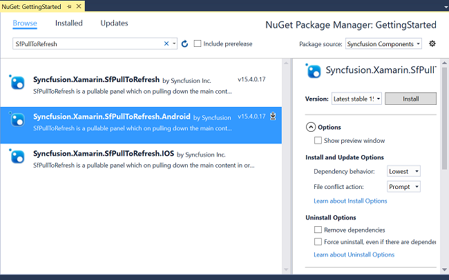
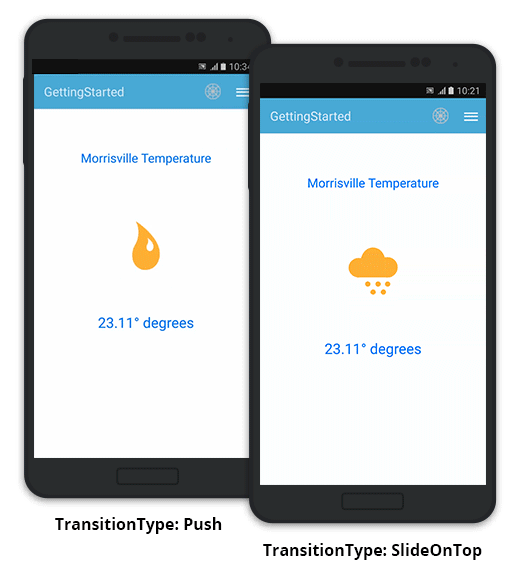

---
layout: post
title: Getting Started | SfPullToRefresh |Xamarin.Android | Syncfusion
description: Getting Started with SfPullToRefresh
platform: Xamarin.Android
control: SfPullToRefresh
documentation: ug
--- 

# Getting Started

This section provides a quick overview for working with SfPullToRefresh in Xamarin.Android. Walk through the entire process of creating a simple application with this control.

## Assembly deployment

After installing Essential Studio for Xamarin, all the required assemblies can be found in {Syncfusion Essential Studio Installed location}\Essential Studio\1{{ site.releaseversion }}\Xamarin\lib this installation folders.

e.g., C:\Program Files (x86)\Syncfusion\Essential Studio\{{ site.releaseversion }}\Xamarin\lib

N> Assemblies can be found in unzipped package location in Mac.

### SfPullToRefresh for Xamarin.Android

The following assembly should be added as reference from the "lib" folder to use SfPullToRefresh in the application.

<table>
<tr>
<th> Project </th>
<th> Required assemblies </th>
</tr>
<tr>
<td> Xamarin.Android </td>
<td> android\Syncfusion.SfPullToRefresh.Android.dll </td>
</tr>
</table>

## NuGet installation

To install the required nugets for the SfPullToRefresh control in the application, first you have to configure the NuGet packages of the Syncfusion components.

[How to configure package source and install Syncfusion NuGet packages in an existing project?](https://www.syncfusion.com/kb/7441/how-to-configure-package-source-and-install-syncfusion-nuget-packages-in-an-existing-project)

### SfPullToRefresh for Xamarin.Android

The following NuGet package should be installed to use SfPullToRefresh control in the application:

<table>
<tr>
<th> Project </th>
<th> Required packages </th>
</tr>
<tr>
<td> Xamarin.Android </td>
<td> Syncfusion.Xamarin.SfPullToRefresh.Android </td>
</tr>
</table>

Refer to the following screenshot in which the Syncfusion.Xamarin.SfPullToRefresh.Android package is highlighted:

I> Starting with v16.2.0.x, if you reference Syncfusion assemblies from trial setup or from the NuGet feed, you also have to include a license key in your projects. Please refer to this [link](https://help.syncfusion.com/common/essential-studio/licensing/license-key) to know about registering Syncfusion license key in your Xamarin application to use our components.

## Create a sample application with SfPullToRefresh

SfPullToRefresh control can be configured entirely in C# code. To create a sample application for this control, follow the topics: 

In this walk through, you will create a new application with SfPullToRefresh.

* [Creating the project](#creating-the-project)  
* [Adding SfPullToRefresh in Xamarin.Android](#adding-sfpulltorefresh-in-xamarinandroid) 
* [Adding a simple layout as the PullableContent](#adding-a-simple-layout-as-the-pullablecontent) 
* [Refreshing the view](#refreshing-the-view) 
* [TransitionType Customization](#transitiontype-customization)
* [Final Output of the sample](#final-output-of-the-sample)
* [Sample Link](#sample-link)

### Creating the project

Create a new Android application in Xamarin Studio or Visual Studio for Xamarin.Android.

### Adding SfPullToRefresh in Xamarin.Android

1. Add the required assembly references to the project as mentioned in the [Assembly deployment](#assembly-deployment) section or install the NuGet as mentioned in the [NuGet installation](#nuget-installation) section.

2. Import SfPullToRefresh control under the namespace `Syncfusion.SfPullToRefresh`.

3. Create an instance of SfPullToRefresh control and set as the ContentView of the Activity. Refer to the following code example to add this control to the application:



using Syncfusion.SfPullToRefresh; 

public class MainActivity : Activity 
{
    SfPullToRefresh pullToRefresh; 

    protected override void OnCreate (Bundle bundle) 
    {
        base.OnCreate (bundle); 
        pullToRefresh = new SfPullToRefresh (this); 
        SetContentView (pullToRefresh); 
    } 
} 



### Adding a simple layout as the PullableContent

Any view can be added as the pullable content using the [SfPullToRefresh.PullableContent](https://help.syncfusion.com/cr/cref_files/xamarin-android/Syncfusion.SfPullToRefresh.Android~Syncfusion.SfPullToRefresh.SfPullToRefresh~PullableContent.html) property to refresh it. Refer to the following code example in which a simple linear layout is added as pullable content:



//MainActivity.cs

protected override void OnCreate(Bundle bundle)
{
	....
	LinearLayout linearLayout = (LinearLayout)LayoutInflater.Inflate(Resource.Layout.pullToRefresh, null);
	//Setting the PullableContent of the SfPullToRefresh.
	pullToRefresh.PullableContent = linearLayout;
	....
}





//pullToRefresh.xml

<LinearLayout xmlns:android="http://schemas.android.com/apk/res/android"
    android:orientation="vertical"
    android:layout_width="match_parent"
    android:layout_height="match_parent"
    android:layout_weight="1"
    android:id="@+id/linearLayout">
    <TextView
        android:layout_marginTop="65dp"
        android:layout_width="wrap_content"
        android:layout_height="wrap_content"
        android:text="Morrisville Temperature"
        android:textSize="20sp"
        android:textColor="#0079ff"
        android:layout_gravity="center_horizontal" />
  <ImageView
        android:layout_marginTop="50dp"
        android:layout_width="155dp"
        android:layout_height="155dp"
        android:id="@+id/weatherImage"
        android:src="@drawable/cloudy"
        android:layout_gravity="center_horizontal"/>
    <TextView
        android:layout_marginTop="30dp"
        android:layout_width="wrap_content"
        android:layout_height="wrap_content"
        android:text="23.11° degrees"
        android:textAppearance="?android:attr/textAppearanceLarge"
        android:textSize="23sp"
        android:textAlignment="center"
        android:id="@+id/weatherData"
        android:textColor="#0079ff"
        android:layout_gravity="center" />
</LinearLayout>



### Refreshing the view

To refresh the view, hook the [SfPullToRefresh.Refreshing](https://help.syncfusion.com/cr/cref_files/xamarin-android/Syncfusion.SfPullToRefresh.Android~Syncfusion.SfPullToRefresh.SfPullToRefresh~Refreshing_EV.html) event. The [SfPullToRefresh.Refreshing](https://help.syncfusion.com/cr/cref_files/xamarin-android/Syncfusion.SfPullToRefresh.Android~Syncfusion.SfPullToRefresh.SfPullToRefresh~Refreshing_EV.html) event will be fired, once the pulling progress reaches 100% and touch is released. You can do the required operations to refresh the view and once the view is refreshed, set the [RefreshingEventArgs.Refreshed](https://help.syncfusion.com/cr/cref_files/xamarin-android/Syncfusion.SfPullToRefresh.Android~Syncfusion.SfPullToRefresh.RefreshingEventArgs~Refreshed.html) as <b>true</b> to stop the refreshing animation. 

Refer to the following code example illustrating hooking of the [SfPullToRefresh.Refreshing](https://help.syncfusion.com/cr/cref_files/xamarin-android/Syncfusion.SfPullToRefresh.Android~Syncfusion.SfPullToRefresh.SfPullToRefresh~Refreshing_EV.html) event and refreshing the view:



public class MainActivity : Activity 
{
    ImageView weatherImage;
    TextView weatherData;
    Random random;
    string[] temperatures = new string[] { "22.01°", "23.11°", "22.50°", "22.77°", "22.20°", "22.00°", "24.01°" };
    int[] weatherImages = new int[] { Resource.Drawable.Cloudy, Resource.Drawable.Humid, Resource.Drawable.Rainy, Resource.Drawable.Warm, Resource.Drawable.Windy };

    protected override void OnCreate(Bundle bundle)
    {
	    ....
	    weatherImage = linearLayout.FindViewById<ImageView>(Resource.Id.weatherImage);
        weatherData = linearLayout.FindViewById<TextView>(Resource.Id.weatherData);
	    //Hooking the Refreshing event.
	    pullToRefresh.Refreshing += PullToRefresh_Refreshing;
	    random = new Random();
	    ....
    }

    private async void PullToRefresh_Refreshing(object sender, RefreshingEventArgs e)
    {
        await Task.Delay(3000);
        weatherImage.SetImageResource(weatherImages[random.Next(0, 4)]);
        weatherData.Text = temperatures[random.Next(1, 5)].ToString() + " degrees";
	    //Setting the e.Refreshed = true, to indicate that the view is refreshed and the SfPullToRefresh can stop the refreshing animation.
        e.Refreshed = true;
    }
}



### TransitionType customization

SfPullToRefresh support two types of transitions. By default, `TransitionType.SlideOnTop` is enabled. 

Refer to the topic `TransitionType` under `Built-in Customization` section for more details regarding [SfPullToRefresh.TransitionType](https://help.syncfusion.com/cr/cref_files/xamarin-android/Syncfusion.SfPullToRefresh.Android~Syncfusion.SfPullToRefresh.SfPullToRefresh~TransitionType.html) property.

Refer to the following code example to switch to the `TransitionType.Push` mode of transition:



protected override void OnCreate(Bundle bundle)
{
	....
	pullToRefresh.TransitionType = TransitionType.Push;
	....
}



### Final output of the sample

The following GIF demonstrates the final output of the sample:

### Sample link

You can download the source code of this sample [here](http://files2.syncfusion.com/Xamarin.Android/Samples/SfPullToRefresh_GettingStarted.zip).
