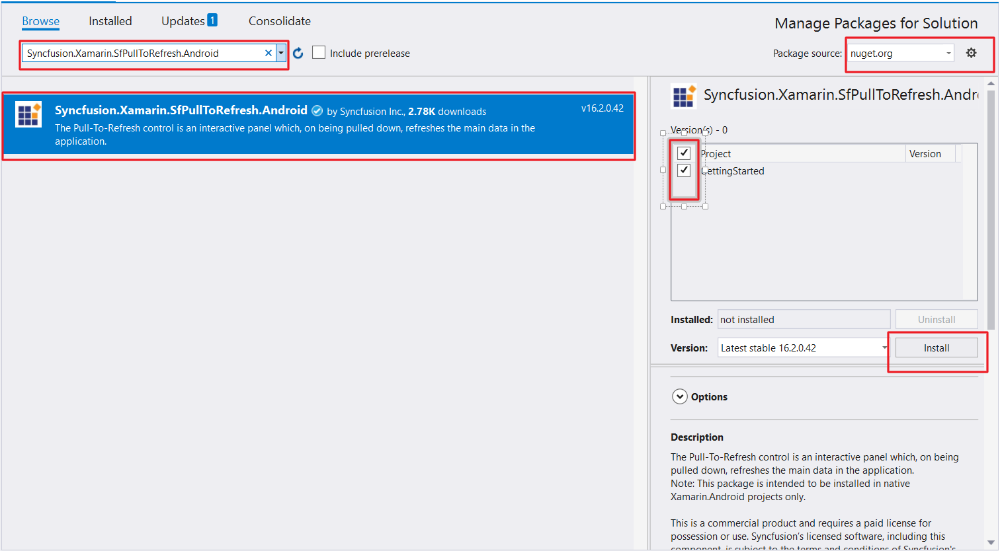
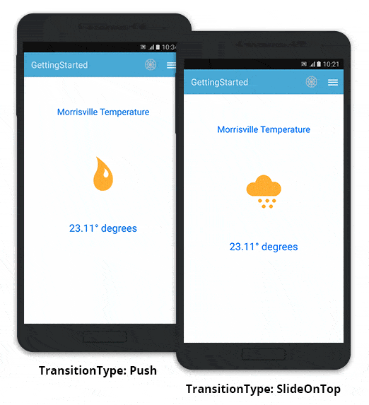

---
layout: post
title: Getting Started | SfPullToRefresh |Xamarin.Android | Syncfusion
description: Getting Started with SfPullToRefresh
platform: Xamarin.Android
control: SfPullToRefresh
documentation: ug
--- 

# Getting Started

This section provides a quick overview for working with SfPullToRefresh in Xamarin.Android. You will walk through the entire process of creating a simple application with SfPullToRefresh.

## Assembly deployment

After installing Essential Studio for Xamarin, you can find all the required assemblies in the installation folders, 

{Syncfusion Essential Studio Installed location}\Essential Studio\15.4.0.17\Xamarin\lib

Eg: C:\Program Files (x86)\Syncfusion\Essential Studio\15.4.0.17\Xamarin\lib

N> Assemblies can be found in unzipped package location in Mac

### SfPullToRefresh for Xamarin.Android

The following assembly need to be added as reference from the "lib" folder to use SfPullToRefresh in your application.

<table>
<tr>
<th> Project </th>
<th> Required assemblies </th>
</tr>
<tr>
<td> Xamarin.Android </td>
<td> android\Syncfusion.SfPullToRefresh.Android.dll </td>
</tr>
</table>

## NuGet installation

You need to configure the NuGet package of Syncfusion components, to install the SfPullToRefresh control in your application. Refer the below KB to configure the NuGet package of Syncfusion components. 

[How to configure package source and install Syncfusion NuGet packages in an existing project?](https://www.syncfusion.com/kb/7441/how-to-configure-package-source-and-install-syncfusion-nuget-packages-in-an-existing-project)

### SfPullToRefresh for Xamarin.Android

The following NuGet package need to be added to use SfPullToRefresh control in your application.

<table>
<tr>
<th> Project </th>
<th> Required packages </th>
</tr>
<tr>
<td> Xamarin.Android </td>
<td> Syncfusion.Xamarin.SfPullToRefresh.Android </td>
</tr>
</table>

Refer the below screenshot in which the Syncfusion.Xamarin.SfPullToRefresh.Android package is highlighted.

## Create a sample application with SfPullToRefresh

This section explains how to create a sample with SfPullToRefresh and configure it. The SfPullToRefresh control can be configured entirely in C# code. 

In this walk through, you will create a new application with SfPullToRefresh.

* [Creating the project](#creating-the-project)  
* [Adding SfPullToRefresh in Xamarin.Android](#adding-sfpulltorefresh-in-xamarinandroid) 
* [Adding a simple layout as the PullableContent](#adding-a-simple-layout-as-the-pullablecontent) 
* [Refreshing the view](#refreshing-the-view) 
* [TransitionType Customization](#transitiontype-customization)
* [Final Output of the sample](#final-output-of-the-sample)
* [Sample Link](#sample-link)

### Creating the project

Create a new Android application in Xamarin Studio or Visual Studio for Xamarin.Android.

### Adding SfPullToRefresh in Xamarin.Android

1. Add the required assembly references to the project as mentioned in the [Assembly deployment](#assembly-deployment) section or install the SfPullToRefresh NuGet as mentioned in the [NuGet installation](#nuget-installation) section.

2. Import SfPullToRefresh control under the namespace `Syncfusion.SfPullToRefresh`.

3. Create an instance of SfPullToRefresh control and set as the ContentView of the Activity. Refer the below code example to add the SfPullToRefresh control to the application.



using Syncfusion.SfPullToRefresh; 

public class MainActivity : Activity 
{
    SfPullToRefresh pullToRefresh; 

    protected override void OnCreate (Bundle bundle) 
    {
        base.OnCreate (bundle); 
        pullToRefresh = new SfPullToRefresh (this); 
        SetContentView (pullToRefresh); 
    } 
} 



### Adding a simple layout as the PullableContent

You can add any view, as the pullable content of SfPullToRefresh using [SfPullToRefresh.PullableContent](https://help.syncfusion.com/cr/cref_files/xamarin-android/sfpulltorefresh/Syncfusion.SfPullToRefresh.Android~Syncfusion.SfPullToRefresh.SfPullToRefresh~PullableContent.html) property to refresh it. Refer the below code example in which a simple linear layout is added as pullable content of SfPullToRefresh.



//MainActivity.cs

protected override void OnCreate(Bundle bundle)
{
	....
	LinearLayout linearLayout = (LinearLayout)LayoutInflater.Inflate(Resource.Layout.pullToRefresh, null);
	//Setting the PullableContent of the SfPullToRefresh.
	pullToRefresh.PullableContent = linearLayout;
	....
}





//pullToRefresh.xml

<LinearLayout xmlns:android="http://schemas.android.com/apk/res/android"
    android:orientation="vertical"
    android:layout_width="match_parent"
    android:layout_height="match_parent"
    android:layout_weight="1"
    android:id="@+id/linearLayout">
    <TextView
        android:layout_marginTop="65dp"
        android:layout_width="wrap_content"
        android:layout_height="wrap_content"
        android:text="Morrisville Temperature"
        android:textSize="20sp"
        android:textColor="#0079ff"
        android:layout_gravity="center_horizontal" />
  <ImageView
        android:layout_marginTop="50dp"
        android:layout_width="155dp"
        android:layout_height="155dp"
        android:id="@+id/weatherImage"
        android:src="@drawable/cloudy"
        android:layout_gravity="center_horizontal"/>
    <TextView
        android:layout_marginTop="30dp"
        android:layout_width="wrap_content"
        android:layout_height="wrap_content"
        android:text="23.11° degrees"
        android:textAppearance="?android:attr/textAppearanceLarge"
        android:textSize="23sp"
        android:textAlignment="center"
        android:id="@+id/weatherData"
        android:textColor="#0079ff"
        android:layout_gravity="center" />
</LinearLayout>



### Refreshing the view

To refresh the view, the user should hook the [SfPullToRefresh.Refreshing](https://help.syncfusion.com/cr/cref_files/xamarin-android/sfpulltorefresh/Syncfusion.SfPullToRefresh.Android~Syncfusion.SfPullToRefresh.SfPullToRefresh~Refreshing_EV.html) event. The [SfPullToRefresh.Refreshing](https://help.syncfusion.com/cr/cref_files/xamarin-android/sfpulltorefresh/Syncfusion.SfPullToRefresh.Android~Syncfusion.SfPullToRefresh.SfPullToRefresh~Refreshing_EV.html) event will be fired, once the pulling progress reaches 100% and the touch is released. The user can do the required operations to refresh the view and once the view is refreshed, set the [RefreshingEventArgs.Refreshed](https://help.syncfusion.com/cr/cref_files/xamarin-android/sfpulltorefresh/Syncfusion.SfPullToRefresh.Android~Syncfusion.SfPullToRefresh.RefreshingEventArgs~Refreshed.html) as <b>true</b> to stop the refreshing animation. 

Refer the below code example illustrating hooking of the [SfPullToRefresh.Refreshing](https://help.syncfusion.com/cr/cref_files/xamarin-android/sfpulltorefresh/Syncfusion.SfPullToRefresh.Android~Syncfusion.SfPullToRefresh.SfPullToRefresh~Refreshing_EV.html) event and refreshing the view.



public class MainActivity : Activity 
{
    ImageView weatherImage;
    TextView weatherData;
    Random random;
    string[] temperatures = new string[] { "22.01°", "23.11°", "22.50°", "22.77°", "22.20°", "22.00°", "24.01°" };
    int[] weatherImages = new int[] { Resource.Drawable.Cloudy, Resource.Drawable.Humid, Resource.Drawable.Rainy, Resource.Drawable.Warm, Resource.Drawable.Windy };

    protected override void OnCreate(Bundle bundle)
    {
	    ....
	    weatherImage = linearLayout.FindViewById<ImageView>(Resource.Id.weatherImage);
        weatherData = linearLayout.FindViewById<TextView>(Resource.Id.weatherData);
	    //Hooking the Refreshing event.
	    pullToRefresh.Refreshing += PullToRefresh_Refreshing;
	    random = new Random();
	    ....
    }

    private async void PullToRefresh_Refreshing(object sender, RefreshingEventArgs e)
    {
        await Task.Delay(3000);
        weatherImage.SetImageResource(weatherImages[random.Next(0, 4)]);
        weatherData.Text = temperatures[random.Next(1, 5)].ToString() + " degrees";
	    //Setting the e.Refreshed = true, to indicate that the view is refreshed and the SfPullToRefresh can stop the refreshing animation.
        e.Refreshed = true;
    }
}



### TransitionType Customization

SfPullToRefresh supports two types of transition. By default, `TransitionType.SlideOnTop` is enabled. 

Refer the topic `TransitionType` under `Built-in Customization` section, for more details regarding [SfPullToRefresh.TransitionType](https://help.syncfusion.com/cr/cref_files/xamarin-android/sfpulltorefresh/Syncfusion.SfPullToRefresh.Android~Syncfusion.SfPullToRefresh.SfPullToRefresh~TransitionType.html) property.

Refer the below code example to switch to the `TransitionType.Push` mode of transition.



protected override void OnCreate(Bundle bundle)
{
	....
	pullToRefresh.TransitionType = TransitionType.Push;
	....
}



### Final output of the sample

The below GIF demonstrates the final output of the sample.

### Sample Link

You can download the source code of this sample here.
