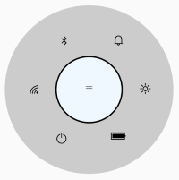

# Dealing with CenterButton and BackButton

The CenterButton or BackButton in radial menu is a view in the center of the radial menu. It performs operations such as opening and closing the rim and navigating to next level items. The radial menu allows you to customize the CenterButton/BackButton with `FontIcon`, `Custom View`, and `Caption`.

## CenterButtonText and CenterButtonBackText

The [CenterButtonText](https://help.syncfusion.com/cr/xamarin-android/Syncfusion.SfRadialMenu.Android~Syncfusion.SfRadialMenu.Android.SfRadialMenu~CenterButtonText.html) changes the text of the center button in `SfRadialMenu`, and the [CenterButtonBackText](https://help.syncfusion.com/cr/xamarin-android/Syncfusion.SfRadialMenu.Android~Syncfusion.SfRadialMenu.Android.SfRadialMenu~CenterButtonBackText.html) changes the text of the center back button in [SfRadialMenu](https://help.syncfusion.com/cr/xamarin-android/Syncfusion.SfRadialMenu.Android~Syncfusion.SfRadialMenu.Android.SfRadialMenu.html).




using Android.App;
using Android.Widget;
using Android.OS;
using Syncfusion.SfRadialMenu.Android;
using Android.Graphics;

namespace GettingStarted
{
    [Activity(Label = "GettingStarted", MainLauncher = true)]
    public class MainActivity : Activity
    {
        protected override void OnCreate(Bundle savedInstanceState)
        {
            base.OnCreate(savedInstanceState);
            string[] layer = new string[] { "\uE701", "\uE702", "\uEA8F", "\uE706", "\uEBAA", "\uE7E8" };
            string[] wifi = new string[] { "\uEC3B", "\uEC3A", "\uEC39", "\uEC38", "\uEC37" };
            Typeface tf = Typeface.CreateFromAsset(Application.Context.Assets, "Segoe_MDL2_Assets.ttf");
            SfRadialMenu radialMenu = new SfRadialMenu(this);
            for (int i = 0; i < 6; i++)
            {
                //Adding Items
                SfRadialMenuItem item = new SfRadialMenuItem(this) { FontIconSize = 20, IconFont = tf, FontIconText = layer[i], FontIconColor = Color.Black, ItemWidth = 50, ItemHeight = 50 };

                //Adding Subitems
                for (int j = 0; j < 4; j++)
                {
                    SfRadialMenuItem subItem = new SfRadialMenuItem(this) { FontIconSize = 30, IconFont = tf, FontIconText = wifi[j], FontIconColor = Color.Black, ItemWidth = 50, ItemHeight = 50 };

                    item.Items.Add(subItem);
                }

                radialMenu.Items.Add(item);
            }

            radialMenu.CenterButtonTextSize = 10;
            radialMenu.CenterButtonText = "\uE700";
            radialMenu.CenterButtonBackTextSize = 10;
            radialMenu.CenterButtonBackText = "\uE72b";
            radialMenu.CenterButtonBackTextColor = Color.ParseColor("#313131");
            radialMenu.CenterButtonTextColor = Color.ParseColor("#313131");
            radialMenu.CenterButtonBackTypeface = Typeface.CreateFromAsset(this.Assets, "Segoe_MDL2_Assets.ttf");
            radialMenu.CenterButtonTypeface = Typeface.CreateFromAsset(this.Assets, "Segoe_MDL2_Assets.ttf");
            SetContentView(radialMenu);
        }
    }
}




## CenterButtonTextColor and CenterButtonBackTextColor

The [CenterButtonTextColor](https://help.syncfusion.com/cr/xamarin-android/Syncfusion.SfRadialMenu.Android~Syncfusion.SfRadialMenu.Android.SfRadialMenu~CenterButtonTextColor.html) changes the text color of the center button in `SfRadialMenu`, and the [CenterButtonBackTextColor](https://help.syncfusion.com/cr/xamarin-android/Syncfusion.SfRadialMenu.Android~Syncfusion.SfRadialMenu.Android.SfRadialMenu~CenterButtonBackTextColor.html) changes the text color of the center back button in [SfRadialMenu](https://help.syncfusion.com/cr/xamarin-android/Syncfusion.SfRadialMenu.Android~Syncfusion.SfRadialMenu.Android.SfRadialMenu.html).




using Android.App;
using Android.Widget;
using Android.OS;
using Syncfusion.SfRadialMenu.Android;
using Android.Graphics;

namespace GettingStarted
{
    [Activity(Label = "GettingStarted", MainLauncher = true)]
    public class MainActivity : Activity
    {
        protected override void OnCreate(Bundle savedInstanceState)
        {
            base.OnCreate(savedInstanceState);
            string[] layer = new string[] { "\uE701", "\uE702", "\uEA8F", "\uE706", "\uEBAA", "\uE7E8" };
            string[] wifi = new string[] { "\uEC3B", "\uEC3A", "\uEC39", "\uEC38", "\uEC37" };
            Typeface tf = Typeface.CreateFromAsset(Application.Context.Assets, "Segoe_MDL2_Assets.ttf");
            SfRadialMenu radialMenu = new SfRadialMenu(this);
            for (int i = 0; i < 6; i++)
            {
                //Adding Items
                SfRadialMenuItem item = new SfRadialMenuItem(this) { FontIconSize = 20, IconFont = tf, FontIconText = layer[i], FontIconColor = Color.Black, ItemWidth = 50, ItemHeight = 50 };

                //Adding Subitems
                for (int j = 0; j < 4; j++)
                {
                    SfRadialMenuItem subItem = new SfRadialMenuItem(this) { FontIconSize = 30, IconFont = tf, FontIconText = wifi[j], FontIconColor = Color.Black, ItemWidth = 50, ItemHeight = 50 };

                    item.Items.Add(subItem);
                }

                radialMenu.Items.Add(item);
            }

            radialMenu.CenterButtonText = "\uE700";
            radialMenu.CenterButtonBackText = "\uE72b";
            radialMenu.CenterButtonTextSize = 10;
            radialMenu.CenterButtonBackTextSize = 10; 
            radialMenu.CenterButtonBackTextColor = Color.Blue;
            radialMenu.CenterButtonTextColor = Color.Blue;
            radialMenu.CenterButtonBackTypeface = Typeface.CreateFromAsset(this.Assets, "Segoe_MDL2_Assets.ttf");
            radialMenu.CenterButtonTypeface = Typeface.CreateFromAsset(this.Assets, "Segoe_MDL2_Assets.ttf");
            SetContentView(radialMenu);
        }
    }
}




## CenterButtonBackground

The [CenterButtonBackgroundColor](https://help.syncfusion.com/cr/xamarin-android/Syncfusion.SfRadialMenu.Android~Syncfusion.SfRadialMenu.Android.SfRadialMenu~CenterButtonBackground.html) changes the background color of the center button in [SfRadialMenu](https://help.syncfusion.com/cr/xamarin-android/Syncfusion.SfRadialMenu.Android~Syncfusion.SfRadialMenu.Android.SfRadialMenu.html).




using Android.App;
using Android.Widget;
using Android.OS;
using Syncfusion.SfRadialMenu.Android;
using Android.Graphics;

namespace GettingStarted
{
    [Activity(Label = "GettingStarted", MainLauncher = true)]
    public class MainActivity : Activity
    {
        protected override void OnCreate(Bundle savedInstanceState)
        {
            base.OnCreate(savedInstanceState);
            string[] layer = new string[] { "\uE701", "\uE702", "\uEA8F", "\uE706", "\uEBAA", "\uE7E8" };
            string[] wifi = new string[] { "\uEC3B", "\uEC3A", "\uEC39", "\uEC38", "\uEC37" };
            Typeface tf = Typeface.CreateFromAsset(Application.Context.Assets, "Segoe_MDL2_Assets.ttf");
            SfRadialMenu radialMenu = new SfRadialMenu(this);
            for (int i = 0; i < 6; i++)
            {
                //Adding Items
                SfRadialMenuItem item = new SfRadialMenuItem(this) { FontIconSize = 20, IconFont = tf, FontIconText = layer[i], FontIconColor = Color.Black, ItemWidth = 50, ItemHeight = 50 };

                //Adding Subitems
                for (int j = 0; j < 4; j++)
                {
                    SfRadialMenuItem item1 = new SfRadialMenuItem(this) { FontIconSize = 30, IconFont = tf, FontIconText = wifi[j], FontIconColor = Color.Black, ItemWidth = 50, ItemHeight = 50 };

                    item.Items.Add(item1);
                }

                radialMenu.Items.Add(item);
            }
           
            radialMenu.CenterButtonText = "\uE700";
            radialMenu.CenterButtonBackText = "\uE72b";
            radialMenu.CenterButtonTextSize = 10;
            radialMenu.CenterButtonBackTextSize = 10;
            radialMenu.CenterButtonBackTextColor = Color.ParseColor("#313131");
            radialMenu.CenterButtonTextColor = Color.ParseColor("#313131");
            radialMenu.CenterButtonBackground = Color.AliceBlue;
            radialMenu.CenterButtonBackTypeface = Typeface.CreateFromAsset(this.Assets, "Segoe_MDL2_Assets.ttf");
            radialMenu.CenterButtonTypeface = Typeface.CreateFromAsset(this.Assets, "Segoe_MDL2_Assets.ttf");
            SetContentView(radialMenu);
        }
    }
}




## CenterButtonRadius

The [CenterButtonRadius](https://help.syncfusion.com/cr/xamarin-android/Syncfusion.SfRadialMenu.Android~Syncfusion.SfRadialMenu.Android.SfRadialMenu~CenterButtonRadius.html) changes the radius of the center button in [SfRadialMenu](https://help.syncfusion.com/cr/xamarin-android/Syncfusion.SfRadialMenu.Android~Syncfusion.SfRadialMenu.Android.SfRadialMenu.html).




using Android.App;
using Android.Widget;
using Android.OS;
using Syncfusion.SfRadialMenu.Android;
using Android.Graphics;

namespace GettingStarted
{
    [Activity(Label = "GettingStarted", MainLauncher = true)]
    public class MainActivity : Activity
    {
        protected override void OnCreate(Bundle savedInstanceState)
        {
            base.OnCreate(savedInstanceState);
            string[] layer = new string[] { "\uE701", "\uE702", "\uEA8F", "\uE706", "\uEBAA", "\uE7E8" };
            string[] wifi = new string[] { "\uEC3B", "\uEC3A", "\uEC39", "\uEC38", "\uEC37" };
            Typeface tf = Typeface.CreateFromAsset(Application.Context.Assets, "Segoe_MDL2_Assets.ttf");
            SfRadialMenu radialMenu = new SfRadialMenu(this);
            for (int i = 0; i < 6; i++)
            {
                //Adding Items
                SfRadialMenuItem item = new SfRadialMenuItem(this) { FontIconSize = 20, IconFont = tf, FontIconText = layer[i], FontIconColor = Color.Black, ItemWidth = 50, ItemHeight = 50 };

                //Adding Subitems
                for (int j = 0; j < 4; j++)
                {
                    SfRadialMenuItem item1 = new SfRadialMenuItem(this) { FontIconSize = 30, IconFont = tf, FontIconText = wifi[j], FontIconColor = Color.Black, ItemWidth = 50, ItemHeight = 50 };

                    item.Items.Add(item1);
                }

                radialMenu.Items.Add(item);
            }

           
            radialMenu.CenterButtonText = "\uE700";
            radialMenu.CenterButtonBackText = "\uE72b";
            radialMenu.CenterButtonRadius = 50;
            radialMenu.CenterButtonTextSize = 10;
            radialMenu.CenterButtonBackTextSize = 10;
            radialMenu.CenterButtonBackTextColor = Color.ParseColor("#313131");
            radialMenu.CenterButtonTextColor = Color.ParseColor("#313131");
            radialMenu.CenterButtonBackground = Color.AliceBlue;
            radialMenu.CenterButtonBackTypeface = Typeface.CreateFromAsset(this.Assets, "Segoe_MDL2_Assets.ttf");
            radialMenu.CenterButtonTypeface = Typeface.CreateFromAsset(this.Assets, "Segoe_MDL2_Assets.ttf");
            SetContentView(radialMenu);
        }
    }
}




## CenterButtonTypeface and CenterButtonBackTypeface

The [CenterButtonTypeface](https://help.syncfusion.com/cr/xamarin-android/Syncfusion.SfRadialMenu.Android~Syncfusion.SfRadialMenu.Android.SfRadialMenu~CenterButtonTypeface.html) changes the font family of the center button in `SfRadialMenu`, and the [CenterButtonBackTypeface](https://help.syncfusion.com/cr/xamarin-android/Syncfusion.SfRadialMenu.Android~Syncfusion.SfRadialMenu.Android.SfRadialMenu~CenterButtonBackTypeface.html) changes the font family of the center back button in [SfRadialMenu](https://help.syncfusion.com/cr/xamarin-android/Syncfusion.SfRadialMenu.Android~Syncfusion.SfRadialMenu.Android.SfRadialMenu.html).




using Android.App;
using Android.Widget;
using Android.OS;
using Syncfusion.SfRadialMenu.Android;
using Android.Graphics;

namespace GettingStarted
{
    [Activity(Label = "GettingStarted", MainLauncher = true)]
    public class MainActivity : Activity
    {
        protected override void OnCreate(Bundle savedInstanceState)
        {
            base.OnCreate(savedInstanceState);
            string[] layer = new string[] { "\uE701", "\uE702", "\uEA8F", "\uE706", "\uEBAA", "\uE7E8" };
            string[] wifi = new string[] { "\uEC3B", "\uEC3A", "\uEC39", "\uEC38", "\uEC37" };
            Typeface tf = Typeface.CreateFromAsset(Application.Context.Assets, "Segoe_MDL2_Assets.ttf");
            SfRadialMenu radialMenu = new SfRadialMenu(this);
            for (int i = 0; i < 6; i++)
            {
                //Adding Items
                SfRadialMenuItem item = new SfRadialMenuItem(this) { FontIconSize = 20, IconFont = tf, FontIconText = layer[i], FontIconColor = Color.Black, ItemWidth = 50, ItemHeight = 50 };

                //Adding Subitems
                for (int j = 0; j < 4; j++)
                {
                    SfRadialMenuItem item1 = new SfRadialMenuItem(this) { FontIconSize = 30, IconFont = tf, FontIconText = wifi[j], FontIconColor = Color.Black, ItemWidth = 50, ItemHeight = 50 };

                    item.Items.Add(item1);
                }

                radialMenu.Items.Add(item);
            }

           
            radialMenu.CenterButtonText = "\uE700";
            radialMenu.CenterButtonBackText = "\uE72b";
            radialMenu.CenterButtonRadius = 50;
            radialMenu.CenterButtonTextSize = 10;
            radialMenu.CenterButtonBackTextSize = 10;
            radialMenu.CenterButtonBackTextColor = Color.ParseColor("#313131");
            radialMenu.CenterButtonTextColor = Color.ParseColor("#313131");
            radialMenu.CenterButtonBackground = Color.AliceBlue;
            radialMenu.CenterButtonBackTypeface = Typeface.CreateFromAsset(this.Assets, "Segoe_MDL2_Assets.ttf");
            radialMenu.CenterButtonTypeface = Typeface.CreateFromAsset(this.Assets, "Segoe_MDL2_Assets.ttf");
            SetContentView(radialMenu);
        }
    }
}




## CenterButtonTextSize and CenterButtonBackTextSize

The [CenterButtonTextSize](https://help.syncfusion.com/cr/xamarin-android/Syncfusion.SfRadialMenu.Android~Syncfusion.SfRadialMenu.Android.SfRadialMenu~CenterButtonTextSize.html) changes the text size of the center button in `SfRadialMenu`, and the [CenterButtonBackTextSize](https://help.syncfusion.com/cr/xamarin-android/Syncfusion.SfRadialMenu.Android~Syncfusion.SfRadialMenu.Android.SfRadialMenu~CenterButtonBackTextSize.html) changes the text size of the center back button in [SfRadialMenu](https://help.syncfusion.com/cr/xamarin-android/Syncfusion.SfRadialMenu.Android~Syncfusion.SfRadialMenu.Android.SfRadialMenu.html).




using Android.App;
using Android.Widget;
using Android.OS;
using Syncfusion.SfRadialMenu.Android;
using Android.Graphics;

namespace GettingStarted
{
    [Activity(Label = "GettingStarted", MainLauncher = true)]
    public class MainActivity : Activity
    {
        protected override void OnCreate(Bundle savedInstanceState)
        {
            base.OnCreate(savedInstanceState);
            string[] layer = new string[] { "\uE701", "\uE702", "\uEA8F", "\uE706", "\uEBAA", "\uE7E8" };
            string[] wifi = new string[] { "\uEC3B", "\uEC3A", "\uEC39", "\uEC38", "\uEC37" };
            Typeface tf = Typeface.CreateFromAsset(Application.Context.Assets, "Segoe_MDL2_Assets.ttf");
            SfRadialMenu radialMenu = new SfRadialMenu(this);
            for (int i = 0; i < 6; i++)
            {
                //Adding Items
                SfRadialMenuItem item = new SfRadialMenuItem(this) { FontIconSize = 20, IconFont = tf, FontIconText = layer[i], FontIconColor = Color.Black, ItemWidth = 50, ItemHeight = 50 };

                //Adding Subitems
                for (int j = 0; j < 4; j++)
                {
                    SfRadialMenuItem item1 = new SfRadialMenuItem(this) { FontIconSize = 30, IconFont = tf, FontIconText = wifi[j], FontIconColor = Color.Black, ItemWidth = 50, ItemHeight = 50 };

                    item.Items.Add(item1);
                }

                radialMenu.Items.Add(item);
            }

           
            radialMenu.CenterButtonText = "\uE700";
            radialMenu.CenterButtonBackText = "\uE72b";
            radialMenu.CenterButtonRadius = 50;
            radialMenu.CenterButtonTextSize = 20;
            radialMenu.CenterButtonBackTextSize = 20;
            radialMenu.CenterButtonBackTextColor = Color.ParseColor("#313131");
            radialMenu.CenterButtonTextColor = Color.ParseColor("#313131");
            radialMenu.CenterButtonBackground = Color.AliceBlue;
            radialMenu.CenterButtonBackTypeface = Typeface.CreateFromAsset(this.Assets, "Segoe_MDL2_Assets.ttf");
            radialMenu.CenterButtonTypeface = Typeface.CreateFromAsset(this.Assets, "Segoe_MDL2_Assets.ttf");
            SetContentView(radialMenu);
        }
    }
}




## CenterButtonBorderColor

The [CenterButtonBorderColor](https://help.syncfusion.com/cr/xamarin-android/Syncfusion.SfRadialMenu.Android~Syncfusion.SfRadialMenu.Android.SfRadialMenu~CenterButtonBorderColor.html) changes the border color of the center button in [SfRadialMenu](https://help.syncfusion.com/cr/xamarin-android/Syncfusion.SfRadialMenu.Android~Syncfusion.SfRadialMenu.Android.SfRadialMenu.html).




using Android.App;
using Android.Widget;
using Android.OS;
using Syncfusion.SfRadialMenu.Android;
using Android.Graphics;

namespace GettingStarted
{
    [Activity(Label = "GettingStarted", MainLauncher = true)]
    public class MainActivity : Activity
    {
        protected override void OnCreate(Bundle savedInstanceState)
        {
            base.OnCreate(savedInstanceState);
            string[] layer = new string[] { "\uE701", "\uE702", "\uEA8F", "\uE706", "\uEBAA", "\uE7E8" };
            string[] wifi = new string[] { "\uEC3B", "\uEC3A", "\uEC39", "\uEC38", "\uEC37" };
            Typeface tf = Typeface.CreateFromAsset(Application.Context.Assets, "Segoe_MDL2_Assets.ttf");
            SfRadialMenu radialMenu = new SfRadialMenu(this);
            for (int i = 0; i < 6; i++)
            {
                //Adding Items
                SfRadialMenuItem item = new SfRadialMenuItem(this) { FontIconSize = 20, IconFont = tf, FontIconText = layer[i], FontIconColor = Color.Black, ItemWidth = 50, ItemHeight = 50 };

                //Adding Subitems
                for (int j = 0; j < 4; j++)
                {
                    SfRadialMenuItem item1 = new SfRadialMenuItem(this) { FontIconSize = 30, IconFont = tf, FontIconText = wifi[j], FontIconColor = Color.Black, ItemWidth = 50, ItemHeight = 50 };

                    item.Items.Add(item1);
                }

                radialMenu.Items.Add(item);
            }

           
            radialMenu.CenterButtonText = "\uE700";
            radialMenu.CenterButtonBackText = "\uE72b";
            radialMenu.CenterButtonRadius = 50;
            radialMenu.CenterButtonTextSize = 10;
            radialMenu.CenterButtonBackTextSize = 10;
            radialMenu.CenterButtonBackTextColor = Color.ParseColor("#313131");
            radialMenu.CenterButtonTextColor = Color.ParseColor("#313131");
            radialMenu.CenterButtonBackground = Color.AliceBlue;
            radialMenu.CenterButtonBorderColor = Color.Black;
            radialMenu.CenterButtonBackTypeface = Typeface.CreateFromAsset(this.Assets, "Segoe_MDL2_Assets.ttf");
            radialMenu.CenterButtonTypeface = Typeface.CreateFromAsset(this.Assets, "Segoe_MDL2_Assets.ttf");
            SetContentView(radialMenu);
        }
    }
}




## CenterButtonBorderThickness

The [CenterButtonBorderThickness](https://help.syncfusion.com/cr/xamarin-android/Syncfusion.SfRadialMenu.Android~Syncfusion.SfRadialMenu.Android.SfRadialMenu~CenterButtonBorderThickness.html) changes the border thickness of the center button in [SfRadialMenu](https://help.syncfusion.com/cr/xamarin-android/Syncfusion.SfRadialMenu.Android~Syncfusion.SfRadialMenu.Android.SfRadialMenu.html).




using Android.App;
using Android.Widget;
using Android.OS;
using Syncfusion.SfRadialMenu.Android;
using Android.Graphics;

namespace GettingStarted
{
    [Activity(Label = "GettingStarted", MainLauncher = true)]
    public class MainActivity : Activity
    {
        protected override void OnCreate(Bundle savedInstanceState)
        {
            base.OnCreate(savedInstanceState);
            string[] layer = new string[] { "\uE701", "\uE702", "\uEA8F", "\uE706", "\uEBAA", "\uE7E8" };
            string[] wifi = new string[] { "\uEC3B", "\uEC3A", "\uEC39", "\uEC38", "\uEC37" };
            Typeface tf = Typeface.CreateFromAsset(Application.Context.Assets, "Segoe_MDL2_Assets.ttf");
            SfRadialMenu radialMenu = new SfRadialMenu(this);
            for (int i = 0; i < 6; i++)
            {
                //Adding Items
                SfRadialMenuItem item = new SfRadialMenuItem(this) { FontIconSize = 20, IconFont = tf, FontIconText = layer[i], FontIconColor = Color.Black, ItemWidth = 50, ItemHeight = 50 };

                //Adding Subitems
                for (int j = 0; j < 4; j++)
                {
                    SfRadialMenuItem item1 = new SfRadialMenuItem(this) { FontIconSize = 30, IconFont = tf, FontIconText = wifi[j], FontIconColor = Color.Black, ItemWidth = 50, ItemHeight = 50 };

                    item.Items.Add(item1);
                }

                radialMenu.Items.Add(item);
            }

           
            radialMenu.CenterButtonText = "\uE700";
            radialMenu.CenterButtonBackText = "\uE72b";
            radialMenu.CenterButtonRadius = 50;
            radialMenu.CenterButtonTextSize = 10;
            radialMenu.CenterButtonBackTextSize = 10;
            radialMenu.CenterButtonBackTextColor = Color.ParseColor("#313131");
            radialMenu.CenterButtonTextColor = Color.ParseColor("#313131");
            radialMenu.CenterButtonBorderColor = Color.Black;
            radialMenu.CenterButtonBorderThickness = 10;
            radialMenu.CenterButtonBackground = Color.AliceBlue;
            radialMenu.CenterButtonBackTypeface = Typeface.CreateFromAsset(this.Assets, "Segoe_MDL2_Assets.ttf");
            radialMenu.CenterButtonTypeface = Typeface.CreateFromAsset(this.Assets, "Segoe_MDL2_Assets.ttf");
            SetContentView(radialMenu);
        }
    }
}




## CenterButtonPlacement

The [CenterButtonPlacement](https://help.syncfusion.com/cr/xamarin-android/Syncfusion.SfRadialMenu.Android~Syncfusion.SfRadialMenu.Android.SfRadialMenu~CenterButtonPlacement.html) changes the placement of the center button in [SfRadialMenu](https://help.syncfusion.com/cr/xamarin-android/Syncfusion.SfRadialMenu.Android~Syncfusion.SfRadialMenu.Android.SfRadialMenu.html).




using Android.App;
using Android.Widget;
using Android.OS;
using Syncfusion.SfRadialMenu.Android;
using Android.Graphics;

namespace GettingStarted
{
    [Activity(Label = "GettingStarted", MainLauncher = true)]
    public class MainActivity : Activity
    {
        protected override void OnCreate(Bundle savedInstanceState)
        {
            base.OnCreate(savedInstanceState);
            string[] layer = new string[] { "\uE701", "\uE702", "\uEA8F", "\uE706", "\uEBAA", "\uE7E8" };
            string[] wifi = new string[] { "\uEC3B", "\uEC3A", "\uEC39", "\uEC38", "\uEC37" };
            Typeface tf = Typeface.CreateFromAsset(Application.Context.Assets, "Segoe_MDL2_Assets.ttf");
            SfRadialMenu radialMenu = new SfRadialMenu(this);
            for (int i = 0; i < 6; i++)
            {
                //Adding Items
                SfRadialMenuItem item = new SfRadialMenuItem(this) { FontIconSize = 20, IconFont = tf, FontIconText = layer[i], FontIconColor = Color.Black, ItemWidth = 50, ItemHeight = 50 };

                //Adding Subitems
                for (int j = 0; j < 4; j++)
                {
                    SfRadialMenuItem item1 = new SfRadialMenuItem(this) { FontIconSize = 30, IconFont = tf, FontIconText = wifi[j], FontIconColor = Color.Black, ItemWidth = 50, ItemHeight = 50 };

                    item.Items.Add(item1);
                }

                radialMenu.Items.Add(item);
            }

            radialMenu.CenterButtonText = "\uE700";
            radialMenu.CenterButtonBackText = "\uE72b";
            radialMenu.CenterButtonRadius = 50;
            radialMenu.CenterButtonTextSize = 10;
            radialMenu.CenterButtonBackTextSize = 10;
            radialMenu.CenterButtonBackTextColor = Color.ParseColor("#313131");
            radialMenu.CenterButtonTextColor = Color.ParseColor("#313131");
            radialMenu.CenterButtonBorderColor = Color.Black;
            radialMenu.CenterButtonBorderThickness = 10;
            radialMenu.CenterButtonBackground = Color.AliceBlue;
            radialMenu.CenterButtonPlacement = SfRadialMenuCenterButtonPlacement.TopLeft;
            radialMenu.CenterButtonBackTypeface = Typeface.CreateFromAsset(this.Assets, "Segoe_MDL2_Assets.ttf");
            radialMenu.CenterButtonTypeface = Typeface.CreateFromAsset(this.Assets, "Segoe_MDL2_Assets.ttf");
            SetContentView(radialMenu);
        }
    }
}




## CenterButtonView and CenterButtonBackIcon

Radial Menu allows you to give customized view to its center button and center back button. You accomplish this by using the [CenterButtonView](https://help.syncfusion.com/cr/xamarin-android/Syncfusion.SfRadialMenu.Android~Syncfusion.SfRadialMenu.Android.SfRadialMenu~CenterButtonView.html) and [CenterButtonBackIcon](https://help.syncfusion.com/cr/xamarin-android/Syncfusion.SfRadialMenu.Android~Syncfusion.SfRadialMenu.Android.SfRadialMenu~CenterButtonBackIcon.html) property.




using Android.App;
using Android.Widget;
using Android.OS;
using Syncfusion.SfRadialMenu.Android;
using Android.Graphics;
using Android.Views;

namespace GettingStarted
{
    [Activity(Label = "GettingStarted", MainLauncher = true)]
    public class MainActivity : Activity
    {
        protected override void OnCreate(Bundle savedInstanceState)
        {
            base.OnCreate(savedInstanceState);
            string[] layer = new string[] { "\uE701", "\uE702", "\uEA8F", "\uE706", "\uEBAA", "\uE7E8" };
            string[] wifi = new string[] { "\uEC3B", "\uEC3A", "\uEC39", "\uEC38", "\uEC37" };
            Typeface tf = Typeface.CreateFromAsset(Application.Context.Assets, "Segoe_MDL2_Assets.ttf");
            SfRadialMenu radialMenu = new SfRadialMenu(this);
            radialMenu.CenterButtonRadius = 25;
            radialMenu.CenterButtonView = new TextView(this) { Text = "Click", TextAlignment = TextAlignment.Center, TextSize = 25 , Gravity = GravityFlags.Center};
            radialMenu.CenterButtonBackIcon = new TextView(this) { Text = "Click", TextAlignment = TextAlignment.Center, TextSize = 25, Gravity = GravityFlags.Center };
            for (int i = 0; i < 6; i++)
            {
                //Adding Items
                SfRadialMenuItem item = new SfRadialMenuItem(this) { FontIconSize = 20, IconFont = tf, FontIconText = layer[i], FontIconColor = Color.Black, ItemWidth = 50, ItemHeight = 50 };

                //Adding Subitems
                for (int j = 0; j < 4; j++)
                {
                    SfRadialMenuItem item1 = new SfRadialMenuItem(this) { FontIconSize = 30, IconFont = tf, FontIconText = wifi[j], FontIconColor = Color.Black, ItemWidth = 50, ItemHeight = 50 };

                    item.Items.Add(item1);
                }

                radialMenu.Items.Add(item);
            }

            SetContentView(radialMenu);
        }
    }
}




## EnableCenterButtonAnimation

The [EnableCenterButtonAnimation](https://help.syncfusion.com/cr/xamarin-android/Syncfusion.SfRadialMenu.Android~Syncfusion.SfRadialMenu.Android.SfRadialMenu~EnableCenterButtonAnimation.html) is used to either enable or disable animation of the center button in [SfRadialMenu](https://help.syncfusion.com/cr/xamarin-android/Syncfusion.SfRadialMenu.Android~Syncfusion.SfRadialMenu.Android.SfRadialMenu.html).




using Android.App;
using Android.Widget;
using Android.OS;
using Syncfusion.SfRadialMenu.Android;
using Android.Graphics;
using Android.Views;

namespace GettingStarted
{
    [Activity(Label = "GettingStarted", MainLauncher = true)]
    public class MainActivity : Activity
    {
        protected override void OnCreate(Bundle savedInstanceState)
        {
            base.OnCreate(savedInstanceState);
            string[] layer = new string[] { "\uE701", "\uE702", "\uEA8F", "\uE706", "\uEBAA", "\uE7E8" };
            string[] wifi = new string[] { "\uEC3B", "\uEC3A", "\uEC39", "\uEC38", "\uEC37" };
            Typeface tf = Typeface.CreateFromAsset(Application.Context.Assets, "Segoe_MDL2_Assets.ttf");
            SfRadialMenu radialMenu = new SfRadialMenu(this);
            radialMenu.CenterButtonRadius = 25;
            radialMenu.EnableCenterButtonAnimation = true;
            radialMenu.CenterButtonView = new TextView(this) { Text = "Click", TextAlignment = TextAlignment.Center, TextSize = 25 , Gravity = GravityFlags.Center};
            radialMenu.CenterButtonBackIcon = new TextView(this) { Text = "Click", TextAlignment = TextAlignment.Center, TextSize = 25, Gravity = GravityFlags.Center };
            for (int i = 0; i < 6; i++)
            {
                //Adding Items
                SfRadialMenuItem item = new SfRadialMenuItem(this) { FontIconSize = 20, IconFont = tf, FontIconText = layer[i], FontIconColor = Color.Black, ItemWidth = 50, ItemHeight = 50 };

                //Adding Subitems
                for (int j = 0; j < 4; j++)
                {
                    SfRadialMenuItem item1 = new SfRadialMenuItem(this) { FontIconSize = 30, IconFont = tf, FontIconText = wifi[j], FontIconColor = Color.Black, ItemWidth = 50, ItemHeight = 50 };

                    item.Items.Add(item1);
                }

                radialMenu.Items.Add(item);
            }

            SetContentView(radialMenu);
        }
    }
}


