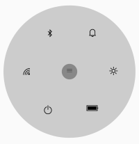

# Getting Started

This section explains the steps required to configure the SfRadialMenu control in a real-time scenario and provides a walk-through on some of the customization features available.

## Referencing Essential Studio® components in your solution

After installing Essential Studio® for Xamarin, you can find all the required assemblies in the installation folders.

{Syncfusion Installed location}\Essential Studio\14.XXXX.X.XX\lib

Add the following assembly reference to the Android project:

android\Syncfusion.SfRadialMenu.Andriod.dll

## Adding SfRadialMenu

* Add the namespace for the added assemblies.




using Syncfusion.SfRadialMenu.Android;




* Now, instantiate and add the SfRadialMenu control with the required optimal name.


		

using Android.App;
using Android.Widget;
using Android.OS;
using Syncfusion.SfRadialMenu.Android;

namespace GettingStarted
{
    [Activity(Label = "GettingStarted", MainLauncher = true)]
    public class MainActivity : Activity
    {
        protected override void OnCreate(Bundle savedInstanceState)
        {
            base.OnCreate(savedInstanceState);
            FrameLayout frame = new FrameLayout(this);
            SfRadialMenu radialMenu = new SfRadialMenu(this);
            frame.AddView(radialMenu);
            SetContentView(frame);
        }
    }
}




## Adding RadialMenu items

SfRadialMenu provides the option to add multiple radial menu items. Add an external font icon typeface into the `Assets` folder, and then set its build action to Android assets. The Unicode can be passed as text to display icons in the SfRadialMenu items.




using Android.App;
using Android.Widget;
using Android.OS;
using Syncfusion.SfRadialMenu.Android;
using Android.Graphics;

namespace GettingStarted
{
    [Activity(Label = "GettingStarted", MainLauncher = true)]
    public class MainActivity : Activity
    {
        protected override void OnCreate(Bundle savedInstanceState)
        {
            base.OnCreate(savedInstanceState);
            string[] layerCollection = new string[] { "\uE701", "\uE702", "\uEA8F", "\uE706", "\uEBAA", "\uE7E8" };
		    string[] outerLayerCollection = new string[] { "\uEC3B", "\uEC3A", "\uEC39", "\uEC38", "\uEC37" };
            FrameLayout frame = new FrameLayout(this);
            Typeface typeface = Typeface.CreateFromAsset(Application.Context.Assets, "settings.ttf");
            SfRadialMenu radialMenu = new SfRadialMenu(this);
            for (int i = 0; i < 6; i++)
            {
                //Adding Items
                SfRadialMenuItem item = new SfRadialMenuItem(this) { FontIconSize = 20, FontIconText = layerCollection[i], FontIconColor = Color.Black, ItemWidth = 50, ItemHeight = 50 };

                //Adding Sub items
                for (int j = 0; j < 4; j++)
                {
                    SfRadialMenuItem item1 = new SfRadialMenuItem(this) { FontIconSize = 30, FontIconText = outerLayerCollection[j], FontIconColor = Color.Black, ItemWidth = 50, ItemHeight = 50 };

                    item.Items.Add(item1);
                }

                radialMenu.Items.Add(item);
            }

            frame.AddView(radialMenu);
            SetContentView(frame);
        }
    }
}




## Adding center button icon and back icon

Any custom view or image can be added as a view of the center button icon and back icon.




using Android.App;
using Android.Widget;
using Android.OS;
using Syncfusion.SfRadialMenu.Android;
using Android.Graphics;

namespace GettingStarted
{
    [Activity(Label = "GettingStarted", MainLauncher = true)]
    public class MainActivity : Activity
    {
        protected override void OnCreate(Bundle savedInstanceState)
        {
		    string[] layerCollection = new string[] { "\uE701", "\uE702", "\uEA8F", "\uE706", "\uEBAA", "\uE7E8" };
		    string[] outerLayerCollection = new string[] { "\uEC3B", "\uEC3A", "\uEC39", "\uEC38", "\uEC37" };
		    FrameLayout frame = new FrameLayout(this);
            Typeface typeface = Typeface.CreateFromAsset(Application.Context.Assets, "Segoe_MDL2_Assets.ttf");
            SfRadialMenu radialMenu = new SfRadialMenu(this);
            for (int i = 0; i < 6; i++)
            {
                //Adding Items
                SfRadialMenuItem item = new SfRadialMenuItem(this) { FontIconSize = 20, IconFont = typeface, FontIconText = layerCollection[i], FontIconColor = Color.Black, ItemWidth = 50, ItemHeight = 50 };

                //Adding Sub items
                for (int j = 0; j < 4; j++)
                {
                    SfRadialMenuItem subItem = new SfRadialMenuItem(this) { FontIconSize = 30, IconFont = typeface, FontIconText = outerLayerCollection[j], FontIconColor = Color.Black, ItemWidth = 50, ItemHeight = 50 };

                    item.Items.Add(subItem);
                }

                radialMenu.Items.Add(item);
            }

            // Adding center icon
            TextView menuIcon = new TextView(Application.Context);
            menuIcon.Text = "\uE713";
            menuIcon.Typeface = typeface;
            menuIcon.SetTextColor(Color.White);
            radialMenu.CenterButtonView = menuIcon;

            // Adding icon for inner level center icon which is a back button
            TextView backIcon = new TextView(Application.Context);
            backIcon.Text = "\uE72B";
            backIcon.Typeface = typeface;
            backIcon.SetTextColor(Color.White);
            radialMenu.CenterButtonBackIcon = backIcon;
            frame.AddView(radialMenu);
            SetContentView(frame);
        }
    }
}




