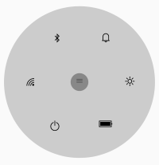

# Overview

The SfRadialMenu control displays a hierarchical menu in a circular layout, which is optimized for touch-enabled devices. Typically, it is used as a context menu, and it can expose more menu items in the same space than traditional menus.

## Key features

* Supports automatic item arrangement. 
* Supports rotating items.
* Supports custom view such as image.
* Provides the option to place items as needed by users.
* Supports floating over the layout to avoid obscuring the content behind the layout.
* Allows you to provide built-in icon font option that helps users add vector images that prevent the control from experiencing any image glitches that are often faced with traditional image icons.
* Provides complete customization options for the menu and its items, such as coloring, size, placement, and shapes using the segmentation option.

