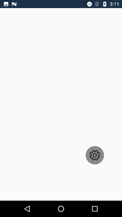

# Placing and dragging RadialMenu

You can place the RadialMenu anywhere within its parent layout and enable dragging functionality to allow users to reposition it dynamically.

## Dragging RadialMenu

You can enable or disable dragging functionality using the [IsDragEnabled](https://help.syncfusion.com/cr/xamarin-android/Syncfusion.SfRadialMenu.Android.SfRadialMenu.html#Syncfusion_SfRadialMenu_Android_SfRadialMenu_IsDragEnabled) property.




using Android.App;
using Android.Widget;
using Android.OS;
using Syncfusion.SfRadialMenu.Android;
using Android.Graphics;
using Android.Views;
using System.Collections.Generic;

namespace GettingStarted
{
    [Activity(Label = "GettingStarted", MainLauncher = true)]
    public class MainActivity : Activity
    {
        protected override void OnCreate(Bundle savedInstanceState)
        {
            base.OnCreate(savedInstanceState);
            SfRadialMenu radialMenu = new SfRadialMenu(this);
            radialMenu.CenterButtonText = "\uE713";
            radialMenu.CenterButtonTypeface = Typeface.CreateFromAsset(this.Assets, "Segoe_MDL2_Assets.ttf");
            radialMenu.CenterButtonRadius = 32;
            radialMenu.CenterButtonBorderColor = Color.White;
            radialMenu.IsDragEnabled = true;
            SetContentView(radialMenu);
        }
    }
}




## Drag Events

SfRadialMenu provides the DragBegin and DragEnd events that occur when the RadialMenu is dragged.
SfRadialMenu provides the DragBegin and DragEnd events that occur when the RadialMenu is being dragged.

### DragBegin

This event occurs when you start dragging the RadialMenu. It provides `DragBeginEventArgs` with the following properties:

* **Position**: Gets the starting position of the RadialMenu.
* **Handled**: Gets or sets a Boolean value to enable or disable the dragging operation.

To handle the [DragBegin](https://help.syncfusion.com/cr/xamarin-android/Syncfusion.SfRadialMenu.Android.SfRadialMenu.html) event and get the start position or restrict dragging, refer to the following code example:




using Android.App;
using Android.Widget;
using Android.OS;
using Syncfusion.SfRadialMenu.Android;
using Android.Graphics;
using Android.Views;
using System.Collections.Generic;

namespace GettingStarted
{
    [Activity(Label = "GettingStarted", MainLauncher = true)]
    public class MainActivity : Activity
    {
        protected override void OnCreate(Bundle savedInstanceState)
        {
            base.OnCreate(savedInstanceState);
            SfRadialMenu radialMenu = new SfRadialMenu(this);
            radialMenu.DragBegin += RadialMenu_DragBegin;
            radialMenu.CenterButtonText = "\uE713";
            radialMenu.CenterButtonTypeface = Typeface.CreateFromAsset(this.Assets, "Segoe_MDL2_Assets.ttf");
            radialMenu.CenterButtonRadius = 32;
            radialMenu.CenterButtonBorderColor = Color.White;
            radialMenu.IsDragEnabled = true;
            SetContentView(radialMenu);
        }

        private void RadialMenu_DragBegin(object sender, DragBeginEventArgs e)
        {
            e.Handled = true;
        }
    }
}




### DragEnd

This event occurs when the dragging operation ends. It provides `DragEndEventArgs` with the following properties:
* **OldValue**: Gets the starting position of the RadialMenu.
* **NewValue**: Gets the ending position of the RadialMenu.
* **Handled**: Gets or sets a Boolean value to restrict the RadialMenu from moving to the new position.

To handle the [DragEnd](https://help.syncfusion.com/cr/xamarin-android/Syncfusion.SfRadialMenu.Android.SfRadialMenu.html) event and get the start and end positions or restrict the movement, refer to the following code example:




using Android.App;
using Android.Widget;
using Android.OS;
using Syncfusion.SfRadialMenu.Android;
using Android.Graphics;
using Android.Views;
using System.Collections.Generic;

namespace GettingStarted
{
    [Activity(Label = "GettingStarted", MainLauncher = true)]
    public class MainActivity : Activity
    {
        protected override void OnCreate(Bundle savedInstanceState)
        {
            base.OnCreate(savedInstanceState);
            SfRadialMenu radialMenu = new SfRadialMenu(this);
            radialMenu.DragEnd += RadialMenu_DragEnd;
            radialMenu.CenterButtonText = "\uE713";
            radialMenu.CenterButtonTypeface = Typeface.CreateFromAsset(this.Assets, "Segoe_MDL2_Assets.ttf");
            radialMenu.CenterButtonRadius = 32;
            radialMenu.CenterButtonBorderColor = Color.White;
            radialMenu.IsDragEnabled = true;
            SetContentView(radialMenu);
        }

        private void RadialMenu_DragEnd(object sender, DragEndEventArgs e)
        {
            e.Handled = true;
        }
    }
}




## Placement of RadialMenu

You can configure the placement of the SfRadialMenu based on its center button axis using the [CenterButtonPlacement](https://help.syncfusion.com/cr/xamarin-android/Syncfusion.SfRadialMenu.Android.SfRadialMenu.html#Syncfusion_SfRadialMenu_Android_SfRadialMenu_CenterButtonPlacement) property with the following options:

* **TopLeft**: Places the origin (0,0) of the SfRadialMenu at the top-left corner.
* **Center**: Places the origin (0,0) of the SfRadialMenu at the center.

N> The default value of the [CenterButtonPlacement](https://help.syncfusion.com/cr/xamarin-android/Syncfusion.SfRadialMenu.Android.SfRadialMenu.html#Syncfusion_SfRadialMenu_Android_SfRadialMenu_CenterButtonPlacement) property is Center.




using Android.App;
using Android.Widget;
using Android.OS;
using Syncfusion.SfRadialMenu.Android;
using Android.Graphics;
using Android.Views;
using System.Collections.Generic;

namespace GettingStarted
{
    [Activity(Label = "GettingStarted", MainLauncher = true)]
    public class MainActivity : Activity
    {
        protected override void OnCreate(Bundle savedInstanceState)
        {
            base.OnCreate(savedInstanceState);
            SfRadialMenu radialMenu = new SfRadialMenu(this);
            radialMenu.CenterButtonText = "\uE713";
            radialMenu.CenterButtonTypeface = Typeface.CreateFromAsset(this.Assets, "Segoe_MDL2_Assets.ttf");
            radialMenu.CenterButtonRadius = 32;
            radialMenu.CenterButtonBorderColor = Color.White;
            radialMenu.CenterButtonPlacement = SfRadialMenuCenterButtonPlacement.TopLeft;
            radialMenu.IsDragEnabled = true;
            SetContentView(radialMenu);
        }
    }
}




## Positioning RadialMenu

You can position the RadialMenu at a specific location within its parent layout using the [Point](https://help.syncfusion.com/cr/xamarin-android/Syncfusion.SfRadialMenu.Android.SfRadialMenu.html#Syncfusion_SfRadialMenu_Android_SfRadialMenu_Point) property. The position is calculated based on the coordinate system of the parent layout.




using Android.App;
using Android.Widget;
using Android.OS;
using Syncfusion.SfRadialMenu.Android;
using Android.Graphics;
using Android.Views;
using System.Collections.Generic;

namespace GettingStarted
{
    [Activity(Label = "GettingStarted", MainLauncher = true)]
    public class MainActivity : Activity
    {
        protected override void OnCreate(Bundle savedInstanceState)
        {
            base.OnCreate(savedInstanceState);
            SfRadialMenu radialMenu = new SfRadialMenu(this);
            radialMenu.CenterButtonText = "\uE713";
            radialMenu.CenterButtonTypeface = Typeface.CreateFromAsset(this.Assets, "Segoe_MDL2_Assets.ttf");
            radialMenu.CenterButtonRadius = 32;
            radialMenu.CenterButtonBorderColor = Color.White;
            radialMenu.Point = new Point(100, 150);
            radialMenu.IsDragEnabled = true;
            SetContentView(radialMenu);
        }
    }
}




