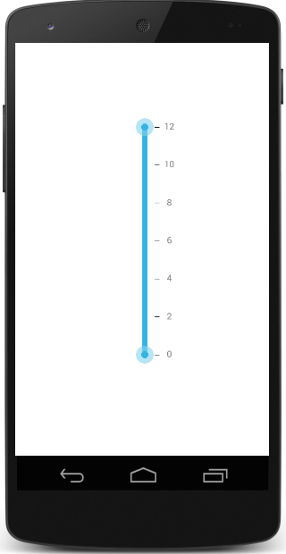

# Getting Started

This section explains you the steps to configure a SfRangeSlider control in a real-time scenario and also provides a walk-through on some of the customization features available in SfRangeSlider control.

## Creating your first SfRangeSlider in Xamarin.Android

### Referencing Essential Studio Components in Your Solution

After installing Essential Studio for Xamarin, you can find all the required assemblies in the installation folders,

{Syncfusion Installed location}\Essential Studio\12.4.0.24\lib

Add the following assembly references to the Android project,

android\Syncfusion.SfRangeSlider.Andriod.dll

### Add and Configure the SfRangeSlider

* Adding reference to RangeSlider.



	using Com.Syncfusion.RangeSlider; 



* Create an instance of SfRangeSlider.

		

	SfRangeSlider rangeSlider = new SfRangeSlider(this);
	SetContentView(rangeSlider);



### Add Values and Scale

You can set the minimum value for the slider by using the `setMinimum()` and `setMaximum()` properties in the SfRangeSlider. It can be Numerical values.



	rangeSlider.Minimum=0; 
	rangeSlider.Maximum=24; 
	rangeSlider.DirectionReversed=false; 
	rangeSlider.RangeEnd=20; 
	rangeSlider.RangeStart=4;
	rangeSlider.ShowRange=true; 
	rangeSlider.Orientation=Orientation.Horizontal;



N> Likewise, `RangeStart` and `RangeEnd` can be set to denote the start range and end range values while dual thumb is used. The `ShowRange` property is used to switch between a single thumb and double thumb. The `Orientation` property sets the type of orientation.

### Add Ticks and Labels for SfRangeSlider

The ticks can be set by setting the `TickFrequency` and `TickPlacement`. Likewise, value labels can be set by setting the `ShowValueLabel` property to true. The position of label can be varied by the `LabelPlacement` property.



	rangeSlider.TickFrequency=4; 
	rangeSlider.ShowValueLabel=true; 
	rangeSlider.ValuePlacement=ValuePlacement.TopLeft; 
	rangeSlider.TickPlacement=TickPlacement.BottomRight;



N> The TickFrequency determines the interval between the ticks.

### Add Snapping Type for SfRangeSlider

The movement of the thumb can be varied in different ways. This is achieved by setting the SnapsTo property.



	rangeSlider.SnapsTo=SnapsTo.Ticks; 
	rangeSlider.StepFrequency=6;



### Configure the Properties in SfRangeSlider



	SfRangeSlider rangeSlider = new SfRangeSlider ();
	rangeSlider.Minimum=0;
	rangeSlider.Maximum=24;
	rangeSlider.RangeStart=4;
	rangeSlider.RangeEnd=20;
	rangeSlider.TickFrequency=4;
	rangeSlider.TickPlacement=TickPlacement.Outside;
	rangeSlider.SnapsTo=SnapsTo.Ticks;
	rangeSlider.ValuePlacement=ValuePlacement.TopLeft;
	rangeSlider.ShowRange=True;

