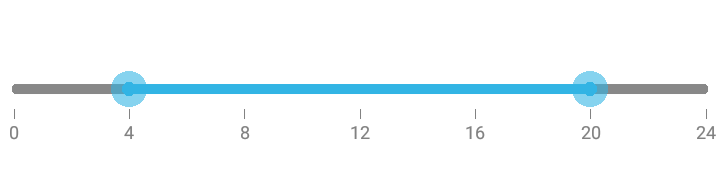

# Orientation

The SfRangeSlider provides an option to display the slider and its values either horizontally or vertically, allowing you to adapt the control to different layout requirements and user interface designs.
N> The default orientation is `Horizontal`.

N> The default option is Horizontal.

## Horizontal





rangeSlider.Orientation=Orientation.Horizontal





## Vertical





rangeSlider.Orientation=Orientation.Vertical





