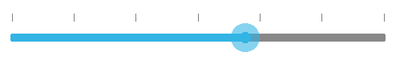

# Customizing Ticks

Tick marks provide visual reference points along the slider track to help users make precise selections. The SfRangeSlider allows you to customize tick placement, appearance, and behavior to match your application's design requirements.
Tick marks can be placed along the track in a uniform manner, or their position can be customized based on your specific layout needs and user experience goals.

## Tick Placement

The `TickPlacement` property determines where to draw tick marks in relation to the track. This property provides flexibility in positioning ticks to optimize visual clarity and space utilization.

**Available Options:**
- `BottomRight` - Places ticks below (horizontal) or right (vertical) of the track
- `TopLeft` - Places ticks above (horizontal) or left (vertical) of the track
- `Inline` - Places ticks along the track itself
- `Outside` - Places ticks on both sides of the track
- `None` - Hides all tick marks

N> The default option is `Inline`.

### BottomRight Placement

Tick marks are placed either below the track in horizontal orientation or to the right of the track in vertical orientation. This placement is ideal when you want to keep the top or left area clear for labels or other UI elements.


	rangeSlider.TickPlacement=TickPlacement.BottomRight;



### TopLeft

Tick marks are placed either above the track in horizontal orientation or to the left of the track in vertical orientation. This placement works well for traditional slider designs and when bottom space is limited.



	rangeSlider.TickPlacement=TickPlacement.TopLeft;



### Inline

Tick marks are placed directly along the track, providing a clean, integrated appearance. This is the default placement and works well for most scenarios.



	rangeSlider.TickPlacement=TickPlacement.Inline;



### Outside

Tick marks are placed on both sides of the track, providing maximum visual prominence and reference points from multiple angles.



	rangeSlider.TickPlacement=TickPlacement.Outside;



## Customizing tick color

The range slider control provides the `TickColor` property to customize the color of ticks in tick bar.



namespace GettingStarted
{
      [Activity(Label = "GettingStarted", MainLauncher = true, Icon = "@mipmap/icon")]
      public class MainActivity : Activity
      {
            protected override void OnCreate(Bundle savedInstanceState)
            {
				base.OnCreate(savedInstanceState);
				LinearLayout linearLayout = new LinearLayout(this);
				linearLayout.LayoutParameters = new LayoutParams(LayoutParams.MatchParent, LayoutParams.MatchParent);
				SfRangeSlider rangeSlider = new SfRangeSlider(this);
				rangeSlider.ShowValueLabel = true;
				rangeSlider.TickColor = Color.Rgb(255, 0, 0);
				rangeSlider.TickPlacement = TickPlacement.TopLeft;
				rangeSlider.Orientation = Com.Syncfusion.Sfrangeslider.Orientation.Horizontal;
				linearLayout.AddView(rangeSlider);
				SetContentView(linearLayout);
            }
      }
}



## Tick length

The `TickLength` property used to customize the length of the ticks.



	rangeSlider.TickLength = 20;



