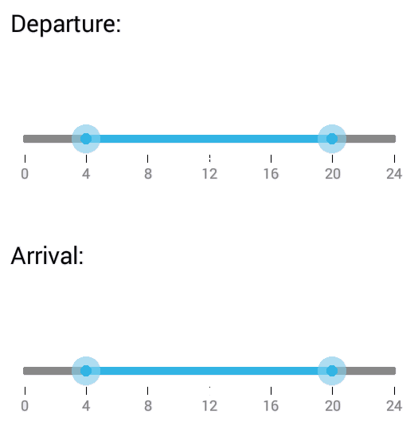

# Overview

The RangeSlider control for Xamarin.Android allows you to select a range of values within specified minimum and maximum limits. The range can be selected by moving one or both thumbs along the track, providing an intuitive interface for range-based input scenarios such as price filtering, date ranges, or value boundaries.

## Key features

* Provides support to select values as a range.
 
* Restricts values to choose within a minimum and maximum constraints.
 
* Supports to change the tick intervals in uniform pattern.
 
* Provides user-friendly customization support to customize ticks and labels.
