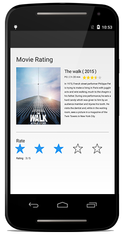

# Overview

The Essential® Xamarin.Android Rating control provides an intuitive way to display and collect user ratings using a customizable star-based interface. The control offers flexible precision options and extensive customization capabilities, including item size, spacing, and the number of displayed rating items.

## Key Features

* `Precision`: Options to decide the accuracy level of rating.

* `Item Count`: Support to determine the number of Rating items to be displayed. 

