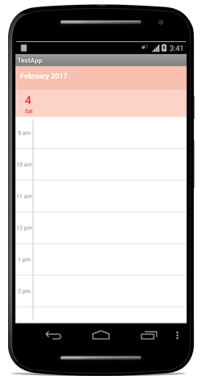
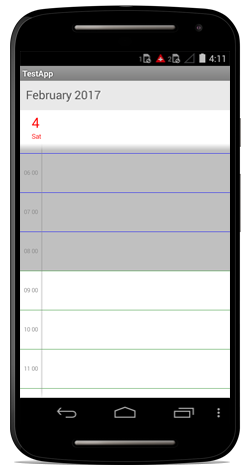
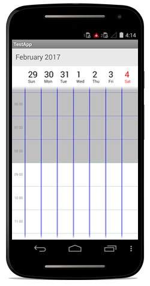
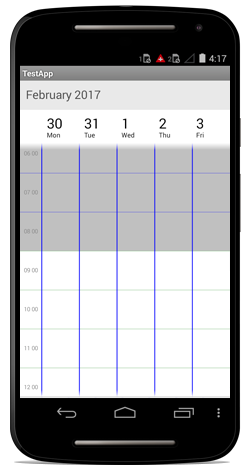
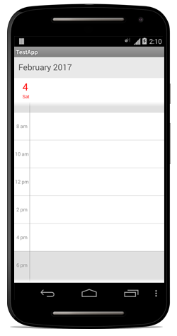

# Appearance & Styling

## Header Customization

You can customize the header of the Schedule using `HeaderStyle` and `HeaderHeight` property in schedule.

### Header Height

You can customize the height for the Header in Schedule using `HeaderHeight` in schedule.



	sfSchedule.HeaderHeight = 50;



### Labels

you can change the header format and style using `HeaderStyle` property in schedule.

#### Format

You can change the header text format and size using `ScheduleDateHeaderSize` and `ScheduleDateHeaderFormat` property in `HeaderStyle`



	sfSchedule.ScheduleDateHeaderSize = 30;
	sfSchedule.ScheduleDateHeaderFormat = "MMM yyyy";



#### Fonts and colors

You can change the backgroundcolor,text style and text size using properties such as `BackgroundColor`,`TextStyle`, `TextSize` of Header using `HeaderStyle` property in schedule.



	HeaderStyle headerStyle = new HeaderStyle();
	headerStyle.BackgroundColor = Color.Argb(255, 214, 214, 214);
	headerStyle.TextStyle = Typeface.DefaultBold;
	headerStyle.TextSize= Color.Black;
	sfSchedule.HeaderStyle = headerStyle;



## View Header Customization

You can customize the header of the Schedule using `ViewHeaderStyle` and `ViewHeaderHeight` property in schedule.

### Labels

#### Fonts and Colors

You can change the backgroundcolor,text style and text size using properties such as `BackgroundColor`,`DateTextStyle`, `DayTextStyle`, `DayTextColor`, `DateTextColor`,`DateTextSize`, `DayTextSize` of ViewHeader using `ViewHeaderStyle` property in schedule.



	ViewHeaderStyle viewHeaderStyle = new ViewHeaderStyle(sfSchedule);
	viewHeaderStyle.BackgroundColor = Color.Argb(255, 28, 28, 28);
	viewHeaderStyle.DayTextColor= Color.Argb(255, 238, 199, 43);
	viewHeaderStyle.DateTextColor= Color.Argb(255, 238, 199, 43);
	viewHeaderStyle.DateTextSize = 15;
	viewHeaderStyle.DayTextSize = 10;
	viewHeaderStyle.DateTextStyle = Typeface.Default;
	viewHeaderStyle.DayTextStyle = Typeface.DefaultBold;
	sfSchedule.ViewHeaderStyle = viewHeaderStyle;



### ViewHeader Height

You can customize the height for the Header in Schedule using `HeaderHeight` in schedule.



	sfSchedule.ViewHeaderHeight = 50;



## Timeslots customization

### Custom Day View

#### Non-Working Hours 

You can differentiate working hours with non-working hour timeslots by its color using `NonWorkingHoursTimeSlotBorderColor`, `NonWorkingHoursTimeSlotColor` properties of `DayViewSettings`.



	//creating new instance for schedule
	sfschedule = new SfSchedule(this);

	//setting schedule view
	sfschedule.ScheduleView = ScheduleView.DayView;

	//setting day view settings properties
	DayViewSettings dayViewSettings = new DayViewSettings();
	dayViewSettings.NonWorkingHoursTimeSlotBorderColor = Color.Gray;
	dayViewSettings.NonWorkingHoursTimeSlotColor = Color.Silver;
	sfschedule.DayViewSettings=dayViewSettings;

	// Set our view from the "main" layout resource
	SetContentView(sfschedule);



#### Timeslots 

You can differentiate working hours with non-working hour timeslots by its color using  `TimeSlotColor`,`TimeSlotBorderColor` and `TimeSlotBorderStrokeWidth` properties of `DayViewSettings`.



	//creating new instance for schedule
	sfschedule = new SfSchedule(this);

	//setting schedule view
	sfschedule.ScheduleView = ScheduleView.DayView;

	//setting day view settings properties
	DayViewSettings dayViewSettings = new DayViewSettings();
	dayViewSettings.TimeSlotColor = Color.Yellow;
	dayViewSettings.TimeSlotBorderColor = Color.Aqua;
	dayViewSettings.TimeSlotBorderStrokeWidth = 5;
	sfschedule.DayViewSettings=dayViewSettings;

	// Set our view from the "main" layout resource
	SetContentView(sfschedule);



#### Lines

You can differentiate the timeslot panel using `VerticalLineColor` and `VerticalLineStrokeWidth` properties of `DayViewSettings`.



	//creating new instance for schedule
	sfschedule = new SfSchedule(this);

	//setting schedule view
	sfschedule.ScheduleView = ScheduleView.DayView;

	//setting day view settings properties
	DayViewSettings dayViewSettings = new DayViewSettings();
	dayViewsettings.VerticalLineColor = Color.Green;
	dayViewsettings.VerticalLineStrokeWidth = 5;
	sfschedule.DayViewSettings=dayViewSettings;

	// Set our view from the "main" layout resource
	SetContentView(sfschedule);



#### Labels

You can change the format , colors, size, style of text using `DateFormat` and `DayFormat`, `DateLabelSize`,`DayLabelSize`,`TimeFormat`, `TimeLabelColor`,`TimeLabelSize` properties of `DayLabelSettings` in `DayViewSettings`.



	//creating new instance for schedule
	sfschedule = new SfSchedule(this);
	
	//setting schedule view
	sfschedule.ScheduleView = ScheduleView.DayView;

	DayViewSettings dayViewSettings = new DayViewSettings();
	DayLabelSettings dayLabelSettings = new WeekLabelSettings();
	dayLabelSettings.DateFormat = "d/M/yyyy";
	dayLabelSettings.DateLabelSize = 10;
	dayLabelSettings.DayLabelSize = 10;
	dayLabelSettings.DayFormat = "ddd";
	dayLabelSettings.TimeFormat = "hh mm";
	dayLabelSettings.TimeLabelColor = Color.Blue;
	dayLabelSettings.TimeLabelSize = 10;
	dayViewSettings.DayLabelSettings = dayLabelSettings;
	sfSchedule.DayViewSettings = dayViewSettings;

	// Set our view from the "main" layout resource
	SetContentView(sfschedule);



#### All Day Appointments color

You can change the all day appointment panel color using the property `AllDayAppointmentBackgroundColor` of `DayViewSettings`.



	//creating new instance for schedule
	sfschedule = new SfSchedule(this);

	//setting schedule view
	sfschedule.ScheduleView = ScheduleView.DayView;

	//setting day view settings properties
	DayViewSettings dayViewSettings = new DayViewSettings();
	dayViewSettings.AllDayAppointmentBackgroundColor = Color.Pink;
	sfschedule.DayViewSettings=dayViewSettings;

	// Set our view from the "main" layout resource
	SetContentView(sfschedule);



### Custom Week View

#### Non-Working Hours 

You can differentiate working hours with non-working hour timeslots by its color using `NonWorkingHoursTimeSlotBorderColor`, `NonWorkingHoursTimeSlotColor` properties of `WeekViewSettings`.



	//creating new instance for schedule
	sfschedule = new SfSchedule(this);

	//setting schedule view
	sfschedule.ScheduleView = ScheduleView.WeekView;

	//setting week view settings properties
	WeekViewSettings weekViewSettings = new WeekViewSettings();
	weekViewSettings.NonWorkingHoursTimeSlotBorderColor = Color.Gray;
	weekViewSettings.NonWorkingHoursTimeSlotColor = Color.Silver;
	sfschedule.WeekViewSettings = weekViewSettings;

	// Set our view from the "main" layout resource
	SetContentView(sfschedule);



#### Timeslots 

You can differentiate working hours with non-working hour timeslots by its color using `TimeSlotColor`,`TimeSlotBorderColor` and `TimeSlotBorderStrokeWidth` properties of `WeekViewSettings`.



	//creating new instance for schedule
	sfschedule = new SfSchedule(this);

	//setting schedule view
	sfschedule.ScheduleView = ScheduleView.WeekView;

	//setting week view settings properties
	WeekViewSettings weekViewSettings = new WeekViewSettings();
	weekViewSettings.TimeSlotBorderColor = Color.Aqua;
	weekViewSettings.TimeSlotColor = Color.Yellow;
	weekViewSettings.TimeSlotBorderStrokeWidth = 5;

	sfschedule.WeekViewSettings = weekViewSettings;

	// Set our view from the "main" layout resource
	SetContentView(sfschedule);



#### Lines

You can differentiate the timeslot panel using `VerticalLineColor` and `VerticalLineStrokeWidth` properties of `WeekViewSettings`.



	//creating new instance for schedule
	sfschedule = new SfSchedule(this);

	//setting schedule view
	sfschedule.ScheduleView = ScheduleView.WeekView;

	WeekViewSettings weekViewSettings = new WeekViewSettings ();
	weekViewSettings.VerticalLineColor = Color.Green;
	weekViewSettings.VerticalLineStrokeWidth = 5;
	sfschedule.WeekViewSettings = weekViewSettings;

	// Set our view from the "main" layout resource
	SetContentView(sfschedule);



#### Labels

You can change the format , colors, size, style of text using `DateFormat` and `DayFormat`, `DateLabelSize`,`DayLabelSize`,`TimeFormat`, `TimeLabelColor`,`TimeLabelSize` properties of `WeekLabelSettings` in `WeekViewSettings`.



	//creating new instance for schedule
	sfschedule = new SfSchedule(this);

	//setting schedule view
	sfschedule.ScheduleView = ScheduleView.WeekView;

	WeekViewSettings weekViewSettings = new WeekViewSettings();
	WeekLabelSettings weekLabelSettings = new WeekLabelSettings();
	weekLabelSettings.DateFormat = "d/M/yyyy";
	weekLabelSettings.DateLabelSize = 10;
	weekLabelSettings.DayLabelSize = 10;
	weekLabelSettings.DayFormat = "ddd";
	weekLabelSettings.TimeFormat = "hh mm";
	weekLabelSettings.TimeLabelColor = Color.Blue;
	weekLabelSettings.TimeLabelSize = 10;
	weekViewSettings.WeekLabelSettings = weekLabelSettings;
	sfSchedule.WeekViewSettings = weekViewSettings;

	// Set our view from the "main" layout resource
	SetContentView(sfschedule);



#### All Day Appointments Color

You can change the all day appointment panel color using the property `AllDayAppointmentBackgroundColor` of `WeekViewSettings`.



	//creating new instance for schedule
	sfschedule = new SfSchedule(this);

	//setting schedule view
	sfschedule.ScheduleView = ScheduleView.WeekView;

	//setting week view settings properties
	WeekViewSettings weekViewSettings = new WeekViewSettings();
	weekViewSettings.AllDayAppointmentBackgroundColor = Color.Pink;
	sfschedule.WeekViewSettings = weekViewSettings;

	// Set our view from the "main" layout resource
	SetContentView(sfschedule);



### Custom Work Week View

#### Non-Working Hours 

You can also differentiate working hours with non-working hour timeslots by its color using `NonWorkingHoursTimeSlotBorderColor`, `NonWorkingHoursTimeSlotColor` properties of `WorkWeekViewSettings`.



	//creating new instance for schedule
	sfschedule = new SfSchedule(this);

	//setting schedule view
	sfschedule.ScheduleView = ScheduleView.WorkWeekView;

	//setting workweek view settings properties
	WorkWeekViewSettings workWeekViewSettings = new WorkWeekViewSettings ();
	workWeekViewSettings.NonWorkingHoursTimeSlotBorderColor = Color.Gray;
	workWeekViewSettings.NonWorkingHoursTimeSlotColor = Color.Silver;
	sfschedule.WorkWeekViewSettings = workWeekViewSettings;

	// Set our view from the "main" layout resource
	SetContentView(sfschedule);



#### Timeslots

You can also differentiate working hours with non-working hour timeslots by its color using `TimeSlotColor`,`TimeSlotBorderColor` and `TimeSlotBorderStrokeWidth` properties of `WorkWeekViewSettings`.



	//creating new instance for schedule
	sfschedule = new SfSchedule(this);

	//setting schedule view
	sfschedule.ScheduleView = ScheduleView.WorkWeekView;

	//setting workweek view settings properties
	WorkWeekViewSettings workWeekViewSettings = new WorkWeekViewSettings ();
	workWeekViewSettings.TimeSlotBorderColor = Color.Aqua;
	workWeekViewSettings.TimeSlotColor = Color.Yellow;
	workWeekViewSettings.TimeSlotBorderStrokeWidth = 5;
	sfschedule.WorkWeekViewSettings = workWeekViewSettings;

	// Set our view from the "main" layout resource
	SetContentView(sfschedule);



#### Lines

You can differentiate the timeslot panel using `VerticalLineColor` and `VerticalLineStrokeWidth` properties of `WorkWeekViewSettings`.



	//creating new instance for schedule
	sfschedule = new SfSchedule(this);

	//setting schedule view
	sfschedule.ScheduleView = ScheduleView.WorkWeekView;

	WorkWeekViewSettings workWeekViewSettings = new WorkWeekViewSettings ();
	workWeekViewSettings.VerticalLineColor = Color.Green;
	workWeekViewSettings.VerticalLineStrokeWidth = 5;
	sfschedule.WorkWeekViewSettings = workWeekViewSettings;

	// Set our view from the "main" layout resource
	SetContentView(sfschedule);



#### Labels

You can change the format , colors, size, style of text using `DateFormat` and `DayFormat`, `DateLabelSize`,`DayLabelSize`,`TimeFormat`, `TimeLabelColor`,`TimeLabelSize` properties of `WorkWeekLabelSettings` in `WorkWeekViewSettings`.



	//creating new instance for schedule
	sfschedule = new SfSchedule(this);

	//setting schedule view
	sfschedule.ScheduleView = ScheduleView.WorkWeekView;

	WorkWeekViewSettings workweekViewSettings = new WorkWeekViewSettings();
	WorkWeekLabelSettings workWeekLabelSettings = new WorkWeekLabelSettings();
	workWeekLabelSettings.DateFormat = "d/M/yyyy";
	workWeekLabelSettings.DateLabelSize = 10;
	workWeekLabelSettings.DayLabelSize = 10;
	workWeekLabelSettings.DayFormat = "ddd";
	workWeekLabelSettings.TimeFormat = "hh mm";
	workWeekLabelSettings.TimeLabelColor = Color.Blue;
	workWeekLabelSettings.TimeLabelSize = 10;
	workweekViewSettings.WorkWeekLabelSettings = workWeekLabelSettings;
	sfSchedule.WorkWeekViewSettings = workweekViewSettings;

	// Set our view from the "main" layout resource
	SetContentView(sfschedule);



#### All Day Appointments Panel

You can change the all day appointment panel color using the property `AllDayAppointmentBackgroundColor` of `WorkWeekViewSettings`.



	//creating new instance for schedule
	sfschedule = new SfSchedule(this);

	//setting schedule view
	sfschedule.ScheduleView = ScheduleView.WorkWeekView;

	//setting workweek view settings properties
	WorkWeekViewSettings workWeekViewSettings = new WorkWeekViewSettings();
	workWeekViewSettings.AllDayAppointmentBackgroundColor = Color.Pink;
	sfschedule.WorkWeekViewSettings = workWeekViewSettings;

	// Set our view from the "main" layout resource
	SetContentView(sfschedule);



### Interval

You can change the time interval and time interval height using `TimeInterval` and `TimeIntervalHeight` in schedule.



	sfSchedule.TimeInterval = 120;
	sfSchedule.TimeIntervalHeight = 100;



>**NOTE** : `TimeInterval` value should be given in minutes.

