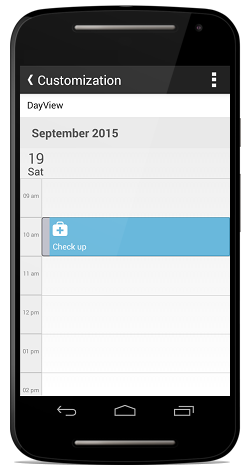
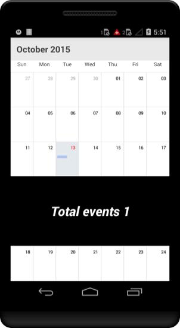

# Appearance & Styling

## MonthCell Customization

Schedule views are designed as per the native calendar control with some enriched user interface for the control interaction and usability. Month view cell contains the date along with its appointments if available. 

You can customize the MonthView cell in two ways, 

* MonthCellStyle property.
* MonthCellLoadedEvent.

**Using MonthCellStyle property**

MonthView can be customized by setting monthCellStyle properties such as TextColor,TextStyle,BackgroundColor to the `MonthCellStyle` property of schedule.



    MonthCellStyle monthCellStyle = new MonthCellStyle();
    monthCellStyle.BackgroundColor = Color.Gray;
    monthCellStyle.TextColor = Color.Blue;
    monthCellStyle.TextSize = 12;
    monthCellStyle.TextStyle = Typeface.DefaultBold;
    sfschedule.MonthCellStyle = monthCellStyle;



**Using MonthCellLoaded Event**

You can customize the month view during runtime using `MonthCellLoaded Event`. In MonthCellLoaded event, the properties such as CellStyle,Appointments,Calendar,view and boolean properties such as IsToday,IsPreviousMonthDate,IsNextMonthDate,IsBlackoutDate are passed in the `MonthCellLoadedEventArgs`.

Month cells can be customized using the `CellStyle` property as follows,


    
    sfschedule.MonthCellLoaded += (object sender, SfSchedule.MonthCellLoadedEventArgs e) =>
		{
			if (e.P0.IsToday)
			{
				e.P0.CellStyle.BackgroundColor = Color.Gray;
				e.P0.CellStyle.TextColor = Color.Blue;
				e.P0.CellStyle.TextSize = 12;
				e.P0.CellStyle.TextStyle = Typeface.DefaultBold;
			}
		};



You can also add an object in the month cell view using `View` property passed through `MonthCellLoadedEventArgs`.



	sfschedule.MonthCellLoaded += (object sender, SfSchedule.MonthCellLoadedEventArgs e) =>
		{
		    Button button = new Button(this);
			button.SetBackgroundColor(Color.Red);
			e.P0.View = button;
		};
		


## Appointment Customization.

`ScheduleAppointment` created in schedule are arranged based on its duration, where the appointments viewed through day, week and work week view  are positioned in the timeslots.Schedule Appointment can be customized in two ways, 

* AppointmentStyle property.
* AppointmentLoadedEvent.

**Using AppointmentStyle property**

`ScheduleAppointment` can be customized by setting appointmentstyle properties such as TextColor,TextStyle,BorderColor,BorderCornerRadius,BorderWidth,SelectionBorderColor,SelectionTextColor to the `AppointmentStyle` property of schedule.



    AppointmentStyle appointmentStyle = new AppointmentStyle();
	appointmentStyle.TextColor = Color.Red;
	appointmentStyle.TextStyle = Font.SystemFontOfSize(15,FontAttributes.Bold);
	appointmentStyle.BorderColor = Color.Blue;
	appointmentStyle.BorderCornerRadius = 12;
	appointmentStyle.BorderWidth = 10;
	appointmentStyle.SelectionBorderColor = Color.Yellow;
	appointmentStyle.SelectionTextColor = Color.Yellow;
	sfschedule.AppointmentStyle = appointmentStyle;
	


**Using AppointmentLoaded Event**

Schedule appointment view can be customized during runtime using `AppointmentLoaded Event`.In AppointmentLoaded event, the properties such as appointmentStyle,appointment,view,Bounds are passed in the `AppointmentLoadedEventArgs`.

ScheduleAppointment can be customized using the `appointmentStyle` property as follows,



    	sfschedule.AppointmentLoaded += (object sender, SfSchedule.AppointmentLoadedEventArgs e) =>
		{
			e.P0.AppointmentStyle.BorderColor = Color.AliceBlue;
			e.P0.AppointmentStyle.BorderCornerRadius = 5;
			e.P0.AppointmentStyle.BorderWidth = 10;
			e.P0.AppointmentStyle.SelectionBorderColor = Color.Blue;
			e.P0.AppointmentStyle.SelectionTextColor = Color.Yellow;
			e.P0.AppointmentStyle.TextColor = Color.Brown;
			e.P0.AppointmentStyle.TextStyle = Typeface.DefaultBold;
		};



You can also add an object in the appointment view using `view` property passed through `AppointmentLoadedEventArgs`.



	sfschedule.AppointmentLoaded += (object sender, SfSchedule.AppointmentLoadedEventArgs e) =>
		{
			Button button = new Button(this);
			button.SetBackgroundColor(Color.Red);
			e.P0.View = button;
		};
	


## Panel Customization

### Custom Day View

#### Date Time Formating

You can differentiate the timeslot panel using `VerticalLineColor` and `VerticalLineStrokeWidth` properties of `WorkWeekViewSettings`.



    //creating new instance for schedule
    sfschedule = new SfSchedule(this);
        
    //setting schedule view
    sfschedule.ScheduleView = ScheduleView.DayView;
        
    //setting day view settings properties
    DayViewSettings dayViewSettings = new DayViewSettings();
    dayViewsettings.VerticalLineColor = Color.Green;
    dayViewsettings.VerticalLineStrokeWidth = 5;
    sfschedule.DayViewSettings=dayViewSettings;
        
    // Set our view from the "main" layout resource
    SetContentView(sfschedule);



#### Working Hours 

You can differentiate working hours with non-working hour timeslots by its color using `NonWorkingHoursTimeSlotBorderColor`, `NonWorkingHoursTimeSlotColor`, `TimeSlotColor`,`TimeSlotBorderColor` and `TimeSlotBorderStrokeWidth` properties of `DayViewSettings`.



    //creating new instance for schedule
    sfschedule = new SfSchedule(this);
    
    //setting schedule view
    sfschedule.ScheduleView = ScheduleView.DayView;

    //setting day view settings properties
    DayViewSettings dayViewSettings = new DayViewSettings();
    dayViewSettings.NonWorkingHoursTimeSlotBorderColor = Color.Gray;
    dayViewSettings.NonWorkingHoursTimeSlotColor = Color.Silver;
    dayViewSettings.TimeSlotColor = Color.Yellow;
    dayViewSettings.TimeSlotBorderColor = Color.Aqua;
    dayViewSettings.TimeSlotBorderStrokeWidth = 5;
    sfschedule.DayViewSettings=dayViewSettings;
    
    // Set our view from the "main" layout resource
    SetContentView(sfschedule);
            


#### All Day Appointments Panel

You can change the all day appointment panel color using the property `AllDayAppointmentBackgroundColor` of `DayViewSettings`.



    //creating new instance for schedule
    sfschedule = new SfSchedule(this);
            
    //setting schedule view
    sfschedule.ScheduleView = ScheduleView.DayView;
            
    //setting day view settings properties
    DayViewSettings dayViewSettings = new DayViewSettings();
    dayViewSettings.AllDayAppointmentBackgroundColor = Color.Pink;
    sfschedule.DayViewSettings=dayViewSettings;
            
    // Set our view from the "main" layout resource
    SetContentView(sfschedule);



### Custom Week View

#### Date Time Formating

You can differentiate the timeslot panel using `VerticalLineColor` and `VerticalLineStrokeWidth` properties of `WeekViewSettings`.



    //creating new instance for schedule
    sfschedule = new SfSchedule(this);
    
    //setting schedule view
    sfschedule.ScheduleView = ScheduleView.WeekView;
    
    WeekViewSettings weekViewSettings = new WeekViewSettings ();
    weekViewSettings.VerticalLineColor = Color.Green;
    weekViewSettings.VerticalLineStrokeWidth = 5;
    sfschedule.WeekViewSettings = weekViewSettings;
            
    // Set our view from the "main" layout resource
    SetContentView(sfschedule);



#### Working Hours 

You can differentiate working hours with non-working hour timeslots by its color using `NonWorkingHoursTimeSlotBorderColor`, `NonWorkingHoursTimeSlotColor`, `TimeSlotColor`,`TimeSlotBorderColor` and `TimeSlotBorderStrokeWidth` properties of `WeekViewSettings`.



    //creating new instance for schedule
    sfschedule = new SfSchedule(this);
    
    //setting schedule view
    sfschedule.ScheduleView = ScheduleView.WeekView;

    //setting week view settings properties
    WeekViewSettings weekViewSettings = new WeekViewSettings();
    weekViewSettings.NonWorkingHoursTimeSlotBorderColor = Color.Gray;
    weekViewSettings.NonWorkingHoursTimeSlotColor = Color.Silver;
    weekViewSettings.TimeSlotBorderColor = Color.Aqua;
    weekViewSettings.TimeSlotColor = Color.Yellow;
    weekViewSettings.TimeSlotBorderStrokeWidth = 5;
    
    sfschedule.WeekViewSettings = weekViewSettings;
    
    // Set our view from the "main" layout resource
    SetContentView(sfschedule);



#### All Day Appointments Panel

You can change the all day appointment panel color using the property `AllDayAppointmentBackgroundColor` of `WeekViewSettings`.



    //creating new instance for schedule
    sfschedule = new SfSchedule(this);

    //setting schedule view
    sfschedule.ScheduleView = ScheduleView.WeekView;

    //setting week view settings properties
    WeekViewSettings weekViewSettings = new WeekViewSettings();
    weekViewSettings.AllDayAppointmentBackgroundColor = Color.Pink;
    sfschedule.WeekViewSettings = weekViewSettings;
    
    // Set our view from the "main" layout resource
    SetContentView(sfschedule);



### Custom Work Week View

#### Date Time Formating

You can differentiate the timeslot panel using `VerticalLineColor` and `VerticalLineStrokeWidth` properties of `WorkWeekViewSettings`.



    //creating new instance for schedule
    sfschedule = new SfSchedule(this);

    //setting schedule view
    sfschedule.ScheduleView = ScheduleView.WorkWeekView;
    
    WorkWeekViewSettings workWeekViewSettings = new WorkWeekViewSettings ();
    workWeekViewSettings.VerticalLineColor = Color.Green;
    workWeekViewSettings.VerticalLineStrokeWidth = 5;
    sfschedule.WorkWeekViewSettings = workWeekViewSettings;
            
    // Set our view from the "main" layout resource
    SetContentView(sfschedule);



#### Working Hours 

You can also differentiate working hours with non-working hour timeslots by its color using `NonWorkingHoursTimeSlotBorderColor`, `NonWorkingHoursTimeSlotColor`, `TimeSlotColor`,`TimeSlotBorderColor` and `TimeSlotBorderStrokeWidth` properties of `WorkWeekViewSettings`.



    //creating new instance for schedule
    sfschedule = new SfSchedule(this);

    //setting schedule view
    sfschedule.ScheduleView = ScheduleView.WorkWeekView;

    //setting workweek view settings properties
    WorkWeekViewSettings workWeekViewSettings = new WorkWeekViewSettings ();
    workWeekViewSettings.NonWorkingHoursTimeSlotBorderColor = Color.Gray;
    workWeekViewSettings.NonWorkingHoursTimeSlotColor = Color.Silver;
    workWeekViewSettings.TimeSlotBorderColor = Color.Aqua;
    workWeekViewSettings.TimeSlotColor = Color.Yellow;
    workWeekViewSettings.TimeSlotBorderStrokeWidth = 5;
    sfschedule.WorkWeekViewSettings = workWeekViewSettings;
    
    // Set our view from the "main" layout resource
    SetContentView(sfschedule);



#### All Day Appointments Panel

You can change the all day appointment panel color using the property `AllDayAppointmentBackgroundColor` of `WorkWeekViewSettings`.



    //creating new instance for schedule
    sfschedule = new SfSchedule(this);

    //setting schedule view
    sfschedule.ScheduleView = ScheduleView.WorkWeekView;

    //setting workweek view settings properties
    WorkWeekViewSettings workWeekViewSettings = new WorkWeekViewSettings();
    workWeekViewSettings.AllDayAppointmentBackgroundColor = Color.Pink;
    sfschedule.WorkWeekViewSettings = workWeekViewSettings;
            
    // Set our view from the "main" layout resource
    SetContentView(sfschedule);



## Inline view Customization.

You can able to know the details of appointments in inline using `InlineAppointmentTapped` event in `Schedule`. Details of the selected  appointment and the corresponding date is passed through `InlineAppointmentTappedEventArgs` as `selectedAppointment` and `selectedDate` respectively.


    
    monthViewSettings.InlineAppointmentTappedEvent += (object sender, MonthViewSettings.InlineAppointmentTappedEventArgs e) =>
		{
		    var appointment = e.P2;
			var date = e.P1;
		};



