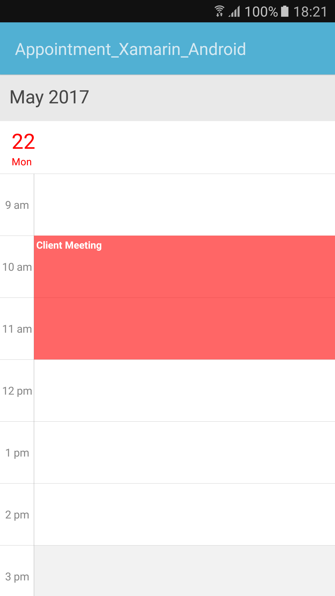
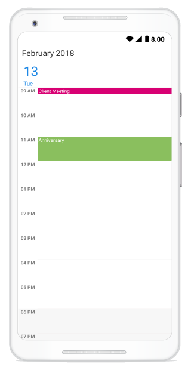
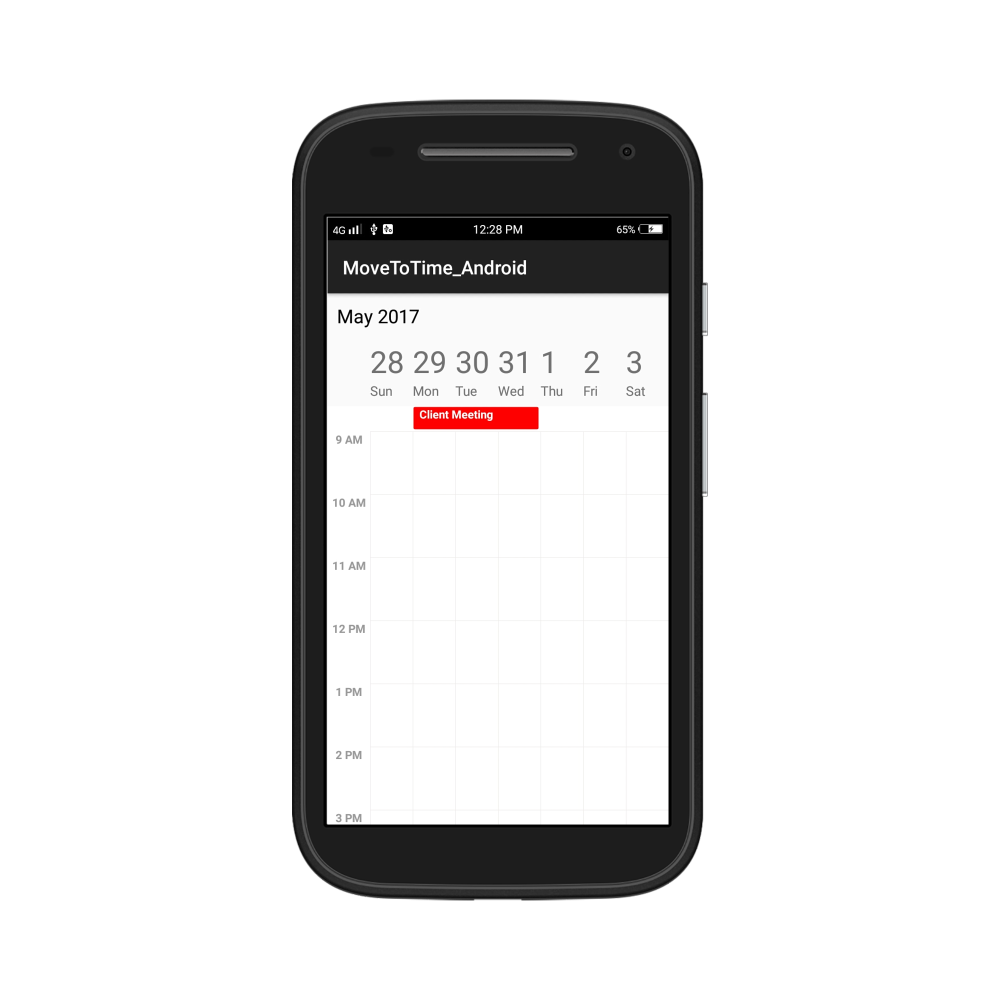
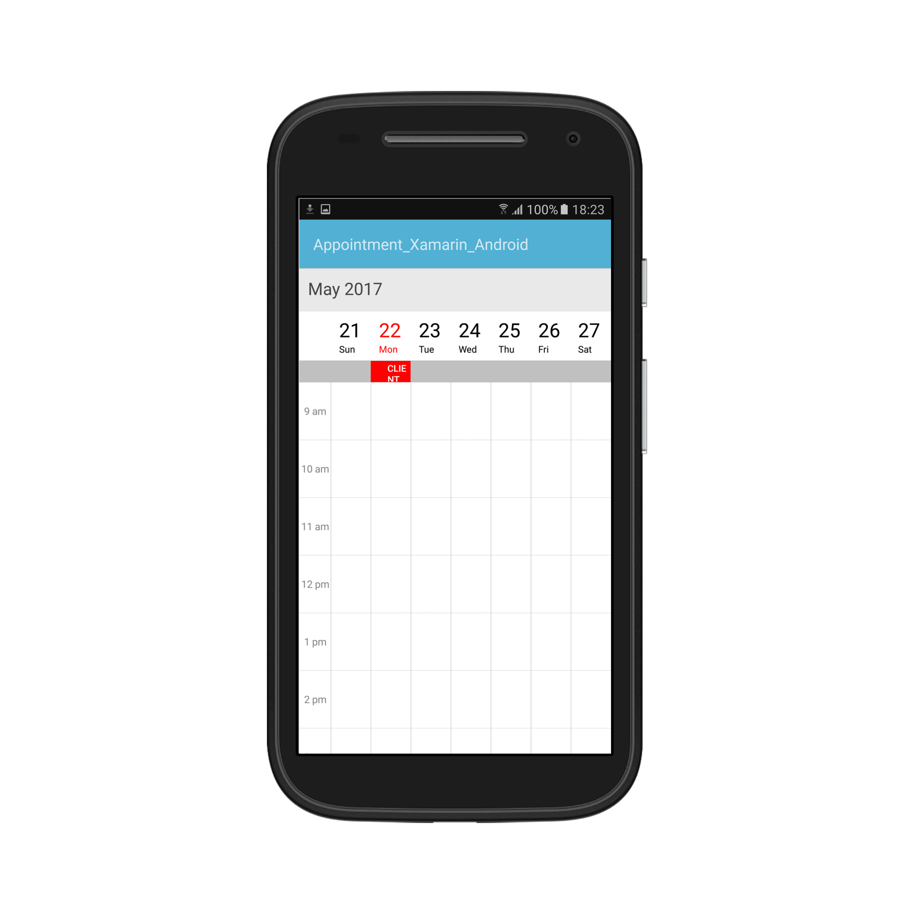
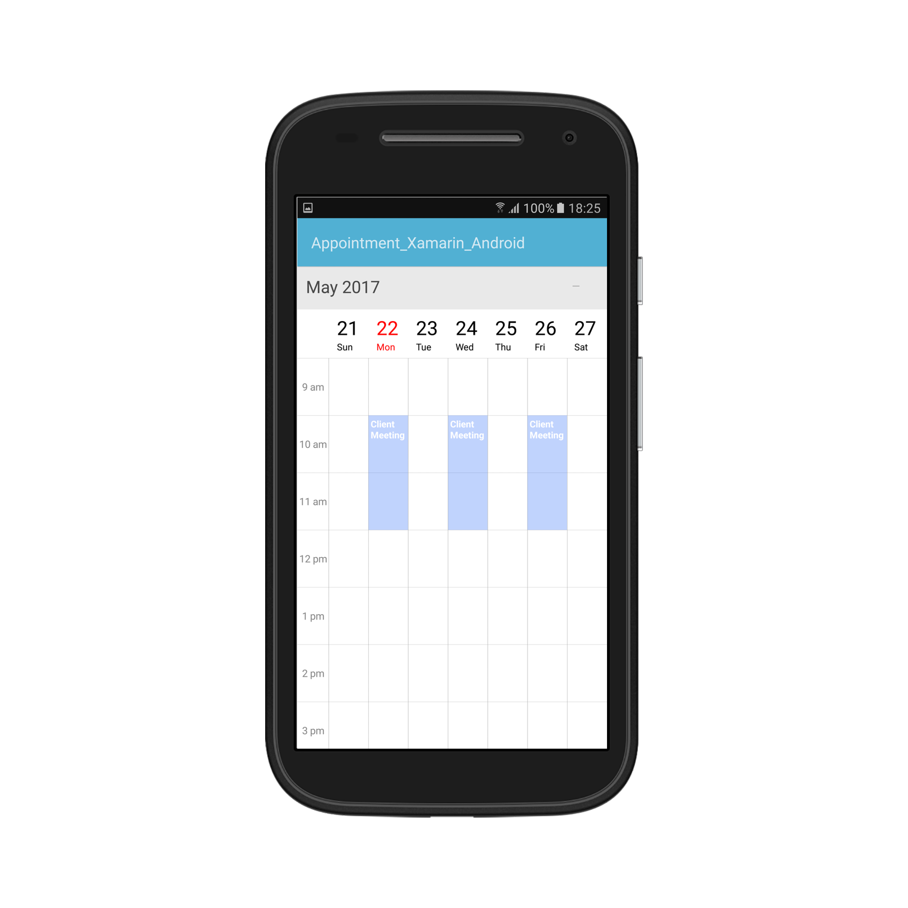
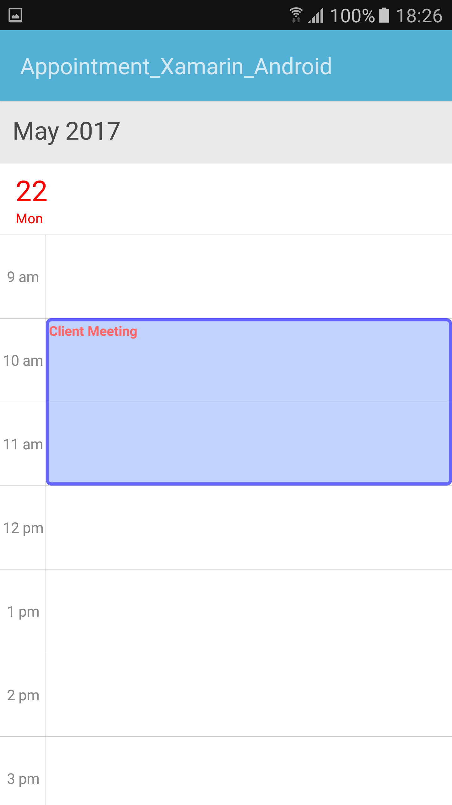
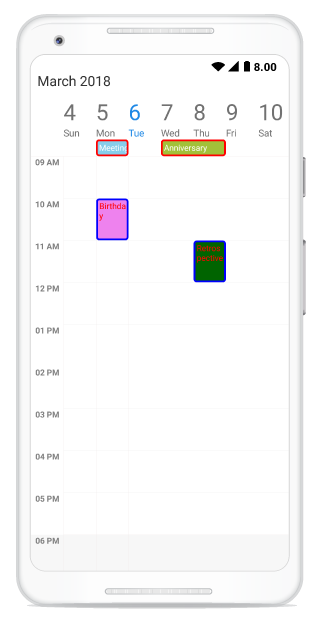
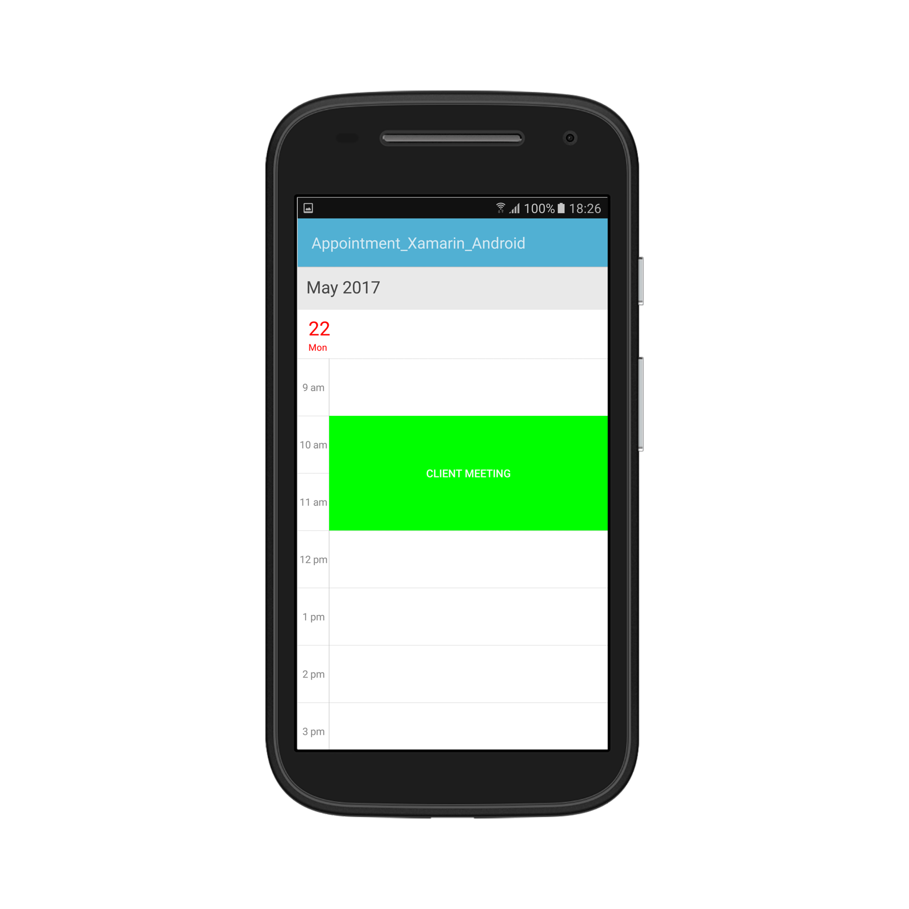
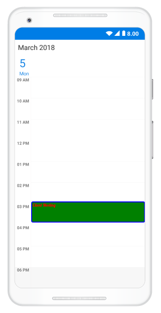
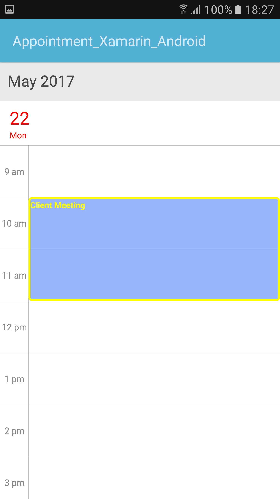

---

layout: post
title: Populating Appointments in Syncfusion SfSchedule control for Xamarin.Android
description: Learn how to Populate Appointments in SfSchedule control
platform: xamarin.android
control: SfSchedule
documentation: ug

---

# Appointments

[ScheduleAppointment](https://help.syncfusion.com/cr/cref_files/xamarin-android/sfschedule/Syncfusion.SfSchedule.Android~Com.Syncfusion.Schedule.ScheduleAppointment.html) is a class, which holds the details about the appointment to be rendered in schedule. It has some basic properties such as [StartTime](https://help.syncfusion.com/cr/cref_files/xamarin-android/sfschedule/Syncfusion.SfSchedule.Android~Com.Syncfusion.Schedule.ScheduleAppointment~StartTime.html), [EndTime](https://help.syncfusion.com/cr/cref_files/xamarin-android/sfschedule/Syncfusion.SfSchedule.Android~Com.Syncfusion.Schedule.ScheduleAppointment~EndTime.html), [Subject](https://help.syncfusion.com/cr/cref_files/xamarin-android/sfschedule/Syncfusion.SfSchedule.Android~Com.Syncfusion.Schedule.ScheduleAppointment~Subject.html) and some additional information about the appointment can be added using [Color](https://help.syncfusion.com/cr/cref_files/xamarin-android/sfschedule/Syncfusion.SfSchedule.Android~Com.Syncfusion.Schedule.ScheduleAppointment~Color.html), [Notes](https://help.syncfusion.com/cr/cref_files/xamarin-android/sfschedule/Syncfusion.SfSchedule.Android~Com.Syncfusion.Schedule.ScheduleAppointment~Notes.html), [Location](https://help.syncfusion.com/cr/cref_files/xamarin-android/sfschedule/Syncfusion.SfSchedule.Android~Com.Syncfusion.Schedule.ScheduleAppointment~Location.html), [All Day](https://help.syncfusion.com/cr/cref_files/xamarin-android/sfschedule/Syncfusion.SfSchedule.Android~Com.Syncfusion.Schedule.ScheduleAppointment~IsAllDay.html), [Recurring properties](https://help.syncfusion.com/cr/cref_files/xamarin-android/sfschedule/Syncfusion.SfSchedule.Android~Com.Syncfusion.Schedule.ScheduleAppointment~RecurrenceProperties.html).



using Com.Syncfusion.Schedule;
using Java.Util;

//Creating an instance for SfSchedule Control
SfSchedule schedule = new SfSchedule(this);

// Creating an instance for schedule appointment Collection
ScheduleAppointmentCollection scheduleAppointmentCollection = new   ScheduleAppointmentCollection();

Calendar currentDate = Calendar.Instance;
Calendar startTime = (Calendar)currentDate.Clone();

//setting start time for the event
startTime.Set(currentDate.Get(CalendarField.Year),
              currentDate.Get(CalendarField.Month),
              currentDate.Get(CalendarField.DayOfMonth),
              10, 0, 0);

Calendar endTime = (Calendar)currentDate.Clone();

//setting end time for the event
endTime.Set(currentDate.Get(CalendarField.Year),
            currentDate.Get(CalendarField.Month),
            currentDate.Get(CalendarField.DayOfMonth),
            12, 0, 0);

//Adding Schedule appointment in schedule appointment collection
scheduleAppointmentCollection.Add(new ScheduleAppointment()
{
    StartTime = startTime,
    EndTime = endTime,
    Subject = "Client Meeting",
    Color = Color.Red,
    Location = "Hutchison road",
});

//Adding schedule appointment collection to SfSchedule appointments
schedule.Appointments = scheduleAppointmentCollection;
SetContentView(schedule);



## Minimum Appointment Height

[MinHeight](https://help.syncfusion.com/cr/cref_files/xamarin-android/sfschedule/Syncfusion.SfSchedule.Android~Com.Syncfusion.Schedule.ScheduleAppointment~MinHeight.html) of an appointment is to set an arbitrary height to appointments when it has minimum duration, so that the subject can be readable.



SfSchedule schedule = new SfSchedule(this);
ScheduleAppointmentCollection scheduleAppointmentCollection = new ScheduleAppointmentCollection();
Calendar currentDate = Calendar.Instance;
Calendar startTime = (Calendar)currentDate.Clone();
Calendar endTime = (Calendar)currentDate.Clone();

startTime.Set(currentDate.Get(CalendarField.Year),
              currentDate.Get(CalendarField.Month),
              currentDate.Get(CalendarField.DayOfMonth),
              9,0,0);
endTime.Set(currentDate.Get(CalendarField.Year),
            currentDate.Get(CalendarField.Month),
            currentDate.Get(CalendarField.DayOfMonth),
            9,0,0);
Calendar startTime1 = (Calendar)currentDate.Clone();
Calendar endTime1 = (Calendar)currentDate.Clone();
startTime1.Set(currentDate.Get(CalendarField.Year),
               currentDate.Get(CalendarField.Month),
               currentDate.Get(CalendarField.DayOfMonth),
               11,0,0);
endTime1.Set(currentDate.Get(CalendarField.Year),
             currentDate.Get(CalendarField.Month),
             currentDate.Get(CalendarField.DayOfMonth),
             12,0,0);
scheduleAppointmentCollection.Add(new ScheduleAppointment()
{
    StartTime = startTime,
    EndTime = endTime,
    Subject = "Client Meeting",
    MinHeight = 30,
    Color = Color.ParseColor("#FFD80073")
});
scheduleAppointmentCollection.Add(new ScheduleAppointment()
{
    StartTime = startTime1,
    EndTime = endTime1,
    Subject = "Anniversary",
    Color = Color.ParseColor("#FFA2C139")
});
schedule.Appointments= scheduleAppointmentCollection;
SetContentView(schedule);



>**NOTE**
* `MinHeight` value will be set, when the an appointment height (duration) value lesser than MinHeight. 
* Appointment height (duration) value will be set, when the appointment height (duration) value greater than `MinHeight`.
* TimeInterval value will be set, when Minimum Height greater than TimeInterval with lesser appointment height (duration). 
* `MinHeight` has ScheduleAppointmentMapping Support. 
* All day Appointment does not support `MinHeight`.

## Spanned Appointments
Spanned Appointment is an appointment which lasts more than 24 hours.



using Com.Syncfusion.Schedule;
using Java.Util;

//Creating an instance for SfSchedule Control
SfSchedule schedule = new SfSchedule(this);

// Creating an instance for schedule appointment Collection
ScheduleAppointmentCollection scheduleAppointmentCollection = new   ScheduleAppointmentCollection();

Calendar currentDate = Calendar.Instance;
Calendar startTime = (Calendar)currentDate.Clone();

//setting start time for the event
startTime.Set(currentDate.Get(CalendarField.Year),
              currentDate.Get(CalendarField.Month),
              currentDate.Get(CalendarField.DayOfMonth),
              10, 0, 0);

Calendar endTime = (Calendar)currentDate.Clone();

//setting end time for the event
endTime.Set(currentDate.Get(CalendarField.Year),
            currentDate.Get(CalendarField.Month),
            currentDate.Get(CalendarField.DayOfMonth)+2,
            12, 0, 0);

//Adding Schedule appointment in schedule appointment collection
scheduleAppointmentCollection.Add(new ScheduleAppointment()
{
    StartTime = startTime,
    EndTime = endTime,
    Subject = "Client Meeting",
    Color = Color.Red,
    Location = "Hutchison road",
});

//Adding schedule appointment collection to SfSchedule appointments
schedule.Appointments = scheduleAppointmentCollection;
SetContentView(schedule);



## All Day Appointments
All-Day appointment is an appointment which is scheduled for a whole day. It can be set by using `IsAllDay` property in the `ScheduleAppointment`.



//Adding Schedule appointment in schedule appointment collection
scheduleAppointmentCollection.Add(new ScheduleAppointment()
{
    StartTime = startTime,
    EndTime = endTime,
    Subject = "Client Meeting",
    Color = Color.Red,
    Location = "Hutchison road",
    IsAllDay = true
});



### All-Day Appointment Panel
All-day appointment doesn't block out entire time slot in SfSchedule, rather it will render in separate layout exclusively for all-day appointment. It can be enabled by setting `ShowAllDay` property of `DayViewSettings`, `WeekViewSettings` and `WorkWeekViewSettings` of `DayView`, `WeekView` and `WorkWeekView` respectively.



//Setting schedule view
schedule.ScheduleView = ScheduleView.WeekView;

//Creating week view settings for SfSchedule WeekView
WeekViewSettings weekViewSettings = new WeekViewSettings();
weekViewSettings.ShowAllDay = true;
schedule.WeekViewSettings = weekViewSettings;



All-Day panel background can be customized by setting `AllDayAppointmentBackgroundColor` 
of the respective view settings.



weekViewSettings.AllDayAppointmentBackgroundColor = Color.Silver;



## Recurrence Appointment
Recurring appointment on a daily, weekly, monthly, or yearly interval. Recurring appointments can be created by enabling `RecurrenceRule` property in Schedule appointments.

### Recurrence Rule
The `RecurrenceRule` is a string value, that contains the details of the recurrence appointments like repeat type - daily/weekly/monthly/yearly, how many times it needs to be repeated, the interval duration and also the time period to render the appointment, etc.
`RecurrenceRule` has the following properties and based on this property value, the recurrence appointments are rendered in the SfSchedule control with its respective time period.

| PropertyName | Purpose |
|--------------|----------------------------------------------------------------------------------------------------------------------------------------------------------------------------------------------------------------------------------------------------------------------------------------------------------------------------------------------------------------------------------------------------------------------------------------------------|
| FREQ | Maintains the Repeat type value of the appointment. (Example: Daily, Weekly, Monthly, Yearly, Every week day) Example: FREQ=DAILY;INTERVAL=1 |
| INTERVAL | Maintains the interval value of the appointments. For example, when you create the daily appointment at an interval of 2, the appointments are rendered on the days Monday, Wednesday and Friday. (creates the appointment on all days by leaving the interval of one day gap) Example: FREQ=DAILY;INTERVAL=1 |
| COUNT | It holds the appointment’s count value. For example, when the recurrence appointment count value is 10, it means 10 appointments are created in the recurrence series. Example: FREQ=DAILY;INTERVAL=1;COUNT=10 |
| UNTIL | This property is used to store the recurrence end date value. For example, when you set the end date of appointment as 6/30/2014, the UNTIL property holds the end date value when the recurrence actually ends. Example: FREQ=DAILY;INTERVAL=1;UNTIL=8/25/2014 |
| BYDAY | It holds the “DAY” values of an appointment to render.For example, when you create the weekly appointment, select the day(s) from the day options (Monday/Tuesday/Wednesday/Thursday/Friday/Saturday/Sunday).  When Monday is selected, the first two letters of the selected day “MO” is stored in the “BYDAY” property.  When you select multiple days, the values are separated by commas. Example: FREQ=WEEKLY;INTERVAL=1;BYDAY=MO,WE;COUNT=10 |
| BYMONTHDAY | This property is used to store the date value of the Month while creating the Month recurrence appointment. For example, when you create a Monthly recurrence appointment in the date 3, it means the BYMONTHDAY holds the value 3 and creates the appointment on 3rd day of every month. Example: FREQ=MONTHLY;BYMONTHDAY=3;INTERVAL=1;COUNT=10 |
| BYMONTH | This property is used to store the index value of the selected Month while creating the yearly appointments. For example, when you create the yearly appointment in the Month June, it means the index value for June month is 6 and it is stored in the BYMONTH field.  The appointment is created on every 6th month of a year. Example: FREQ=YEARLY;BYMONTHDAY=16;BYMONTH=6;INTERVAL=1;COUNT=10 |
| BYSETPOS | This property is used to store the index value of the week. For example, when you create the monthly appointment in second week of the month, the index value of the second week (2) is stored in BYSETPOS. Example: FREQ=MONTHLY;BYDAY=MO;BYSETPOS=2;UNTIL=8/11/2014 |

### Recurrence Pattern
Recurrence pattern used in the control are in iCal standard. Schedule control supports all four types of [recurrence patterns](https://help.syncfusion.com/cr/cref_files/xamarin-android/sfschedule/Syncfusion.SfSchedule.Android~Com.Syncfusion.Schedule.RecurrenceProperties.html).

| RecurrenceType | RecurrenceProperties | Description                                                                                 |
|----------------|----------------------|---------------------------------------------------------------------------------------------|
| Daily          | Interval             | Gets or sets the day interval on which recurrence has to be set.                            |
| 				 | IsDailyEveryNDays    | Checks whether the event occurs Daily Every N days.                                         |
| Weekly         | Interval             | Gets or sets the day interval on which recurrence has to be set.                            |
|                | DayOfWeek            | Gets or sets the day of week on which recurrence has to be set.                             |
|                | WeekDays             | Gets or sets the day/days in a week on which recurrence has to be set.                      |
|				 | Week					| Gets or sets the week of month on which recurrence has to be set.							  |
| Monthly        | Interval             | Gets or sets the day interval on which  recurrence has to be set.                           |
|                | DayOfWeek            | Gets or sets the day of week on which  recurrence has to be set.                            |
|				 | Week					| Gets or sets the week of month on which recurrence has to be set.							  |
|                | DayOfMonth           | Gets or sets the day on which recurrence has to be set for every month.                     |
|				 | IsMonthlySpecific    | Checks whether the event is Monthly specific event.										  |
| Yearly         | Interval             | Gets or sets the day interval on which recurrence has to be set.                            |
|                | DayOfMonth           | Gets or sets the day on which recurrence has to be set for every month.                     |
|                | DayOfWeek            | Gets or sets the day of week on which  recurrence has to be set.                            |
|				 | Month				| Gets or sets the specific month of year on which recurrence has to be set.				  |
|				 | Week					| Gets or sets the week of month on which recurrence has to be set.							  |
|				 | IsYearlySpecific     | Checks whether the event is Yearly Specific.												  |
| Common         | RecurrenceRange      | Gets or sets the type of the recurrence range for the time limit of recurrence appointment. |
|                | RecurrenceCount      | Gets or sets the count for recurring appointment.                                           |
|                | StartDate            | Gets or sets the date to start the recurrence appointment.                                  |
|                | EndDate              | Gets or sets the date to end the recurrence appointment.                                    |
| 				 | IsSpecific			| Checks whether the event occurs in specific recurrence type.								  |

Find the following `RecurrenceRule` possibilities available in the Schedule control while creating the recurrence appointment.

| PossibilityType | Description | RecurrenceProperties | Examples |
|-----------------|----------------------------------------------------------------|----------------------------------------------------------------------------------------------------------------------------------------------------------------------------------------------------------------------------------------------------------|-----------------------------------------------------------------------|
| Daily | Appointment is created with Ends Never | RecurrenceType = RecurrenceType.Daily, Interval = 1, IsDailyEveryNDays = true, RecurrenceRange = RecurrenceRange.NoEndDate | FREQ=DAILY; INTERVAL=1 |
|  | Appointment is created with Ends After | RecurrenceType = RecurrenceType.Daily, Interval = 1, IsDailyEveryNDays = true, RecurrenceRange = RecurrenceRange.Count, RecurrenceCount = 15 | FREQ=DAILY; INTERVAL=1; COUNT=5 |
|  | Appointment is created with Ends On | RecurrenceType = RecurrenceType.Daily, Interval = 1, IsDailyEveryNDays = true, RecurrenceRange = RecurrenceRange.EndDate, EndDate = new DateTime(2017, 06, 20) | FREQ=DAILY; INTERVAL=1; UNTIL=06/20/2017 |
|  | Appointment is created with Every (Interval) | RecurrenceType = RecurrenceType.Daily, Interval = 2, IsDailyEveryNDays = true, RecurrenceRange = RecurrenceRange.Count, RecurrenceCount = 10 | FREQ=DAILY; INTERVAL=2; COUNT=10 |
| Weekly | Appointment is created with Ends Never | RecurrenceType = RecurrenceType.Weekly, Interval = 1, WeekDays = WeekDays.Monday|WeekDays.Wednesday|WeekDays.Friday, RecurrenceRange = RecurrenceRange.NoEndDate | FREQ=WEEKLY; INTERVAL=1; BYDAY=MO, WE, FR |
|  | Appointment is created with Ends After | RecurrenceType = RecurrenceType.Weekly, Interval = 1, WeekDays = WeekDays.Thursday, RecurrenceRange = RecurrenceRange.Count, RecurrenceCount = 10 | FREQ=WEEKLY; INTERVAL=1; BYDAY=TH; COUNT=10 |
|  | Appointment is created with Ends On | RecurrenceType = RecurrenceType.Weekly, Interval = 1, WeekDays = WeekDays.Monday, RecurrenceRange = RecurrenceRange.EndDate, EndDate = new DateTime(2017, 07, 20) | FREQ=WEEKLY; INTERVAL=1; BYDAY=MO; UNTIL=07/20/2017 |
|  | Appointment is created with selecting multiple day | RecurrenceType = RecurrenceType.Weekly, Interval = 2, WeekDays = WeekDays.Monday|WeekDays.Wednesday|WeekDays.Friday, RecurrenceRange = RecurrenceRange.Count, RecurrenceCount = 10 | FREQ=WEEKLY; INTERVAL=2; BYDAY=MO, WE, FR; COUNT=10 |
| Every Day | Appointment is created with Ends Never | RecurrenceType = RecurrenceType.Weekly, Interval = 1, WeekDays = WeekDays.Monday|WeekDays.Tuesday|WeekDays.Wednesday|WeekDays.Thursday|WeekDays.Friday, RecurrenceRange = RecurrenceRange.NoEndDate | FREQ=WEEKLY; BYDAY=MO, TU, WE, TH, FR |
|  | Appointment is created with Ends After | RecurrenceType = RecurrenceType.Weekly, Interval = 1, WeekDays = WeekDays.Monday|WeekDays.Tuesday|WeekDays.Wednesday|WeekDays.Thursday | WeekDays.Friday, RecurrenceRange = RecurrenceRange.Count, RecurrenceCount = 10 | FREQ=WEEKLY; BYDAY=MO, TU, WE, TH, FR; COUNT=10 |
|  | Appointment is created with Ends On | RecurrenceType = RecurrenceType.Weekly, Interval = 1, WeekDays = WeekDays.Monday|WeekDays.Tuesday|WeekDays.Wednesday|WeekDays.Thursday|WeekDays.Friday, RecurrenceRange = RecurrenceRange.EndDate, EndDate = new DateTime(2017, 07, 15) | FREQ=WEEKLY; BYDAY=MO, TU, WE, TH, FR; UNTIL=07/15/2017 |
| Monthly | Appointment is created with selected date Ends Never | RecurrenceType = RecurrenceType.Monthly, Interval = 1, IsMonthlySpecific = true, DayOfMonth = 15, RecurrenceRange = RecurrenceRange.NoEndDate | FREQ=MONTHLY; BYMONTHDAY=15; INTERVAL=1 |
|  | Appointment is created with selected date and Ends After | RecurrenceType = RecurrenceType.Monthly, Interval = 1, IsMonthlySpecific = true, DayOfMonth = 16, RecurrenceRange = RecurrenceRange.Count, RecurrenceCount = 10 | FREQ=MONTHLY; BYMONTHDAY=16; INTERVAL=1; COUNT=10 |
|  | Appointment is created with selected date and Ends On | RecurrenceType = RecurrenceType.Monthly, Interval = 1, IsMonthlySpecific = true, DayOfMonth = 16, RecurrenceRange = RecurrenceRange.EndDate, EndDate = new DateTime(2018, 06, 11) | FREQ=MONTHLY; BYMONTHDAY=17; INTERVAL=1; UNTIL=06/11/2018 |
|  | Appointment is created with selected day Ends Never | RecurrenceType = RecurrenceType.Monthly, Interval = 1, Week = 2, DayOfWeek = 6, RecurrenceRange = RecurrenceRange.NoEndDate | FREQ=MONTHLY; BYDAY=FR; BYSETPOS=2; INTERVAL=1 |
|  | Appointment is created with selected day and Ends After | RecurrenceType = RecurrenceType.Monthly, Interval = 1, Week = 4, DayOfWeek = 4, RecurrenceRange = RecurrenceRange.Count, RecurrenceCount = 10 | FREQ=MONTHLY; BYDAY=WE; BYSETPOS=4; INTERVAL=1; COUNT=10 |
|  | Appointment is created with selected day and Ends On | RecurrenceType = RecurrenceType.Monthly, Interval = 1, Week = 4, DayOfWeek = 6, RecurrenceRange = RecurrenceRange.EndDate, EndDate = new DateTime(2018, 06, 11) | FREQ=MONTHLY; BYDAY=FR; BYSETPOS=4; INTERVAL=1; UNTIL=06/11/2018 |
| Yearly | Appointment is created with selected date and month Ends Never | RecurrenceType = RecurrenceType.Yearly, IsYearlySpecific = true, Interval = 1, Month = 12, DayOfMonth = 15, RecurrenceRange = RecurrenceRange.NoEndDate | FREQ=YEARLY; BYMONTHDAY=15; BYMONTH=12; INTERVAL=1 |
|  | Appointment is created with selected date and month Ends After | RecurrenceType = RecurrenceType.Yearly, IsYearlySpecific = true, Interval = 1, Month = 12, DayOfMonth = 10, RecurrenceRange = RecurrenceRange.Count, RecurrenceCount = 10 | FREQ=YEARLY; BYMONTHDAY=10; BYMONTH=12; INTERVAL=1; COUNT=10 |
|  | Appointment is created with selected date and month Ends On | RecurrenceType = RecurrenceType.Yearly, IsYearlySpecific = true, Interval = 1, Month = 12, DayOfMonth = 12, RecurrenceRange = RecurrenceRange.EndDate, EndDate = new DateTime(2018, 06, 11) | FREQ=YEARLY; BYMONTHDAY=12; BYMONTH=12; INTERVAL=1; UNTIL=06/11//2018 |
N> `SfSchedule` does not support Editing and Deleting of Recurring appointment's occurrences.

### Adding Recurrence Appointment using Recurrence Builder
Schedule appointment [RecurrenceRule](https://help.syncfusion.com/cr/cref_files/xamarin-android/sfschedule/Syncfusion.SfSchedule.Android~Com.Syncfusion.Schedule.ScheduleAppointment~RecurrenceRule.html) is used to populate the required recurring appointment collection in a specific pattern. `RRULE` can be easily created through `RecurrenceBuilder` engine by simple APIs available in Schedule control.



// Creating instance for schedule appointment collection
ScheduleAppointmentCollection scheduleAppointmentCollection = new ScheduleAppointmentCollection();

//Adding schedule appointment in schedule appointment collection
var scheduleAppointment = new ScheduleAppointment()
{
    StartTime = startTime,
    EndTime = endTime,
    Subject = "Client Meeting",
    Location = "Hutchison road",
};

//Adding schedule appointment in schedule appointment collection
scheduleAppointmentCollection.Add(scheduleAppointment);

// Creating recurrence rule
RecurrenceProperties recurrenceProperties = new RecurrenceProperties();
recurrenceProperties.RecurrenceType = RecurrenceType.Daily;
recurrenceProperties.RecurrenceRange = RecurrenceRange.Count;
recurrenceProperties.Interval = 2;
recurrenceProperties.IsDailyEveryNDays = true;
recurrenceProperties.RecurrenceCount = 10;

// Setting recurrence rule to schedule appointment
scheduleAppointment.RecurrenceRule = ScheduleHelper.RRuleGenerator(recurrenceProperties, scheduleAppointment.StartTime, scheduleAppointment.EndTime);

//Adding Schedule appointment collection to SfSchedule appointments
schedule.Appointments = scheduleAppointmentCollection;



## Appearance Customization
The default appearance of the appointment can be customized by using the [AppointmentStyle](https://help.syncfusion.com/cr/cref_files/xamarin-android/sfschedule/Syncfusion.SfSchedule.Android~Com.Syncfusion.Schedule.AppointmentStyle.html) property and [AppointmentLoadedEvent](https://help.syncfusion.com/cr/cref_files/xamarin-android/sfschedule/Syncfusion.SfSchedule.Android~Com.Syncfusion.Schedule.AppointmentLoadedEventArgs.html). The event and property is used to customize or override the default template of the Appointments.

•	[Customize appearance using Style](https://help.syncfusion.com/xamarin-android/sfschedule/data-bindings#customize-appearance-using-style) 
•	[Customize appearance using Event](https://help.syncfusion.com/xamarin-android/sfschedule/data-bindings#customize-appearance-using-event)
•	[Customize appearance using Custom View](https://help.syncfusion.com/xamarin-android/sfschedule/data-bindings#customize-appearance-using-custom-view)

### Customize appearance using Style
Schedule appointment can be customized by setting appointment style properties such as [TextColor](https://help.syncfusion.com/cr/cref_files/xamarin-android/sfschedule/Syncfusion.SfSchedule.Android~Com.Syncfusion.Schedule.AppointmentStyle~TextColor.html), [TextStyle](https://help.syncfusion.com/cr/cref_files/xamarin-android/sfschedule/Syncfusion.SfSchedule.Android~Com.Syncfusion.Schedule.AppointmentStyle~TextStyle.html), [BorderColor](https://help.syncfusion.com/cr/cref_files/xamarin-android/sfschedule/Syncfusion.SfSchedule.Android~Com.Syncfusion.Schedule.AppointmentStyle~BorderColor.html), [BorderCornerRadius](https://help.syncfusion.com/cr/cref_files/xamarin-android/sfschedule/Syncfusion.SfSchedule.Android~Com.Syncfusion.Schedule.AppointmentStyle~BorderCornerRadius.html), [BorderWidth](https://help.syncfusion.com/cr/cref_files/xamarin-android/sfschedule/Syncfusion.SfSchedule.Android~Com.Syncfusion.Schedule.AppointmentStyle~BorderWidth.html) to the `AppointmentStyle` property of `SfSchedule`.



//Creating appointment style
AppointmentStyle appointmentStyle = new AppointmentStyle();
appointmentStyle.TextColor = Color.Red;
appointmentStyle.TextStyle = Typeface.Create("Calibri", TypefaceStyle.Bold);
appointmentStyle.BorderColor = Color.Blue;
appointmentStyle.BorderCornerRadius = 12;
appointmentStyle.BorderWidth = 10;

//Setting appointment style
schedule.AppointmentStyle = appointmentStyle;



### Customize appearance using Event
Schedule appointment can be customized during runtime using [AppointmentLoadedEvent](https://help.syncfusion.com/cr/cref_files/xamarin-android/sfschedule/Syncfusion.SfSchedule.Android~Com.Syncfusion.Schedule.AppointmentLoadedEventArgs.html). `ScheduleAppointment` style can be customized using the `AppointmentStyle` property.

[AppointmentLoadedEventArgs](https://help.syncfusion.com/cr/cref_files/xamarin-android/sfschedule/Syncfusion.SfSchedule.Android~Com.Syncfusion.Schedule.AppointmentLoadedEventArgs.html) has below properties,

•	[Appointment](https://help.syncfusion.com/cr/cref_files/xamarin-android/sfschedule/Syncfusion.SfSchedule.Android~Com.Syncfusion.Schedule.AppointmentLoadedEventArgs~Appointment.html) – Contains the appointments values.
•	[AppointmentStyle](https://help.syncfusion.com/cr/cref_files/xamarin-android/sfschedule/Syncfusion.SfSchedule.Android~Com.Syncfusion.Schedule.AppointmentLoadedEventArgs~AppointmentStyle.html) – Gets and sets the appointments style.
•	[View](https://help.syncfusion.com/cr/cref_files/xamarin-android/sfschedule/Syncfusion.SfSchedule.Android~Com.Syncfusion.Schedule.AppointmentLoadedEventArgs~View.html) -  Sets the Custom UI for Appointments.
•	[Bounds](https://help.syncfusion.com/cr/cref_files/xamarin-android/sfschedule/Syncfusion.SfSchedule.Android~Com.Syncfusion.Schedule.AppointmentLoadedEventArgs~Bounds.html) – Contains the UI bounds of appointment.


  
schedule.AppointmentLoaded += schedule_AppointmentLoaded ;

...

private void schedule_AppointmentLoaded(object sender, AppointmentLoadedEventArgs args)
{
    args.AppointmentStyle = new AppointmentStyle();
    
    if(args.Appointment != null && args.Appointment.IsAllDay)
    {
        args.AppointmentStyle.BorderColor = Color.Red;
        args.AppointmentStyle.BorderCornerRadius = 12;
        args.AppointmentStyle.TextColor= Color.White;
        args.AppointmentStyle.BorderWidth = 10;
    }
    else
    {
        args.AppointmentStyle.BorderColor = Color.Blue;
        args.AppointmentStyle.BorderCornerRadius = 12;
        args.AppointmentStyle.TextColor= Color.Red;
        args.AppointmentStyle.BorderWidth = 10;
    }
}



## Customize appearance using Custom View
Default appointment UI can be changed using `View` property passed through `AppointmentLoadedEventArgs`.



schedule.AppointmentLoaded += schedule_AppointmentLoaded;

...

private void schedule_AppointmentLoaded(object sender, AppointmentLoadedEventArgs args)
{
    if (args.Appointment == null)
        return;
    if(args.Appointment.IsAllDay)
    {
        TextView textView = new TextView(this);
        textView.SetTextColor(Color.Black);
        textView.SetBackgroundColor(GetAndroidColorFromInt(args.Appointment.Color));
        textView.Text = arg.Appointment.Subject;
        arg.View = textView;
    }
    else if (args.Appointment.Subject == "Retrospective")
    {
        ImageButton button = new ImageButton(this);
        button.SetImageResource(Resource.Drawable.Meeting); // Meeting as Image name
        button.SetBackgroundColor(GetAndroidColorFromInt(args.Appointment.Color));
        arg.View = button;
    }
    else
    {
        ImageButton button = new ImageButton(this);
        button.SetImageResource(Resource.Drawable.Cake); // Cake as Image name
        button.SetBackgroundColor(GetAndroidColorFromInt(args.Appointment.Color));
        arg.View = button;
    }
}



### Customize Font Appearance

You can change the appearance of Font by setting the [TextStyle](https://help.syncfusion.com/cr/cref_files/xamarin-android/sfschedule/Syncfusion.SfSchedule.Android~Com.Syncfusion.Schedule.AppointmentStyle~TextStyle.html) property of [AppointmentStyle](https://help.syncfusion.com/xamarin-android/sfschedule/data-bindings#appearance-customization) property in Schedule.



 appointmentStyle.TextStyle = Typeface.CreateFromAsset(Assets, "Lobster-Regular.ttf");     



Refer [this](https://help.syncfusion.com/xamarin-android/sfschedule/monthview#custom-font-setting-in-xamarinandroid) to configure the custom fonts in Xamarin.Android.

## Selection
Schedule control has built-in events to handle tapped, double tapped and long pressed touch actions.

•	[CellTapped](https://help.syncfusion.com/cr/cref_files/xamarin-android/sfschedule/Syncfusion.SfSchedule.Android~Com.Syncfusion.Schedule.CellTappedEventArgs.html)
•	[CellDoubleTapped](https://help.syncfusion.com/cr/cref_files/xamarin-android/sfschedule/Syncfusion.SfSchedule.Android~Com.Syncfusion.Schedule.CellTappedEventArgs.html)
•	[CellLongPressed](https://help.syncfusion.com/cr/cref_files/xamarin-android/sfschedule/Syncfusion.SfSchedule.Android~Com.Syncfusion.Schedule.CellTappedEventArgs.html)

These events will be triggered while perform respective touch actions in timeslots, month cells and in appointments. All the three events contain the same argument [CellTappedEventArgs](https://help.syncfusion.com/cr/cref_files/xamarin-android/sfschedule/Syncfusion.SfSchedule.Android~Com.Syncfusion.Schedule.CellTappedEventArgs.html) which holds selected appointment and date time details in it.

• [Appointment](https://help.syncfusion.com/cr/cref_files/xamarin-android/sfschedule/Syncfusion.SfSchedule.Android~Com.Syncfusion.Schedule.CellTappedEventArgs~SelectedAppointment.html) -  Contains the selected appointment value, it will be null, if any time slots selected.
• [Calendar](https://help.syncfusion.com/cr/cref_files/xamarin-android/sfschedule/Syncfusion.SfSchedule.Android~Com.Syncfusion.Schedule.CellTappedEventArgs~Calendar.html) - Contains selected time slot DateTime value.



schedule.CellTapped += Schedule_CellTapped;
schedule.CellDoubleTapped += Schedule_CellDoubleTapped;
schedule.CellLongPressed += Schedule_CellLongPressed;

...

private void Schedule_CellTapped(object sender, CellTappedEventArgs e)
{
}
private void Schedule_CellDoubleTapped(object sender, CellTappedEventArgs e)
{
}
private void Schedule_CellLongPressed(object sender, CellTappedEventArgs e)
{
}




### Selection customization
The default selection of an appointment can be customized by using [SelectionBorderColor](https://help.syncfusion.com/cr/cref_files/xamarin-android/sfschedule/Syncfusion.SfSchedule.Android~Com.Syncfusion.Schedule.AppointmentStyle~SelectionBorderColor.html), [SelectionTextColor](https://help.syncfusion.com/cr/cref_files/xamarin-android/sfschedule/Syncfusion.SfSchedule.Android~Com.Syncfusion.Schedule.AppointmentStyle~SelectionTextColor.html) properties in `AppointmentStyle` property of `SfSchedule`. The property is used to customize or override the default selection of the appointments.

N> `BorderWidth` value must be set to highlight `SelectionBorderColor`.



//Creating an appointment style
AppointmentStyle appointmentStyle = new AppointmentStyle();
appointmentStyle.SelectionBorderColor = Color.Yellow;
appointmentStyle.SelectionTextColor = Color.Yellow;

//Setting an appointment style
schedule.AppointmentStyle = appointmentStyle;



