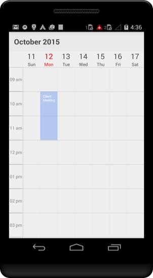

# Data Bindings 

Schedule control has an built-in capability to handle the appointment arrangement internally based on the `ScheduleAppointment` collections. `ScheduleAppointment` is a class, which holds the details about the appointment to be rendered in schedule. Schedule Appointments collection can be provided to schedule using the following method.

## Adding appointments using Collection

`ScheduleAppointment` has some basic properties such as StartTime, EndTime, Subject and some additional information about the appointment can be added using Color, Notes, Location, All Day, Recursive properties.

Create the collection of the ScheduleAppointments by setting required details using above mentioned properties for each appointment. And then assign the created collection to the `Appointments` property of `SfSchedule` as like in below code example.



	ScheduleAppointmentCollection appointmentCollection;
	//..//
	//creating new instance for schedule
	SfSchedule sfschedule = new SfSchedule(this);
	sfschedule.ScheduleView = ScheduleView.WeekView;
	appointmentCollection = new ScheduleAppointmentCollection();
	
	//Creating new event
	ScheduleAppointment clientMeeting = new ScheduleAppointment();

	Calendar currentDate = Calendar.Instance;
	Calendar startTime = (Calendar)currentDate.Clone();

	//setting start time for the event
	startTime.Set(
	currentDate.Get(CalendarField.Year),
	currentDate.Get(CalendarField.Month),
	currentDate.Get(CalendarField.DayOfMonth),
	10, 0, 0
	);

	Calendar endTime = (Calendar)currentDate.Clone();

	//setting end time for the event
	endTime.Set(
	currentDate.Get(CalendarField.Year),
	currentDate.Get(CalendarField.Month),
	currentDate.Get(CalendarField.DayOfMonth),
	12, 0, 0
	);

	clientMeeting.StartTime = startTime;
	clientMeeting.EndTime = endTime;
	clientMeeting.Color = Color.Blue;

	//setting Subject for the event
	clientMeeting.Subject = "ClientMeeting";

	//adding event into the collection
	appointmentCollection.Add(clientMeeting);
	sfschedule.Appointments = appointmentCollection;

	// Set our view from the "main" layout resource
	SetContentView(sfschedule);



### Adding AllDayAppointments 

AllDayAppointment is for setting appointmet for fullday by using `ShowAllDay` property in the `ScheduleAppointment`. Create the collection of the `ScheduleAppointments` by setting required details using above mentioned properties for each appointment. And then assign the created collection to the `Appointment` property of `SfSchedule` as like in below code example.



	ScheduleAppointmentCollection appointmentCollection;
	//..//
	//creating new instance for schedule
	SfSchedule sfschedule = new SfSchedule(this);
	sfschedule.ScheduleView = ScheduleView.WeekView;
	appointmentCollection = new ScheduleAppointmentCollection();

	//Creating new event
	ScheduleAppointment clientMeeting = new ScheduleAppointment();

	Calendar currentDate = Calendar.Instance;
	Calendar startTime = (Calendar)currentDate.Clone();

	//setting start time for the event
	startTime.Set(
	currentDate.Get(CalendarField.Year),
	currentDate.Get(CalendarField.Month),
	currentDate.Get(CalendarField.DayOfMonth),
	10, 0, 0
	);

	Calendar endTime = (Calendar)currentDate.Clone();

	//setting end time for the event
	endTime.Set(
	currentDate.Get(CalendarField.Year),
	currentDate.Get(CalendarField.Month),
	currentDate.Get(CalendarField.DayOfMonth),
	12, 0, 0
	);

	clientMeeting.StartTime = startTime;
	clientMeeting.EndTime = endTime;
	clientMeeting.Color = Color.Blue;

	//setting Subject for the event
	clientMeeting.Subject = "ClientMeeting";

	//adding event into the collection
	appointmentCollection.Add(clientMeeting);
	sfschedule.Appointments = appointmentCollection;

	// Set our view from the "main" layout resource
	SetContentView(sfschedule);



### Adding Recurrence Appointments  

Recursive appointments can be created by enabling `IsRecursive` property in Schedule appointments, to know more about adding appointments in the control, refer `ScheduleAppointment`.

And then need to set the RecurrenceRule to populate the required recursive appointment collection in a specific pattern.RRULE can be easily created through `RecurrenceBuilder` engine by simple APIs available in Schedule control.

Recursive appointment can be created in any recurrence patterns, for instance, some events can be repeated every week such as “Server maintenance”, where as some on them may repeat every year like wedding anniversary. 

To know more about customization of all day appointment panel refer [Recurrence Appointments](/xamarin-android/sfschedule/Recurrence "Recurrence Pattern")

### Appointment Editor

Appointments can be edit using this Appointmenteditor by tapping the Appointment using `ScheduleCellTapped`event and set the required properties of `ScheduleAppointment` for editing, To know more about Appointment Editor please refer the KB (Knowledge Base).

## Appointment Customization

ScheduleAppointment can be customized using the `AppointmentStyle` property. To know more about customization of Schedule Appointment refer [View Customization](/xamarin-android/sfschedule/View-Customization "View Customization")

