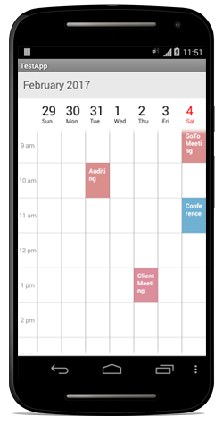

# Date Navigation and Gesture

## Min Date

Visible dates can be restricted to certain range of dates using `MinDisplayDate` property available in Schedule control. It is applicable in all the schedule views.

So that beyond the min date range, it will restrict date navigations features of Forward(), Backward(), MoveToDate and also can’t swipe the control using touch gesture beyond the min date range. Also, beyond the min date range, selection will also not works for month view. So that tapped events while tapped on the month cell will not be listened. Thus Inline feature in month view will works only within the min max date range.



	//creating new instance for schedule
	SfSchedule sfschedule = new SfSchedule(this);
	sfschedule.ScheduleView = ScheduleView.MonthView;

	Calendar currentDate = Calendar.Instance;
	Calendar minDate = (Calendar)currentDate.Clone();
	minDate.Set(2015, 5, 12);

	sfschedule.MinDisplayDate = minDate;

	// Set our view from the "main" layout resource
	SetContentView(sfschedule);



## Max Date

Visible dates can be restricted to certain range of dates using `MaxDisplayDate` properties available in Schedule control. It is applicable in all the schedule views.

So that beyond the max date range, it will restrict date navigations features of Forward(), Backward(), MoveToDate() and also can’t swipe the control using touch gesture beyond the max date range. Also, beyond the max date range, selection will also not works for month view. So that tapped events while tapped on the month cell will not be listened. Thus Inline feature in month view will works only within the min max date range.



	//creating new instance for schedule
	SfSchedule sfschedule = new SfSchedule(this);
	sfschedule.ScheduleView = ScheduleView.MonthView;

	Calendar currentDate = Calendar.Instance;
	Calendar maxDate = (Calendar)currentDate.Clone();
	maxDate.Set(2015, 11, 12);

	sfschedule.MaxDisplayDate = maxDate;

	// Set our view from the "main" layout resource
	SetContentView(sfschedule);



## FirstDay of the Week

By default schedule control will be rendered with Sunday as the first day of the week, it can be customized to any day of the week by `FirstDayOfWeek` property of `SfSchedule`.



	//setting first day of the week
	sfschedule.FirstDayOfWeek = Calendar.Tuesday;



## Visible Dates event

Appointments can be loaded in schedule after the visible dates has changed using `VisibleDatesChanged` event in Schedule. To know more about the event refer the following KB.

## Forward

By default the date can be navigated to next view using touch gesture, by swiping the control in right to left direction. The view can be also changed programmatically using `Forward()` method available in `SfSchedule`. So that next immediate visible dates will be viewed. It will move to next month if the schedule views is month, similarly it will move to next week for week view and next day for day view.



	//using schedule forward()
	sfschedule.Forward();



>**NOTE**  It can be navigated until it reaches the Min Max dates.

## Backward

By default the date can be navigated to previous view using touch gesture, by swiping the control in left to right direction. The view can be also changed programmatically using `Backward()` method available in `SfSchedule`. So that previous immediate visible dates will be displayed. It will move to previous month if the schedule views is month, similarly it will move to previous week for week view and previous day for day view.



	//using schedule backward()
	sfschedule.Backward();



>**NOTE** It can be navigated until it reaches the Min Max dates.

## Move to Date 

Visible dates can be moved to specific date using `MoveToDate` property available in `SfSchedule`. It will move to any specific date if the `schedule view` is Day View, similarly it will move to the specific week if it is week view and to specific month if it is month view.



	Calendar moveToSpecificDate = Calendar.Instance;
	moveToSpecificDate.Set(2015, 7, 25);

	//navigating to specific date
	sfschedule.MoveToDate=moveToSpecificDate;

	// Set our view from the "main" layout resource
	SetContentView(sfschedule);



>**NOTE**  The specified date should lies between `MinDisplayDate` and `MaxDisplayDate` , if  the specified date is greater than `MaxDisplayDate` then the view moved to `MaxDisplayDate` similarly if the specified date is lesser than the `MinDisplayDate` then the view moved to `MinDisplayDate`.

## Enable/disable navigation

By default Schedule views can be moved backwards and forwards using touch swipe gesture. This navigation, using touch gesture can be enabled and disabled using `EnableNavigation` property available in `SfSchedule`. By default this is enabled.



	//disabling navigation gesture
	sfschedule.EnableNavigation = false;

	// Set our view from the "main" layout resource
	SetContentView(sfschedule);



## Cell tapped event

`ScheduleTappedEvent` enables to know the details of the appointment and dates passed for an appointment.



    sfschedule.ScheduleTappedEvent += (object sender, SfSchedule.ScheduleTappedEventArgs e) =>
    {
    var date = e.P1;
    var appointmentCollection = e.P2;
    var appointment = e.P3;
    };



## Selection

Cells can be selected using customized properties such as `BackgroundColor`, `BorderColor`,`BorderThickness`,`CornerRadius` in the `selectionStyle` property of Schedule. Also view can be passed using the `SelectionView` in Schedule. To know more about customization of selection refer [View Customization](/xamarin-android/sfschedule/View-Customization "View Customization")

## Transition modes

Dates can be navigated by using swipe gesture as well as using built-in methods (Forward() and Backward()). By default those navigation are performed along with `Scroll` transition. Other than the default scroll animation, there are other options available like Card, Reveal, Float transitions is also available with it. It can be changed by using `TransitionMode` property of `SfSchedule`.



	//creating new instance for schedule
	sfschedule = new SfSchedule(this);
	//setting schedule view
	sfschedule.ScheduleView = ScheduleView.DayView;

	//setting transition mode
	sfschedule.TransitionMode = TransitionMode.Reveal;

	// Set our view from the "main" layout resource
	SetContentView(sfschedule);



