---

layout: post
title: Customize the Schedule DayView at SfSchedule control for Xamarin.Android
description: Learn how to Customize the schedule DayView in SfSchedule control
platform: xamarin.Android
control: SfSchedule
documentation: ug

---

# DayView
Day view is used to display a single day; current day will be visible by default. Appointments on a specific day will be arranged in respective timeslots based on its duration.

## ViewHeader Appearance
You can customize the default appearance of view header in [DayView](https://help.syncfusion.com/cr/cref_files/xamarin-android/sfschedule/Syncfusion.SfSchedule.Android~Com.Syncfusion.Schedule.Enums.ScheduleView.html) by using [ViewHeaderStyle](https://help.syncfusion.com/cr/cref_files/xamarin-android/sfschedule/Syncfusion.SfSchedule.Android~Com.Syncfusion.Schedule.SfSchedule~ViewHeaderStyle.html) property of [SfSchedule](https://help.syncfusion.com/cr/cref_files/xamarin-android/sfschedule/Syncfusion.SfSchedule.Android~Com.Syncfusion.Schedule.SfSchedule.html).



          //Create new instance of Schedule
			SfSchedule schedule = new SfSchedule(this);
			schedule.ScheduleView = ScheduleView.DayView;
			//Customize the schedule view header
			ViewHeaderStyle viewHeaderStyle = new ViewHeaderStyle();
			viewHeaderStyle.BackgroundColor = Color.Rgb(0, 150, 136);
			viewHeaderStyle.DayTextColor = Color.Rgb(255, 255, 255);
			viewHeaderStyle.DateTextColor = Color.Rgb(255, 255, 255);
			viewHeaderStyle.DayTextStyle = Typeface.DefaultFromStyle(TypefaceStyle.Italic);
			viewHeaderStyle.DateTextStyle = Typeface.DefaultFromStyle(TypefaceStyle.Italic);
			schedule.ViewHeaderStyle = viewHeaderStyle;


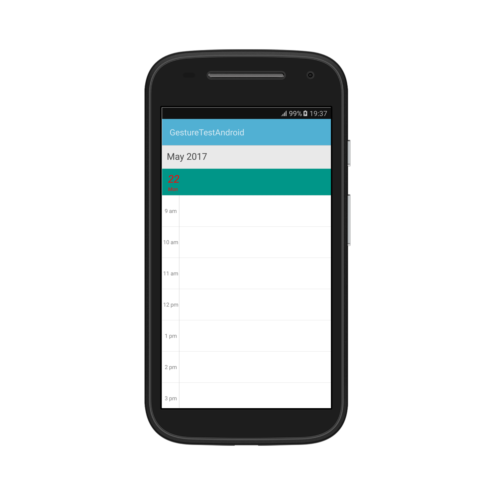

You can customize the height of the ViewHeader in `DayView` by setting [ViewHeaderHeight](https://help.syncfusion.com/cr/cref_files/xamarin-android/sfschedule/Syncfusion.SfSchedule.Android~Com.Syncfusion.Schedule.SfSchedule~ViewHeaderHeight.html) property of `SfSchedule`.



        schedule.ScheduleView = ScheduleView.DayView;
		schedule.ViewHeaderHeight = 50;


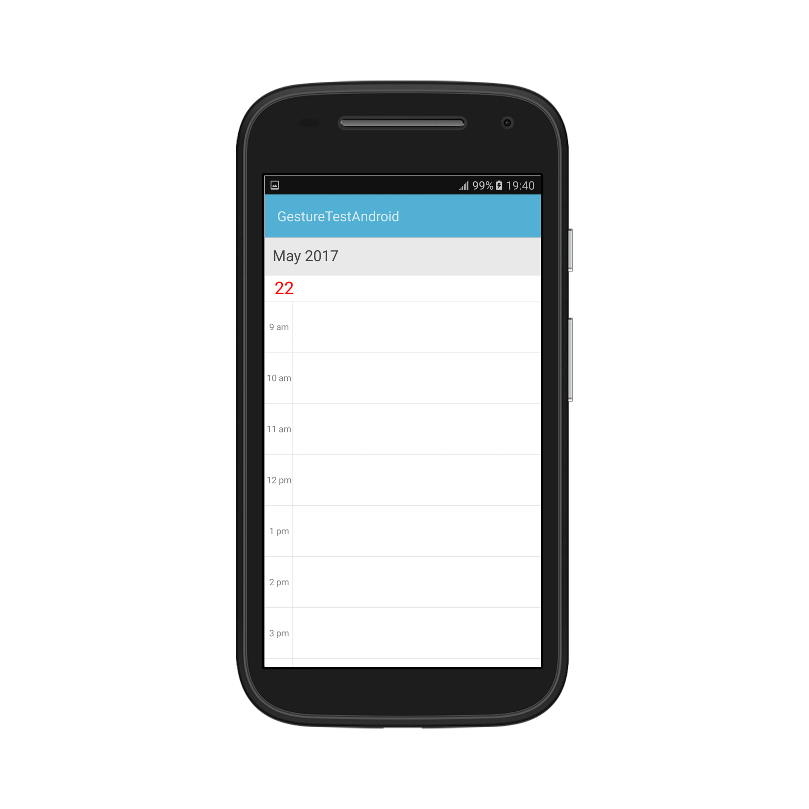

## Change Time Interval
You can customize the interval of timeslots in `DayView` by setting [TimeInterval](https://help.syncfusion.com/cr/cref_files/xamarin-android/sfschedule/Syncfusion.SfSchedule.Android~Com.Syncfusion.Schedule.SfSchedule~TimeInterval.html) property of `SfSchedule`.



    schedule.ScheduleView = ScheduleView.DayView;
    schedule.TimeInterval = 120;


>**Note**:

If you modify the `TimeInterval` value (in minutes), you need to change the time labels format by setting the `TimeFormat` value as "hh:mm". By default, TimeFormat value is `"h a"`. You can refer [here](https://help.syncfusion.com/xamarin-android/sfschedule/dayview#time-label-formatting) for changing TimeFormat value.

## Change Time Interval Height
You can customize the interval height of timeslots in `DayView` by setting [TimeIntervalHeight](https://help.syncfusion.com/cr/cref_files/xamarin-android/sfschedule/Syncfusion.SfSchedule.Android~Com.Syncfusion.Schedule.SfSchedule~TimeIntervalHeight.html)  property of `SfSchedule`.



    schedule.ScheduleView = ScheduleView.DayView;
    schedule.TimeIntervalHeight = 180;


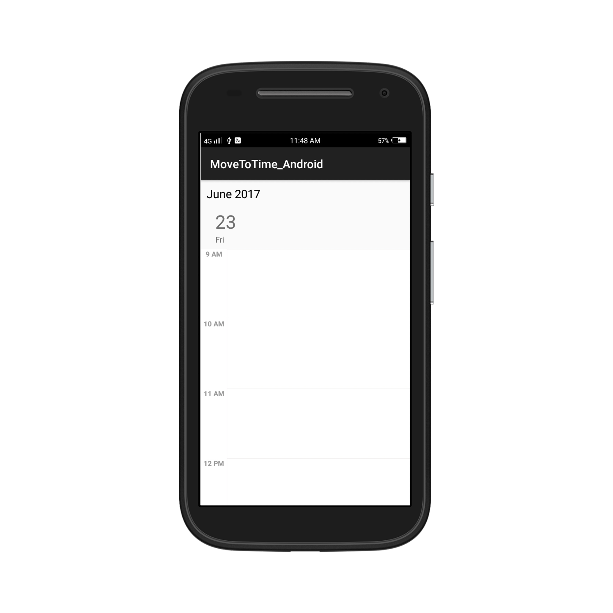

## Change Working hours

Working hours in `DayView` of Schedule control will be differentiated with non-working hours by separate color. By default, working hours will be between 09 to 18. You can customize the working hours by setting [WorkStartHour](https://help.syncfusion.com/cr/cref_files/xamarin-android/sfschedule/Syncfusion.SfSchedule.Android~Com.Syncfusion.Schedule.DayViewSettings~WorkStartHour.html) and [WorkEndHour](https://help.syncfusion.com/cr/cref_files/xamarin-android/sfschedule/Syncfusion.SfSchedule.Android~Com.Syncfusion.Schedule.DayViewSettings~WorkEndHour.html) properties of [DayViewSettings](https://help.syncfusion.com/cr/cref_files/xamarin-android/sfschedule/Syncfusion.SfSchedule.Android~Com.Syncfusion.Schedule.SfSchedule~DayViewSettings.html).



            schedule.ScheduleView = ScheduleView.DayView;
			//Create new instance of DayViewSettings
			DayViewSettings dayViewSettings = new DayViewSettings();	
			dayViewSettings.WorkStartHour = 10;
			dayViewSettings.WorkEndHour = 18;
			schedule.DayViewSettings = dayViewSettings;


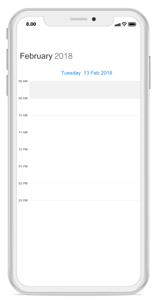

>**Note**:
	`WorkStartHour` and `WorkEndHour` should be in integer value to represent hours.

## Changing StartHour and EndHour

Default value for [StartHour](https://help.syncfusion.com/cr/cref_files/xamarin-android/sfschedule/Syncfusion.SfSchedule.Android~Com.Syncfusion.Schedule.DayViewSettings~StartHour.html) and [EndHour](https://help.syncfusion.com/cr/cref_files/xamarin-android/sfschedule/Syncfusion.SfSchedule.Android~Com.Syncfusion.Schedule.DayViewSettings~EndHour.html) value is 0 to 24 to show all the time slots in `DayView`. You need to set [StartHour](https://help.syncfusion.com/cr/cref_files/xamarin-android/sfschedule/Syncfusion.SfSchedule.Android~Com.Syncfusion.Schedule.DayViewSettings~StartHour.html) and [EndHour](https://help.syncfusion.com/cr/cref_files/xamarin-android/sfschedule/Syncfusion.SfSchedule.Android~Com.Syncfusion.Schedule.DayViewSettings~EndHour.html) property of `DayView`, to show only the required time duration for end users.



            schedule.ScheduleView = ScheduleView.DayView;
			//Create new instance of DayViewSettings
			DayViewSettings dayViewSettings = new DayViewSettings();
			dayViewSettings.StartHour = 08;
			dayViewSettings.EndHour = 15;	
			schedule.DayViewSettings = dayViewSettings;


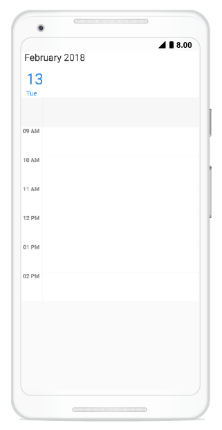

>**Note**:
* `StartHour` and `EndHour` should be in integer value to represent hours.
* `StartHour` must be greater than or equal to 0 and `EndHour` must be lesser than or equal to 24, otherwise `InvalidDataException` will be thrown.
* `EndHour` value must be greater than `StartHour`, otherwise `InvalidDataException` will be thrown.
* Schedule UI such as Appointments and NonAccessibleBlocks which does not fall within the `StartHour` and `EndHour` will not be visible and if it falls partially, it will be clipped.

## Timeslot Appearance
You can customize the appearance of timeslots in `DayView`.

 * [Timeslot customization in Work hours](#timeslot-customization-in-work-hours)
* [Timeslot customization in Non Working hours](#timeslot-customization-in-non-working-hours)

### Timeslot customization in Work hours
You can customize the appearance of the WorkingHourTimeslot by its color using[TimeSlotColor](https://help.syncfusion.com/cr/cref_files/xamarin-android/sfschedule/Syncfusion.SfSchedule.Android~Com.Syncfusion.Schedule.DayViewSettings~TimeSlotColor.html),[TimeSlotBorderColor](https://help.syncfusion.com/cr/cref_files/xamarin-android/sfschedule/Syncfusion.SfSchedule.Android~Com.Syncfusion.Schedule.DayViewSettings~TimeSlotBorderColor.html) and [TimeSlotBorderStrokeWidth](https://help.syncfusion.com/cr/cref_files/xamarin-android/sfschedule/Syncfusion.SfSchedule.Android~Com.Syncfusion.Schedule.DayViewSettings~TimeSlotBorderStrokeWidth.html) properties of `DayViewSettings`.



           schedule.ScheduleView = ScheduleView.DayView;
			//Create new instance of DayViewSettings
			DayViewSettings dayViewSettings = new DayViewSettings();
			dayViewSettings.TimeSlotBorderColor = Color.Aqua;
			dayViewSettings.TimeSlotColor = Color.Yellow;
			dayViewSettings.TimeSlotBorderStrokeWidth = 5;
			schedule.DayViewSettings = dayViewSettings;


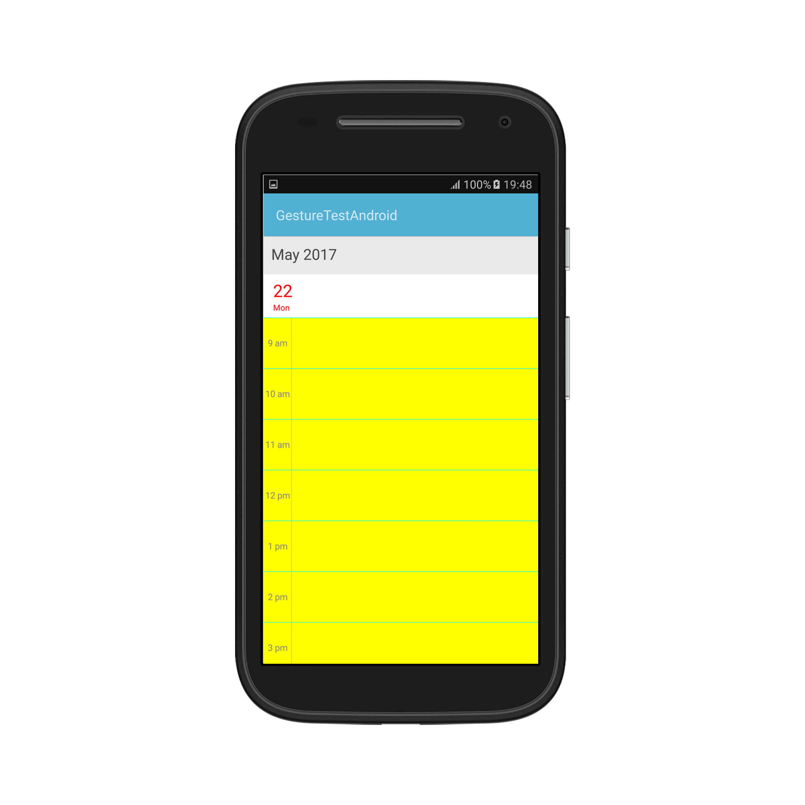

### Timeslot customization in Non Working hours

You can customize the appearance of the Non-workingHourTimeslots by its color using [NonWorkingHoursTimeSlotBorderColor](https://help.syncfusion.com/cr/cref_files/xamarin-android/sfschedule/Syncfusion.SfSchedule.Android~Com.Syncfusion.Schedule.DayViewSettings~NonWorkingHoursTimeSlotBorderColor.html),[NonWorkingHoursTimeSlotColor](https://help.syncfusion.com/cr/cref_files/xamarin-android/sfschedule/Syncfusion.SfSchedule.Android~Com.Syncfusion.Schedule.DayViewSettings~NonWorkingHoursTimeSlotColor.html), properties of `DayViewSettings`.



          schedule.ScheduleView = ScheduleView.DayView;
			//Create new instance of DayViewSettings
			DayViewSettings dayViewSettings = new DayViewSettings();
			dayViewSettings.NonWorkingHoursTimeSlotBorderColor = Color.Aqua;
			dayViewSettings.NonWorkingHoursTimeSlotColor = Color.Yellow;
			schedule.DayViewSettings = dayViewSettings;


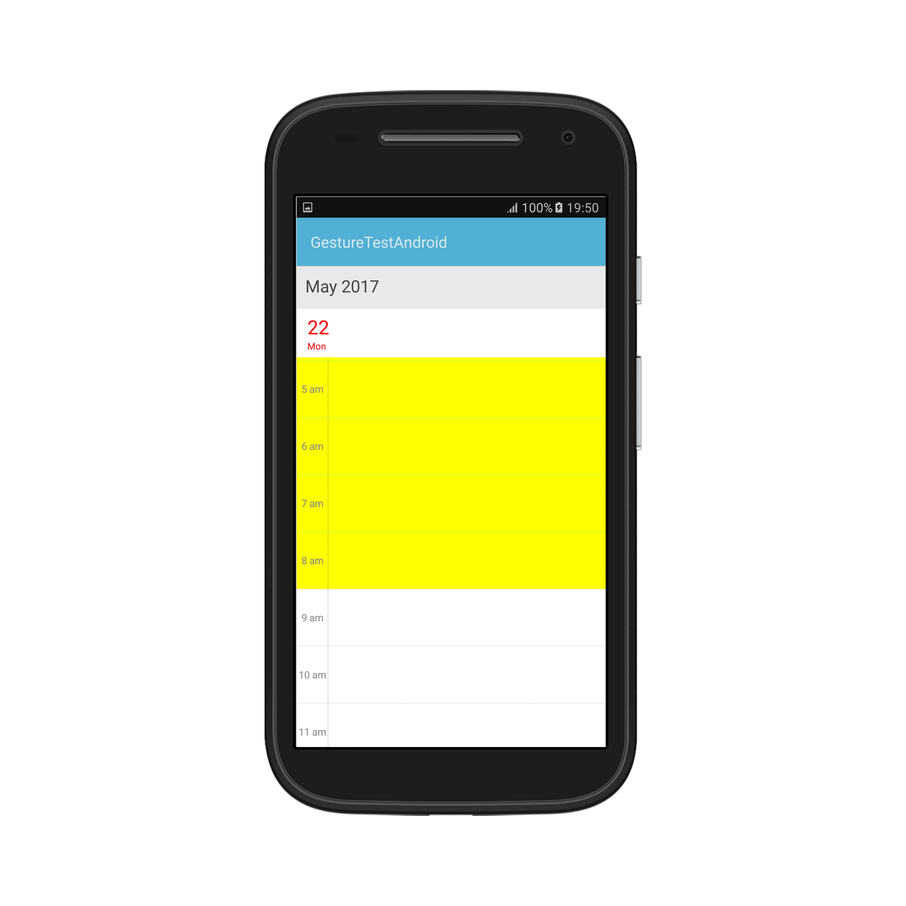

>**Note**:
`TimeSlotBorderStrokeWidth` property common for both Working hours and Non-Working hour time slot customization.

## Non-Accessible timeslots

You can restrict or allocate certain timeslot as non-accessible blocks by using [NonAccessibleBlocks](https://help.syncfusion.com/cr/cref_files/xamarin-android/sfschedule/Syncfusion.SfSchedule.Android~Com.Syncfusion.Schedule.DayViewSettings~NonAccessibleBlocks.html) of `DayViewSettings`, so that you can allocate those timeslots for predefined events/activities like Lunch hour.



           schedule.ScheduleView = ScheduleView.DayView;
			//Create new instance of NonAccessibleBlock
			NonAccessibleBlock nonAccessibleBlock = new NonAccessibleBlock();
			//Create new instance of NonAccessibleBlocksCollection
			NonAccessibleBlocksCollection nonAccessibleBlocksCollection = new NonAccessibleBlocksCollection();
			DayViewSettings dayViewSettings = new DayViewSettings();
			nonAccessibleBlock.StartTime = 13;
			nonAccessibleBlock.EndTime = 14;
			nonAccessibleBlock.Text = "LUNCH";
			nonAccessibleBlock.Color = Color.Black;
			nonAccessibleBlocksCollection.Add(nonAccessibleBlock);
			dayViewSettings.NonAccessibleBlocks = nonAccessibleBlocksCollection;
			schedule.DayViewSettings = dayViewSettings;


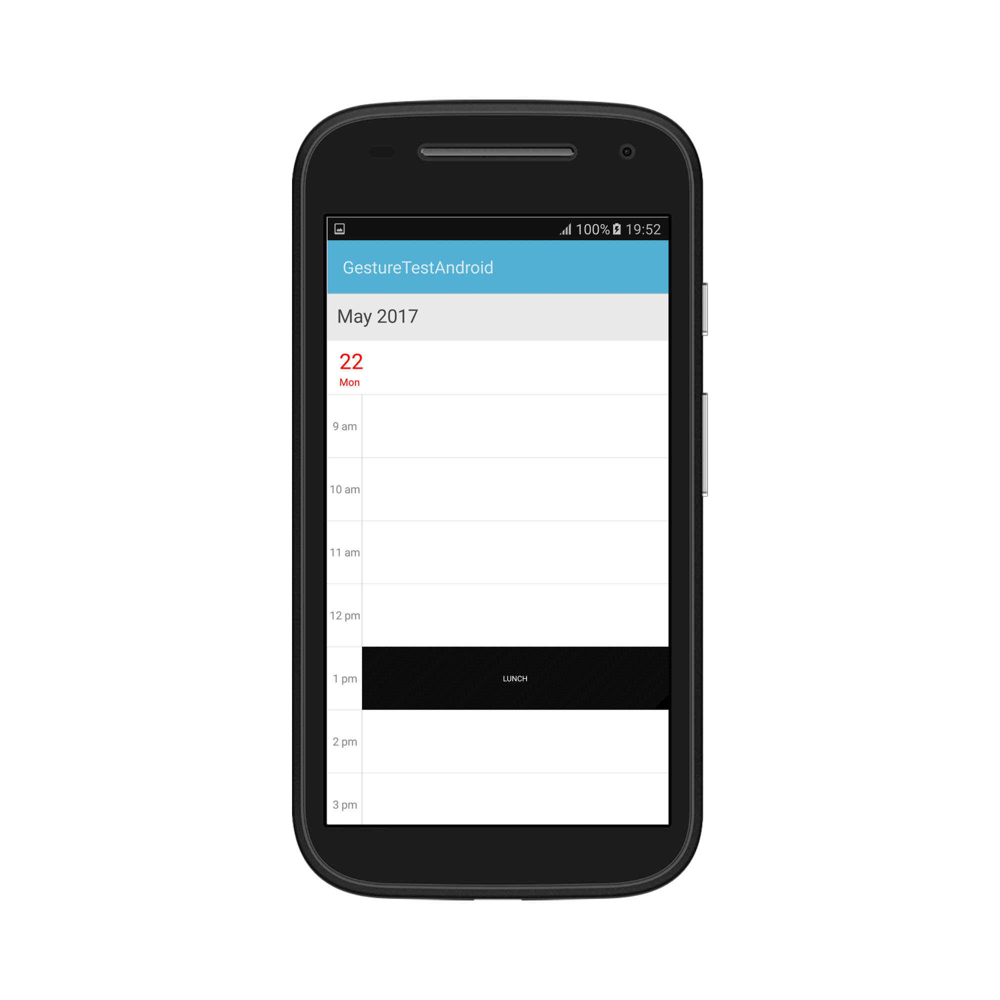

>**Note**:
Selection and related events will not be working in this blocks.

## Change first day of week
[FirstDayOfWeek](https://help.syncfusion.com/cr/cref_files/xamarin-android/sfschedule/Syncfusion.SfSchedule.Android~Com.Syncfusion.Schedule.SfSchedule~FirstDayOfWeek.html) of `SfSchedule` is not applicable for `DayView` as it displays only one day.

## Time Label Formatting:
You can customize the format for the labels which are mentioning the time, by setting [TimeFormat](https://help.syncfusion.com/cr/cref_files/xamarin-android/sfschedule/Syncfusion.SfSchedule.Android~Com.Syncfusion.Schedule.DayLabelSettings~TimeFormat.html) property of [DayLabelSettings](https://help.syncfusion.com/cr/cref_files/xamarin-android/sfschedule/Syncfusion.SfSchedule.Android~Com.Syncfusion.Schedule.DayViewSettings~DayLabelSettings.html) in `DayViewSettings`.



            schedule.ScheduleView = ScheduleView.DayView;
			DayViewSettings dayViewSettings = new DayViewSettings();
			DayLabelSettings dayLabelSettings = new DayLabelSettings();
			dayLabelSettings.TimeFormat = "hh mm";
			dayViewSettings.DayLabelSettings = dayLabelSettings;
			schedule.DayViewSettings = dayViewSettings;


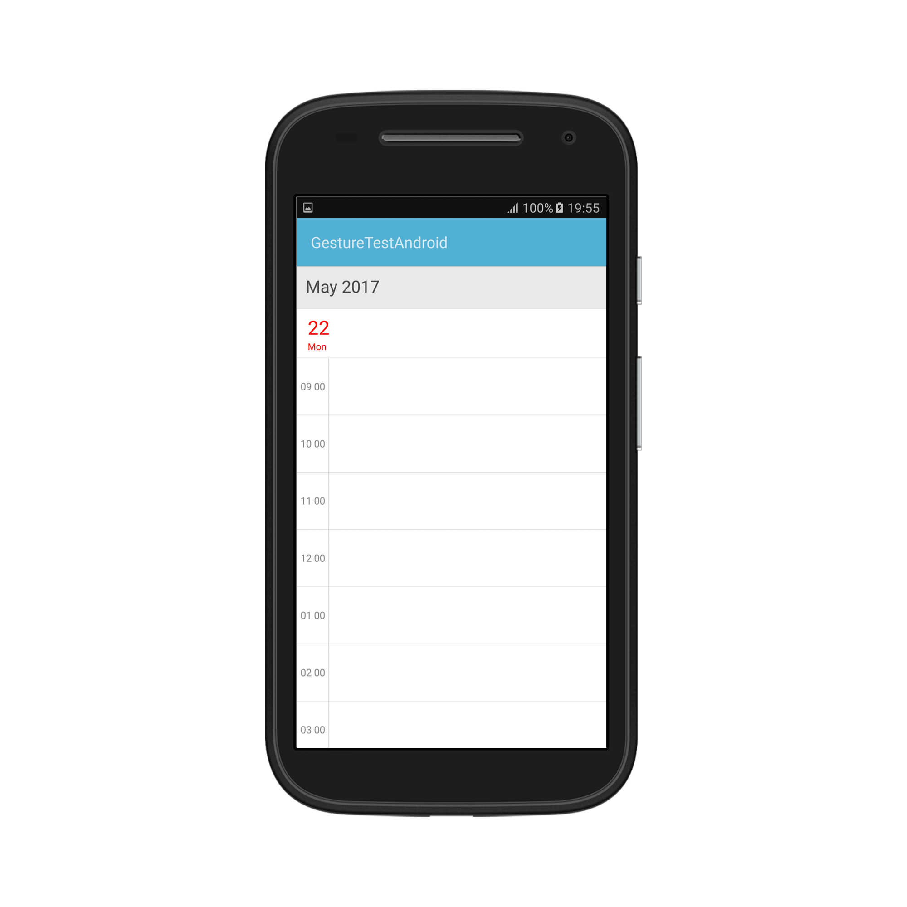

## Time Label Appearance

You can customize the color for the labels which are mentioning the time, by setting [TimeLabelColor](https://help.syncfusion.com/cr/cref_files/xamarin-android/sfschedule/Syncfusion.SfSchedule.Android~Com.Syncfusion.Schedule.DayLabelSettings~TimeLabelColor.html) property of `DayLabelSettings` in `DayViewSettings`.



   schedule.ScheduleView = ScheduleView.DayView;
			//Create new instance of DayViewSettings
			DayViewSettings dayViewSettings = new DayViewSettings();
			//Create new instance of DayLabelSettings
			DayLabelSettings dayLabelSettings = new DayLabelSettings();
			dayLabelSettings.TimeLabelColor = Color.Blue;
			dayViewSettings.DayLabelSettings = dayLabelSettings;
			schedule.DayViewSettings = dayViewSettings;


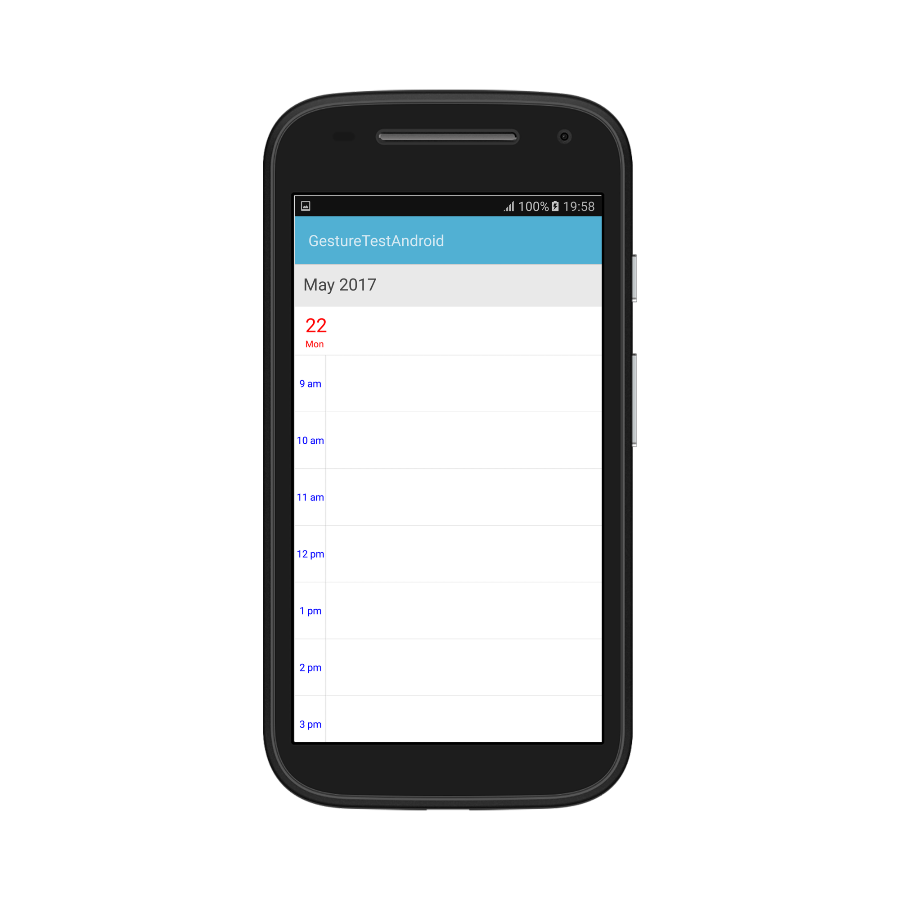

## Selection
You can customize the default appearance of selection UI in the timeslots.

* [Selection customization using style](#selection-customization-using-style)
* [Selection customization using custom View](#selection-customization-using-custom-view)

### Selection customization using style
You can customize the timeslot selection by using [SelectionStyle](https://help.syncfusion.com/cr/cref_files/xamarin-android/sfschedule/Syncfusion.SfSchedule.Android~Com.Syncfusion.Schedule.SfSchedule~SelectionStyle.html) property of `SfSchedule`.



   schedule.ScheduleView = ScheduleView.DayView;
			//Create new instance of SelectionStyle 
			SelectionStyle selectionStyle = new SelectionStyle();
			selectionStyle.BackgroundColor = Color.Blue;
			selectionStyle.BorderColor = Color.Black;
			selectionStyle.BorderThickness = 5;
			selectionStyle.CornerRadius = 5;
			schedule.SelectionStyle = selectionStyle;


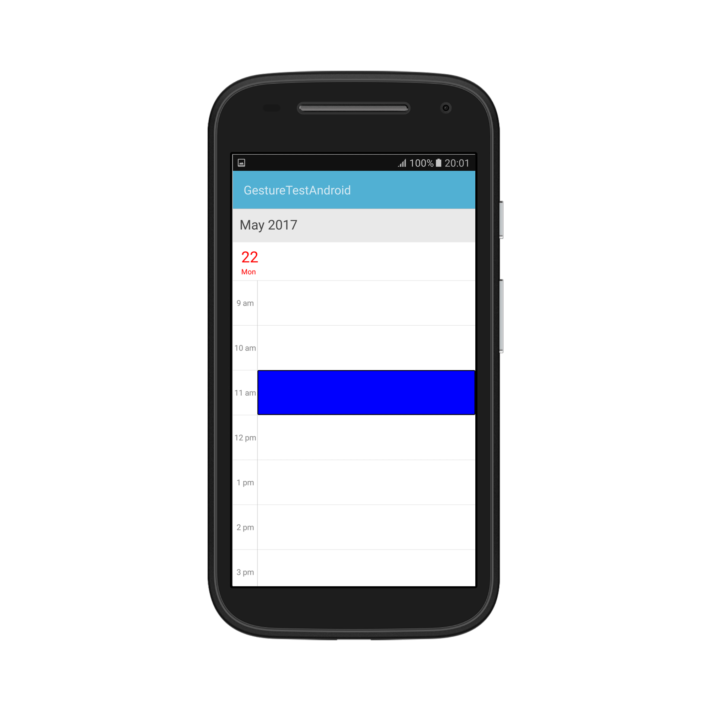

### Selection customization using custom View
You can replace the default selection UI with your custom view by setting [SelectionView](https://help.syncfusion.com/cr/cref_files/xamarin-android/sfschedule/Syncfusion.SfSchedule.Android~Com.Syncfusion.Schedule.SfSchedule~SelectionView.html) property of `SfSchedule`.


          schedule.ScheduleView = ScheduleView.DayView;
			//Add the CustomView 
			Button customView = new Button(this);
			customView.Text = "+NewEvent";
			customView.SetBackgroundColor(Color.Rgb(255, 152, 0));
			customView.SetTextColor(Color.White);
			schedule.SelectionView = customView;


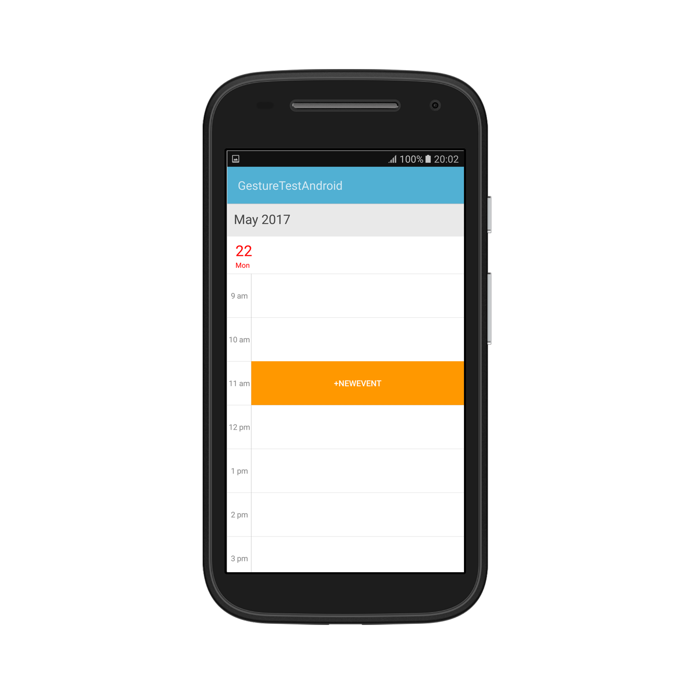

### Programmatic selection
You can programmatically select the specific timeslot by setting corresponding date and time value to [SelectedDate]( https://help.syncfusion.com/cr/cref_files/xamarin-android/sfschedule/Syncfusion.SfSchedule.Android~Com.Syncfusion.Schedule.SfSchedule~SelectedDate.html) property of `SfSchedule`. By default, it is null.



    // Creating instance of calendar
    Calendar calendar = Calendar.Instance;

    // Setting a date and time to select
    calendar.Set(2017, 09, 04, 10, 0, 0);
    schedule.SelectedDate = calendar;



You can clear the selection by setting [SelectedDate]( https://help.syncfusion.com/cr/cref_files/xamarin-android/sfschedule/Syncfusion.SfSchedule.Android~Com.Syncfusion.Schedule.SfSchedule~SelectedDate.html) as null.



    // Setting null value to deselect
    schedule.SelectedDate = null;



You can download the entire source code of this demo for Xamarin.Android from here [Date_Selection](http://www.syncfusion.com/downloads/support/directtrac/general/ze/Date_Selection-303833588.zip)

>**Note**:
* `SfSchedule` does not support multiple selection.
* `SfSchedule` supports two-way binding of `SelectedDate` property.

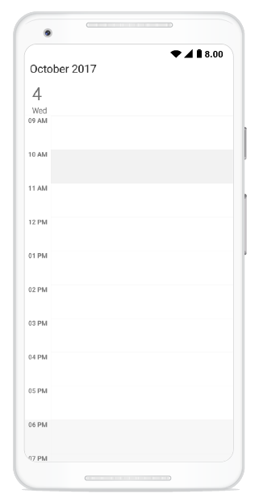
