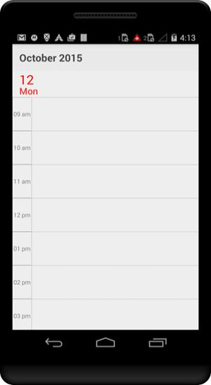
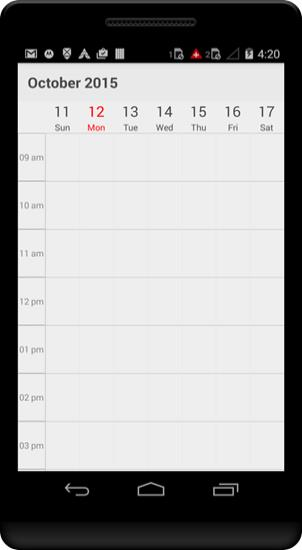
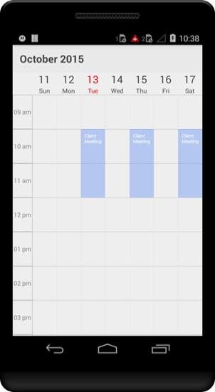

# Getting started

This section explains you the steps required to render the Schedule control by populating  events(appointments), with inline support and min max dates support in the control. This section covers only the minimal features that you need to know to get started with the Schedule.

## Adding control reference to the application

Illustration for the procedures to install the Syncfusion Essential Studio can be referred from [Syncfusion Xamarin.Android components installation](http://help.syncfusion.com/Xamarin.Android/introduction/download-and-installation), `Syncfusion.SfSchedule.Android` should be used to add schedule reference in the application. 

## Initializing Schedule 

Create a SfSchedule instance in Main Activity and set schedule as a ContentView in onCreate() overridden method.



    using Com.Syncfusion.Schedule;

    protected override void OnCreate(Bundle bundle)
    {
    base.OnCreate(bundle);
    SfSchedule sfschedule = new SfSchedule(this);
    // Set our view from the "main" layout resource
    SetContentView(sfschedule);
    }



You can change the default UI of schedule using `ScheduleView` to display the dates in different layouts available in the control.



    SfSchedule sfschedule = new SfSchedule(this);
    sfschedule.ScheduleView = ScheduleView.WeekView;
    // Set our view from the "main" layout resource
            SetContentView(sfschedule);



## Populating Events

You can also add events to the schedule by creating collection of ` ScheduleAppointment` using  `ScheduleAppointmentCollection`. 



    ScheduleAppointmentCollection appointmentCollection;
    //..//
    //creating new instance for schedule
     SfSchedule sfschedule = new SfSchedule(this);
    sfschedule.ScheduleView = ScheduleView.WeekView;
    appointmentCollection = new ScheduleAppointmentCollection();

    //Creating new event
    ScheduleAppointment clientMeeting = new ScheduleAppointment();

    Calendar currentDate = Calendar.Instance;
    Calendar startTime = (Calendar)currentDate.Clone();
     
    //setting start time for the event
    startTime.Set(
    currentDate.Get(CalendarField.Year),
    currentDate.Get(CalendarField.Month),
    currentDate.Get(CalendarField.DayOfMonth),
    10, 0, 0
    );

    Calendar endTime = (Calendar)currentDate.Clone();
   
    //setting end time for the event
    endTime.Set(
    currentDate.Get(CalendarField.Year),
    currentDate.Get(CalendarField.Month),
    currentDate.Get(CalendarField.DayOfMonth),
    12, 0, 0
    ;

    clientMeeting.StartTime = startTime;
    clientMeeting.EndTime = endTime;
    clientMeeting.Color = Color.Blue;

    //setting Subject for the event
    clientMeeting.Subject = "ClientMeeting";
    
    //adding event into the collection
    appointmentCollection.Add(clientMeeting);
    sfschedule.Appointments = appointmentCollection;

    // Set our view from the "main" layout resource
    SetContentView(sfschedule);



## Populating Recursive Events

You can also add recursive appointments to Schedule, refer Recurrence section to know more about creating the recursive appointments using RRULE generator in schedule.



    ScheduleAppointmentCollection appointmentCollection;
    //..//
    //creating new instance for schedule
    SfSchedule sfschedule = new SfSchedule(this);
    sfschedule.ScheduleView = ScheduleView.WeekView;
    appointmentCollection = new ScheduleAppointmentCollection();

    //Recurrence Appointment 1
    //Creating new events
    ScheduleAppointment appointment1 = new ScheduleAppointment();
    Calendar currentDate = Calendar.Instance;
    Calendar startTime = (Calendar)currentDate.Clone();
    Calendar endTime = (Calendar)currentDate.Clone();

    //setting start time for the event
    startTime.Set(
    currentDate.Get(CalendarField.Year),
    currentDate.Get(CalendarField.Month),
    currentDate.Get(CalendarField.DayOfMonth),
    10, 0, 0
    );

    //setting end time for the event
    endTime.Set(
    currentDate.Get(CalendarField.Year),
    currentDate.Get(CalendarField.Month),
    currentDate.Get(CalendarField.DayOfMonth),
    12, 0, 0
    );

    appointment1.StartTime = startTime;
    appointment1.EndTime = endTime;
    appointment1.Color = Color.ParseColor("#FF1BA1E2");

    //setting Subject for the event
    appointment1.Subject = "Client Meeting";
    appointment1.IsRecursive = true;

    //setting recurrence properties
    RecurrenceProperties recurrenceProp1 = new RecurrenceProperties();
    recurrenceProp1.RecurrenceType = RecurrenceType.Daily;
    recurrenceProp1.IsDailyEveryNDays = true;
    recurrenceProp1.DailyNDays = 2;
    recurrenceProp1.IsRangeRecurrenceCount = true;
    recurrenceProp1.IsRangeNoEndDate = false;
    recurrenceProp1.IsRangeEndDate = false;
    recurrenceProp1.RangeRecurrenceCount = 10;
    recurrenceProp1.RecurrenceRule = RecurrenceBuilder.RRuleGenerator(recurrenceProp1, appointment1.StartTime, appointment1.EndTime);
    appointment1.RecurrenceRule = recurrenceProp1.RecurrenceRule;

    //adding appointment to the collection  
    appointmentCollection.Add(appointment1);
    sfschedule.Appointments = appointmentCollection;
            
    // Set our view from the "main" layout resource
    SetContentView(sfschedule);



## Enabling Appointments Inline

When the schedule appointments are viewed in Month view, it will not display much information about the appointments, you can view the appointments in inline by setting `ShowAppointmentsInline` property of `MonthViewSettings` as `True`.



    //creating new instance for schedule
    SfSchedule sfschedule = new SfSchedule(this);
    sfschedule.ScheduleView = ScheduleView.WeekView;
    //setting Show inline 
    sfschedule.MonthViewSettings.ShowAppointmentsInline = true;
    SetContentView(sfschedule);  
    


## Restricting Dates

Certain dates can be restricted in schedule by setting `MinDisplayDate` and `MaxDisplayDate` properties of `SfSchedule`.  To know more about restricting dates within a particular range of dates refer Min Max dates.



            //creating new instance for schedule
            SfSchedule sfschedule = new SfSchedule(this);
            sfschedule.ScheduleView = ScheduleView.MonthView;

            Calendar currentDate = Calendar.Instance;
            Calendar minDate = (Calendar)currentDate.Clone();
            minDate.Set(2015, 5, 12);

            Calendar maxDate = (Calendar)currentDate.Clone();
            maxDate.Set(2015, 11, 12);

            sfschedule.MinDisplayDate = minDate;
            sfschedule.MaxDisplayDate = maxDate;

            // Set our view from the "main" layout resource
            SetContentView(sfschedule);


