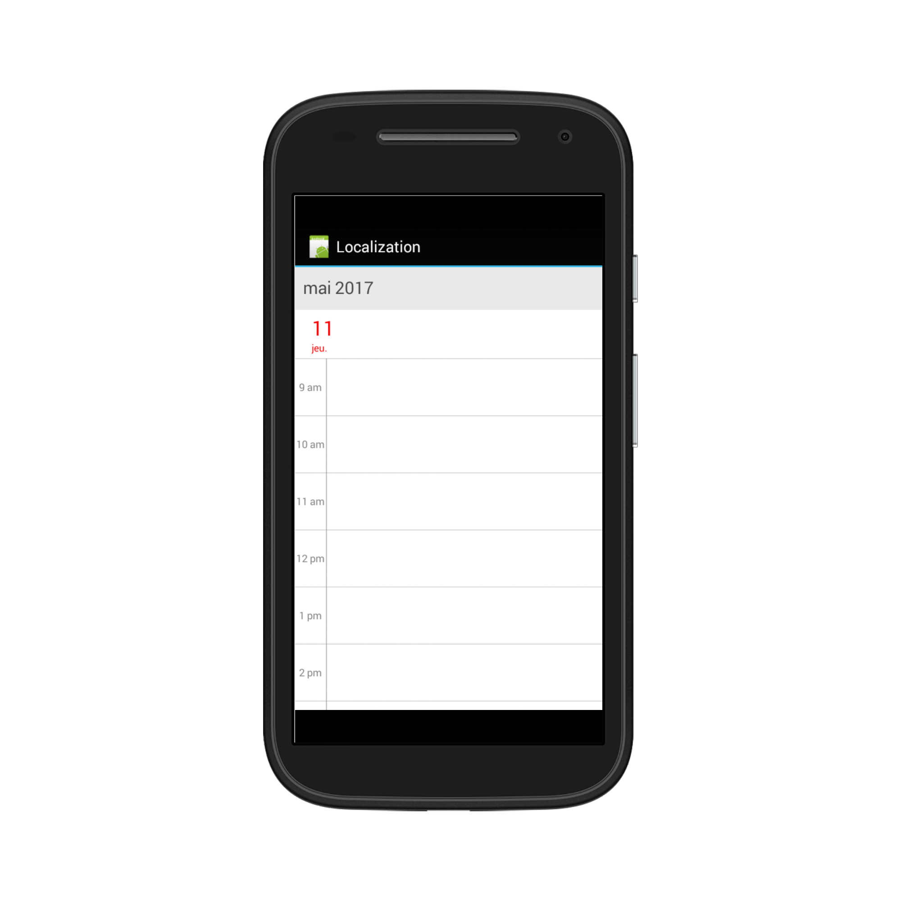

# Localization 

Schedule control is available with complete localization support . Localization can be specified by setting the `Locale` property of the control. In the format of `Language code`.  Based on the locale specified the strings in the control such as Date, time, days are localized accordingly. As the subject of the appointments are given in the application level, it can be set as localized strings as per the requirement. 

## Locale

Based on the locale specified the strings in the control such as Date, time, days are localized accordingly. By default schedule control is available with `en-US` locale. 



	//creating new instance for schedule
	sfschedule = new SfSchedule(this);

	//setting schedule view
	sfschedule.ScheduleView = ScheduleView.DayView;

	//setting locale for the control
	sfschedule.Locale = new Locale("fr");

	// Set our view from the "main" layout resource
	SetContentView(sfschedule);



>**NOTE**: AM/PM in the timeline will not be localized in the Schedule views.

