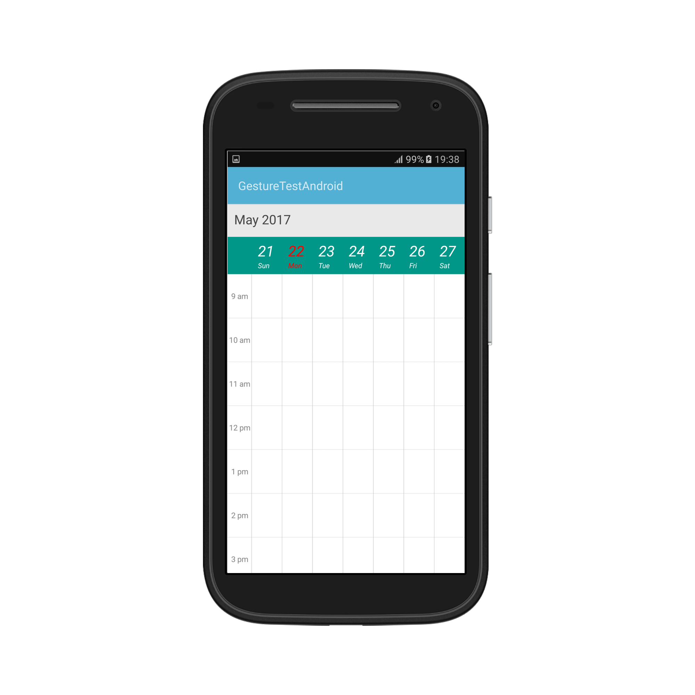
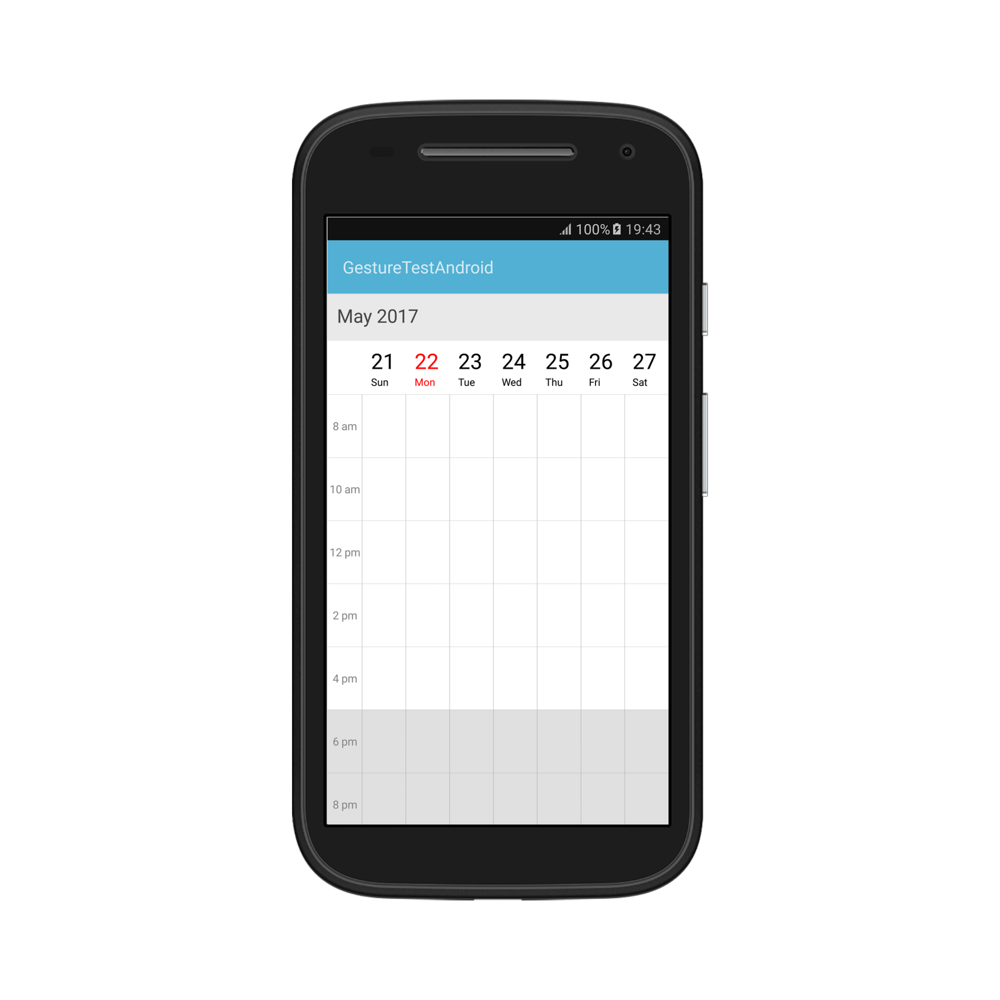
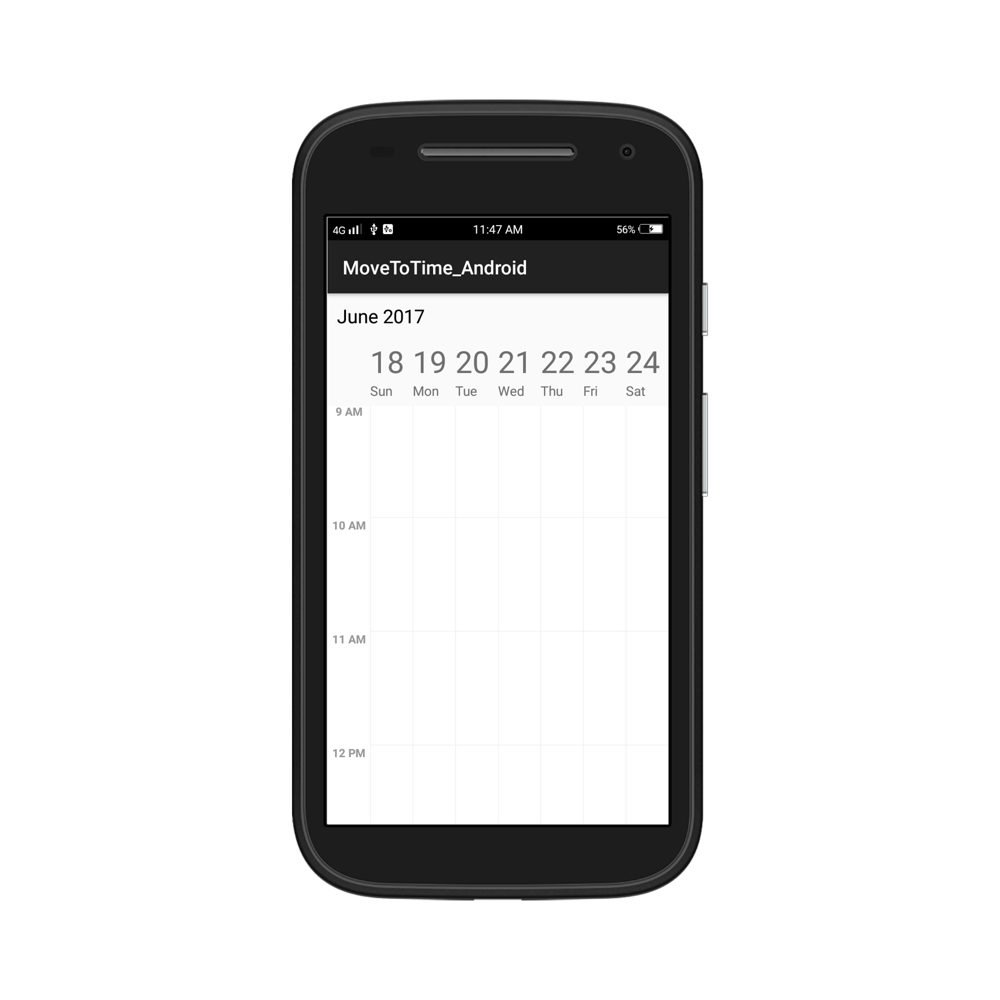
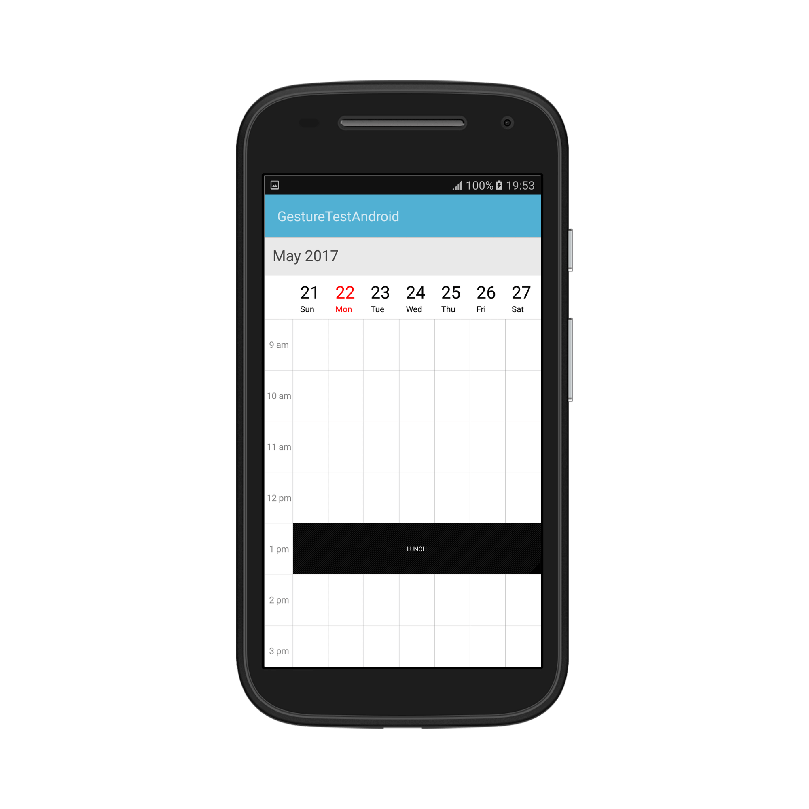
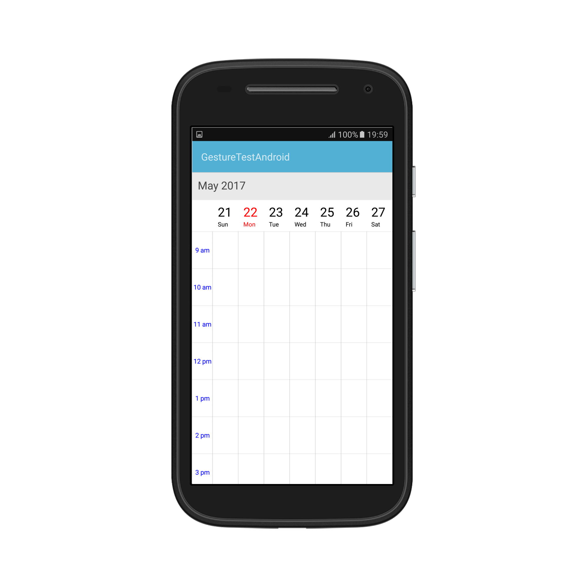
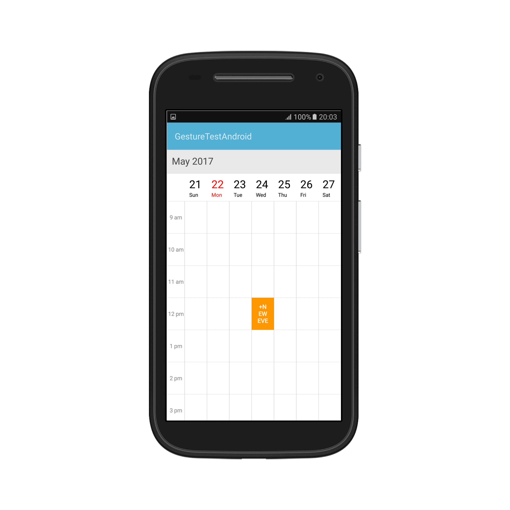

---

layout: post
title: Customize the Schedule WeekView at SfSchedule control for Xamarin.Android
description: Learn how to Customize the schedule WeekView in SfSchedule control
platform: xamarin.Android
control: SfSchedule
documentation: ug

---

# WeekView:
To view all the seven days of a particular week, by default if will be current week. Appointments arranged in timeslots based on its duration with respective day of the week.

## ViewHeader Appearance:
You can customize the default appearance of view header in [WeekView](https://help.syncfusion.com/cr/cref_files/xamarin-android/sfschedule/Syncfusion.SfSchedule.Android~Com.Syncfusion.Schedule.Enums.ScheduleView.html) by using [ViewHeaderStyle](https://help.syncfusion.com/cr/cref_files/xamarin-android/sfschedule/Syncfusion.SfSchedule.Android~Com.Syncfusion.Schedule.SfSchedule~ViewHeaderStyle.html) property of [SfSchedule](https://help.syncfusion.com/cr/cref_files/xamarin-android/sfschedule/Syncfusion.SfSchedule.Android~Com.Syncfusion.Schedule.SfSchedule.html).



            //Create new instance of Schedule
			SfSchedule schedule = new SfSchedule(this);
			schedule.ScheduleView = ScheduleView.WeekView;
			//Customize the schedule view header
			ViewHeaderStyle viewHeaderStyle = new ViewHeaderStyle();
			viewHeaderStyle.BackgroundColor = Color.Rgb(0, 150, 136);
			viewHeaderStyle.DayTextColor = Color.Rgb(255, 255, 255);
			viewHeaderStyle.DateTextColor = Color.Rgb(255, 255, 255);
			viewHeaderStyle.DayTextStyle = Typeface.DefaultFromStyle(TypefaceStyle.Italic);
			viewHeaderStyle.DateTextStyle = Typeface.DefaultFromStyle(TypefaceStyle.Italic);
			schedule.ViewHeaderStyle = viewHeaderStyle;


You can customize the height of the ViewHeader in `WeekView` by setting [ViewHeaderHeight](https://help.syncfusion.com/cr/cref_files/xamarin-android/sfschedule/Syncfusion.SfSchedule.Android~Com.Syncfusion.Schedule.SfSchedule~ViewHeaderHeight.html) property of `SfSchedule`.



            schedule.ScheduleView = ScheduleView.WeekView;
			schedule.ViewHeaderHeight = 50;


## Change Time Interval:
You can customize the interval of timeslots in `WeekView` by setting [TimeInterval](https://help.syncfusion.com/cr/cref_files/xamarin-android/sfschedule/Syncfusion.SfSchedule.Android~Com.Syncfusion.Schedule.SfSchedule~TimeInterval.html) property of `SfSchedule`.



            schedule.ScheduleView = ScheduleView.WeekView;
			schedule.TimeInterval = 120;


## Change Time Interval Height
You can customize the interval height of timeslots in `WeekView` by setting [TimeIntervalHeight](https://help.syncfusion.com/cr/cref_files/xamarin-android/sfschedule/Syncfusion.SfSchedule.Android~Com.Syncfusion.Schedule.SfSchedule~TimeIntervalHeight.html)  property of `SfSchedule`.



    schedule.ScheduleView = ScheduleView.WeekView;
    schedule.TimeIntervalHeight = 180;


## Change Working hours:
You can hide the time slots by setting [StartHour](https://help.syncfusion.com/cr/cref_files/xamarin-android/sfschedule/Syncfusion.SfSchedule.Android~Com.Syncfusion.Schedule.WeekViewSettings~StartHour.html) and [EndHour](https://help.syncfusion.com/cr/cref_files/xamarin-android/sfschedule/Syncfusion.SfSchedule.Android~Com.Syncfusion.Schedule.WeekViewSettings~EndHour.html) properties of [WeekViewSettings](https://help.syncfusion.com/cr/cref_files/xamarin-android/sfschedule/Syncfusion.SfSchedule.Android~Com.Syncfusion.Schedule.SfSchedule~WeekViewSettings.html). Default value for StartHour and EndHour will be 0 to 24 hours. 
Working hours in `WeekView` of Schedule control will be differentiated with non-working hours by separate color. By default, working hours will be between 09 to 18. You can customize the working hours by setting [WorkStartHour](https://help.syncfusion.com/cr/cref_files/xamarin-android/sfschedule/Syncfusion.SfSchedule.Android~Com.Syncfusion.Schedule.WeekViewSettings~WorkStartHour.html) and [WorkEndHour](https://help.syncfusion.com/cr/cref_files/xamarin-android/sfschedule/Syncfusion.SfSchedule.Android~Com.Syncfusion.Schedule.WeekViewSettings~WorkEndHour.html) properties of [WeekViewSettings](https://help.syncfusion.com/cr/cref_files/xamarin-android/sfschedule/Syncfusion.SfSchedule.Android~Com.Syncfusion.Schedule.SfSchedule~WeekViewSettings.html).



            schedule.ScheduleView = ScheduleView.WeekView;
			//Create new instance of WeekViewSettings
			WeekViewSettings weekViewSettings = new WeekViewSettings();
			weekViewSettings.StartHour = 08;
            weekViewSettings.EndHour = 15;
			weekViewSettings.WorkStartHour = 09;
			weekViewSettings.WorkEndHour = 16;
			schedule.WeekViewSettings = weekViewSettings;


>**Note**:
*	`WorkStartHour` and `WorkEndHour` should be in integer value to represent hours.
*	`StartHour` must be greater than 0 and `EndHour` must be lesser than 24, otherwise `InvalidDataException` will be thrown.
*	`EndHour` value must be greater than `StartHour`, otherwise `InvalidDataException` will be thrown.
*	 Before `StartHour` and after `EndHour` values, Schedule UI such as Appointments and NonAccessibleBlocks will be clipped.

## Timeslot Appearance:
You can customize the appearance of timeslots in `WeekView`.

 * [Timeslot customization in Work hours](#timeslot-customization-in-work-hours)
* [Timeslot customization in Non Working hours](#timeslot-customization-in-non-working-hours)

### Timeslot customization in Work hours:
You can customize the appearance of the working hour timeslots by its color using [TimeSlotColor](https://help.syncfusion.com/cr/cref_files/xamarin-android/sfschedule/Syncfusion.SfSchedule.Android~Com.Syncfusion.Schedule.WeekViewSettings~TimeSlotColor.html),[TimeSlotBorderColor](https://help.syncfusion.com/cr/cref_files/xamarin-android/sfschedule/Syncfusion.SfSchedule.Android~Com.Syncfusion.Schedule.WeekViewSettings~TimeSlotBorderColor.html), [VerticalLineStrokeWidth](https://help.syncfusion.com/cr/cref_files/xamarin-android/sfschedule/Syncfusion.SfSchedule.Android~Com.Syncfusion.Schedule.WeekViewSettings~VerticalLineStrokeWidth.html), [VerticalLineColor](https://help.syncfusion.com/cr/cref_files/xamarin-android/sfschedule/Syncfusion.SfSchedule.Android~Com.Syncfusion.Schedule.WeekViewSettings~VerticalLineColor.html) and [TimeSlotBorderStrokeWidth](https://help.syncfusion.com/cr/cref_files/xamarin-android/sfschedule/Syncfusion.SfSchedule.Android~Com.Syncfusion.Schedule.WeekViewSettings~TimeSlotBorderStrokeWidth.html) properties of `WeekViewSettings`.



            schedule.ScheduleView = ScheduleView.WeekView;
			//Create new instance of WeekViewSettings
			WeekViewSettings weekViewSettings = new WeekViewSettings();
			weekViewSettings.TimeSlotBorderColor = Color.Aqua;
			weekViewSettings.VerticalLineColor = Color.Blue;
			weekViewSettings.TimeSlotColor = Color.Yellow;
			weekViewSettings.TimeSlotBorderStrokeWidth = 5;
			weekViewSettings.VerticalLineStrokeWidth = 5;
			schedule.WeekViewSettings = weekViewSettings;


### Timeslot customization in Non Working hours:

You can customize the appearance of the non-working hour timeslots by its color using [NonWorkingHoursTimeSlotBorderColor](https://help.syncfusion.com/cr/cref_files/xamarin-android/sfschedule/Syncfusion.SfSchedule.Android~Com.Syncfusion.Schedule.WeekViewSettings~NonWorkingHoursTimeSlotBorderColor.html),[NonWorkingHoursTimeSlotColor](https://help.syncfusion.com/cr/cref_files/xamarin-android/sfschedule/Syncfusion.SfSchedule.Android~Com.Syncfusion.Schedule.WeekViewSettings~NonWorkingHoursTimeSlotColor.html),[VerticalLineStrokeWidth](https://help.syncfusion.com/cr/cref_files/xamarin-android/sfschedule/Syncfusion.SfSchedule.Android~Com.Syncfusion.Schedule.WeekViewSettings~VerticalLineStrokeWidth.html), [VerticalLineColor](https://help.syncfusion.com/cr/cref_files/xamarin-android/sfschedule/Syncfusion.SfSchedule.Android~Com.Syncfusion.Schedule.WeekViewSettings~VerticalLineColor.html) and [TimeSlotBorderStrokeWidth](https://help.syncfusion.com/cr/cref_files/xamarin-android/sfschedule/Syncfusion.SfSchedule.Android~Com.Syncfusion.Schedule.WeekViewSettings~TimeSlotBorderStrokeWidth.html) properties of `WeekViewSettings`.



            schedule.ScheduleView = ScheduleView.WeekView;
			//Create new instance of WeekViewSettings
			WeekViewSettings weekViewSettings = new WeekViewSettings();
			weekViewSettings.NonWorkingHoursTimeSlotBorderColor = Color.Aqua;
			weekViewSettings.VerticalLineColor = Color.Blue;
			weekViewSettings.NonWorkingHoursTimeSlotColor = Color.Yellow;
			weekViewSettings.TimeSlotBorderStrokeWidth = 5;
			weekViewSettings.VerticalLineStrokeWidth = 5;
			schedule.WeekViewSettings = weekViewSettings;


>**Note**:
` TimeSlotBorderStrokeWidth`and ` VerticalLineStrokeWidth` properties are common to both Working hours and Non-Working hour time slot customization.

## Non-Accessible timeslots:

You can restrict or allocate certain timeslot as Non-accessible blocks by using[NonAccessibleBlocks](https://help.syncfusion.com/cr/cref_files/xamarin-android/sfschedule/Syncfusion.SfSchedule.Android~Com.Syncfusion.Schedule.WeekViewSettings~NonAccessibleBlocks.html) of `WeekViewSettings` so that you can allocate those timeslots for predefined events/activities like Lunch hour.



   schedule.ScheduleView = ScheduleView.WeekView;
			//Create new instance of NonAccessibleBlock
			NonAccessibleBlock nonAccessibleBlock = new NonAccessibleBlock();
			//Create new instance of NonAccessibleBlocksCollection
			NonAccessibleBlocksCollection nonAccessibleBlocksCollection = new NonAccessibleBlocksCollection();
			WeekViewSettings weekViewSettings = new WeekViewSettings();
			nonAccessibleBlock.StartTime = 13;
			nonAccessibleBlock.EndTime = 14;
			nonAccessibleBlock.Text = "LUNCH";
			nonAccessibleBlock.Color = Color.Black;
			nonAccessibleBlocksCollection.Add(nonAccessibleBlock);
			weekViewSettings.NonAccessibleBlocks = nonAccessibleBlocksCollection;
			schedule.WeekViewSettings = weekViewSettings;


>**Note**:
Selection and related events will not be working in this blocks.

## Change first day of week:

By default, schedule control will be rendered with Sunday as the first day of the week, it can be customized to any day of the week by using[FirstDayOfWeek](https://help.syncfusion.com/cr/cref_files/xamarin-android/sfschedule/Syncfusion.SfSchedule.Android~Com.Syncfusion.Schedule.SfSchedule~FirstDayOfWeek.html) property of `SfSchedule`.



            schedule.ScheduleView = ScheduleView.WeekView;
			schedule.FirstDayOfWeek = 3;


## Time Label Formatting:
You can customize the format for the labels which are mentioning the time, by setting [TimeFormat](https://help.syncfusion.com/cr/cref_files/xamarin-android/sfschedule/Syncfusion.SfSchedule.Android~Com.Syncfusion.Schedule.WeekLabelSettings~TimeFormat.html) property of [WeekLabelSettings](https://help.syncfusion.com/cr/cref_files/xamarin-android/sfschedule/Syncfusion.SfSchedule.Android~Com.Syncfusion.Schedule.WeekViewSettings~WeekLabelSettings.html) in `WeekViewSettings`.



            schedule.ScheduleView = ScheduleView.WeekView;
			WeekViewSettings weekViewSettings = new WeekViewSettings();
			WeekLabelSettings weekLabelSettings = new WeekLabelSettings();
			weekLabelSettings.TimeFormat = "hh mm";
			weekViewSettings.WeekLabelSettings = weekLabelSettings;
			schedule.WeekViewSettings = weekViewSettings;


## Time Label Appearance:

You can customize the color for the labels which are mentioning the time, by setting [TimeLabelColor](https://help.syncfusion.com/cr/cref_files/xamarin-android/sfschedule/Syncfusion.SfSchedule.Android~Com.Syncfusion.Schedule.WeekLabelSettings~TimeLabelColor.html) property of `WeekLabelSettings` in `WeekViewSettings`.



            schedule.ScheduleView = ScheduleView.WeekView;
			//Create new instance of WeekViewSettings
			WeekViewSettings weekViewSettings = new WeekViewSettings();
			//Create new instance of WeekLabelSettings
			WeekLabelSettings weekLabelSettings = new WeekLabelSettings();
			weekLabelSettings.TimeLabelColor = Color.Blue;
			weekViewSettings.WeekLabelSettings = weekLabelSettings;
			schedule.WeekViewSettings = weekViewSettings;


## Selection:
You can customize the default appearance of selection UI in the timeslots.

* [Selection customization using style](#selection-customization-using-style)
* [Selection customization using custom View](#selection-customization-using-custom-view)

### Selection customization using style:
You can customize the timeslot selection by using [SelectionStyle](https://help.syncfusion.com/cr/cref_files/xamarin-android/sfschedule/Syncfusion.SfSchedule.Android~Com.Syncfusion.Schedule.SfSchedule~SelectionStyle.html) property of `SfSchedule`.



            schedule.ScheduleView = ScheduleView.WeekView;
			//Create new instance of SelectionStyle 
			SelectionStyle selectionStyle = new SelectionStyle();
			selectionStyle.BackgroundColor = Color.Blue;
			selectionStyle.BorderColor = Color.Black;
			selectionStyle.BorderThickness = 5;
			selectionStyle.CornerRadius = 5;
			schedule.SelectionStyle = selectionStyle;


### Selection customization using custom View:
You can replace the default selection UI with your custom view by setting [SelectionView](https://help.syncfusion.com/cr/cref_files/xamarin-android/sfschedule/Syncfusion.SfSchedule.Android~Com.Syncfusion.Schedule.SfSchedule~SelectionView.html) property of `SfSchedule`.


          schedule.ScheduleView = ScheduleView.WeekView;
			//Add the CustomView 
			Button customView = new Button(this);
			customView.Text = "+NewEvent";
			customView.SetBackgroundColor(Color.Rgb(255, 152, 0));
			customView.SetTextColor(Color.White);
			schedule.SelectionView = customView;


>**Note:**
Selection customization is applicable for time slots alone.

