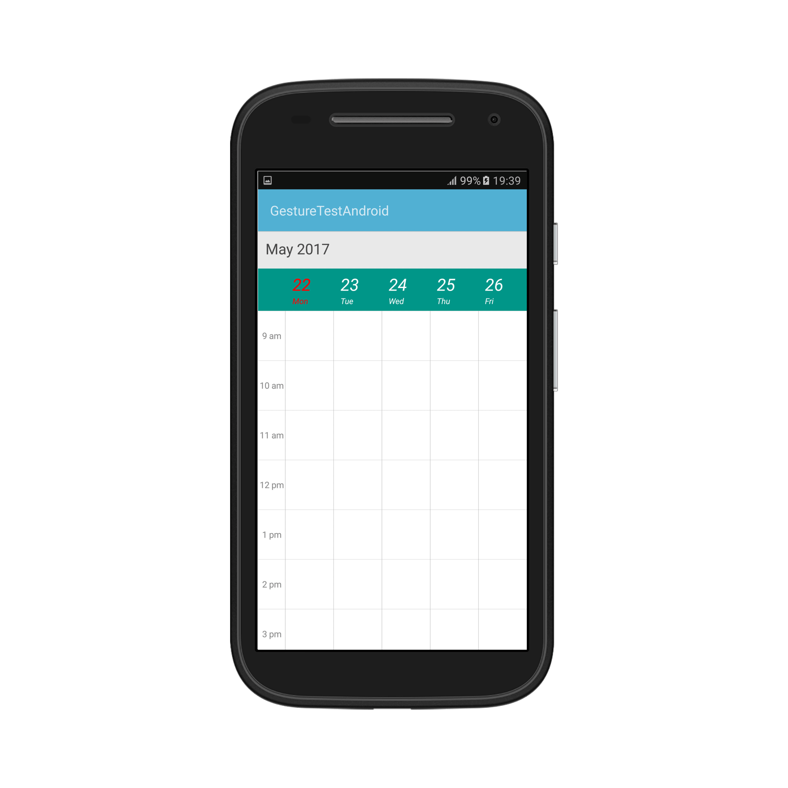
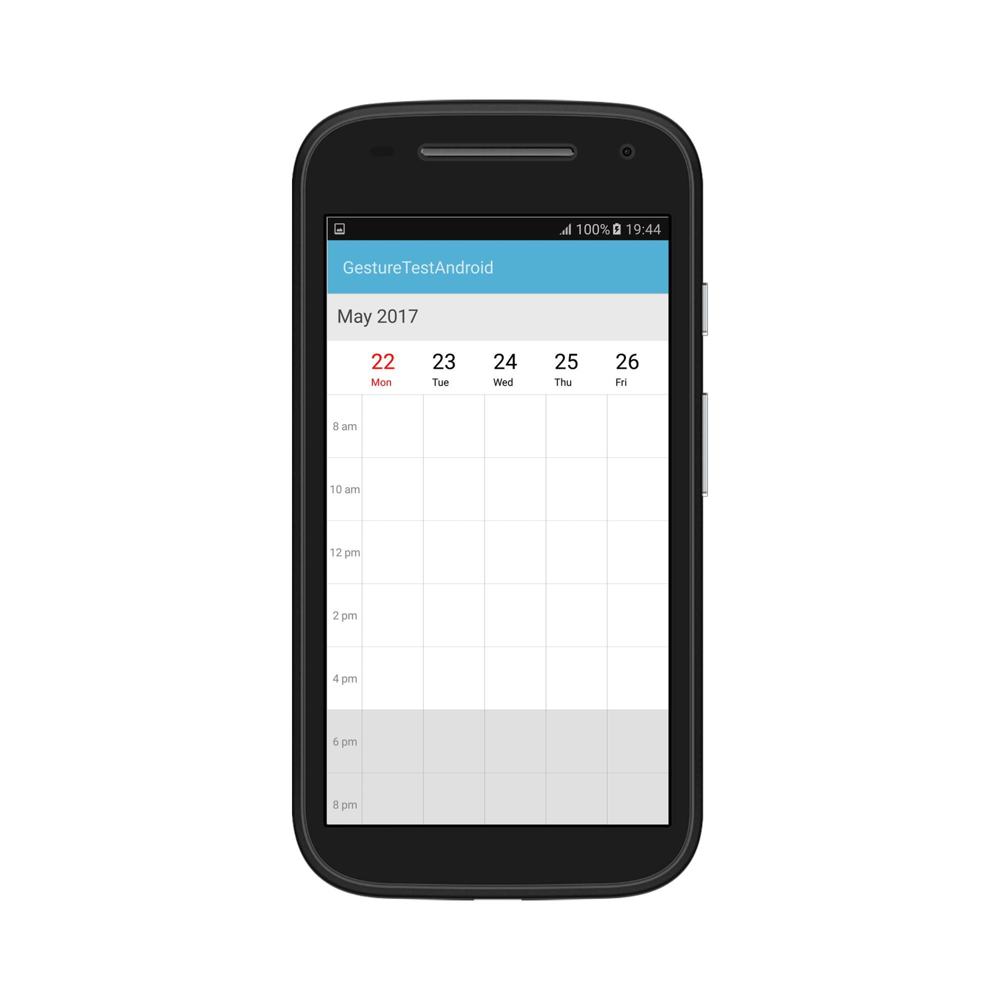
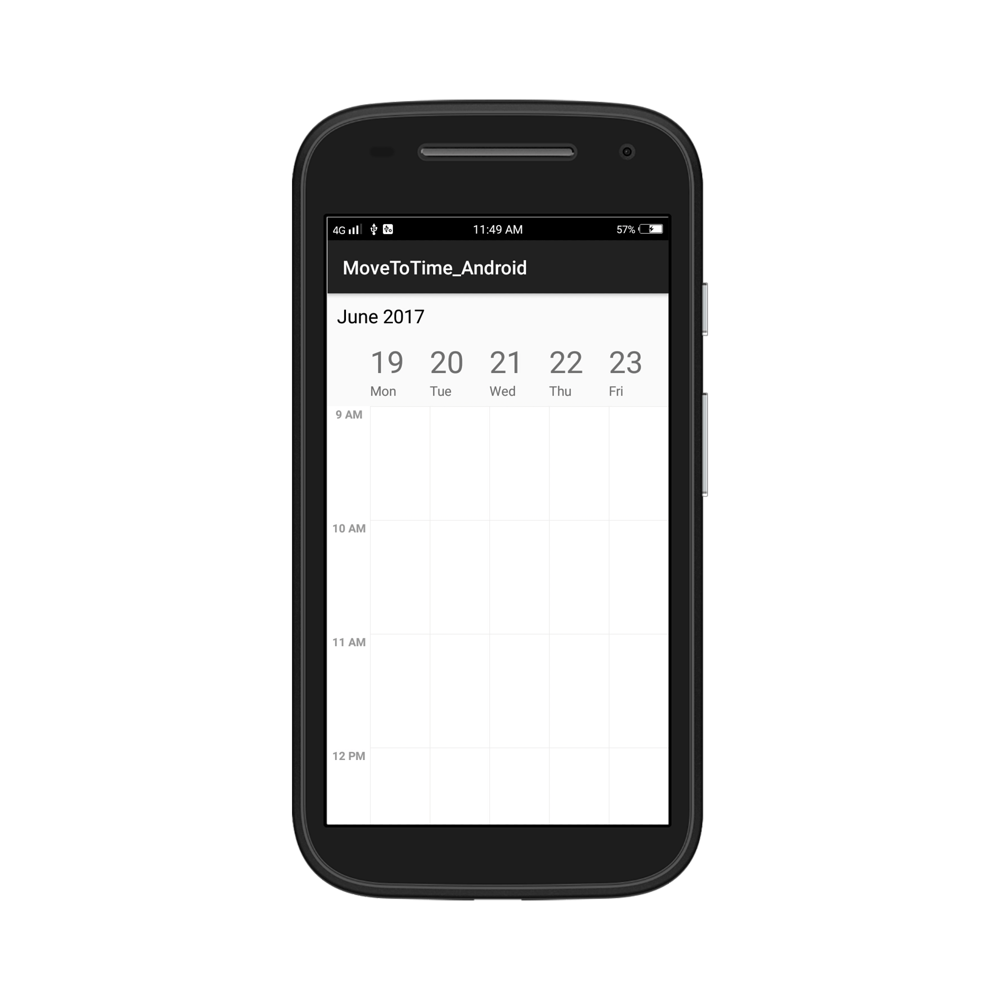
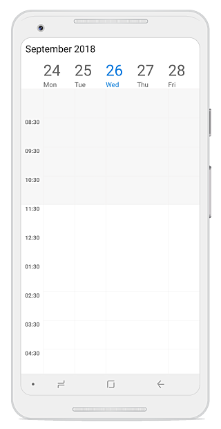
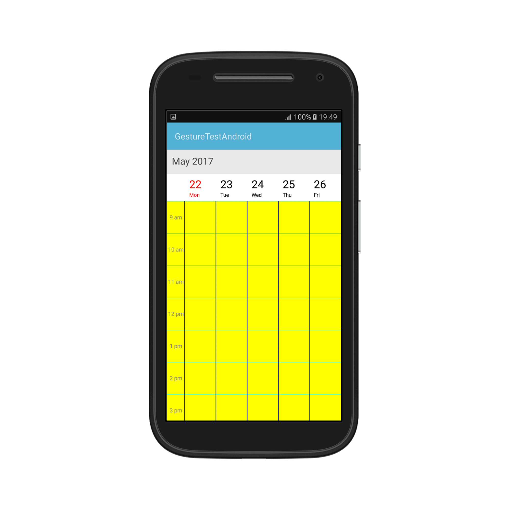
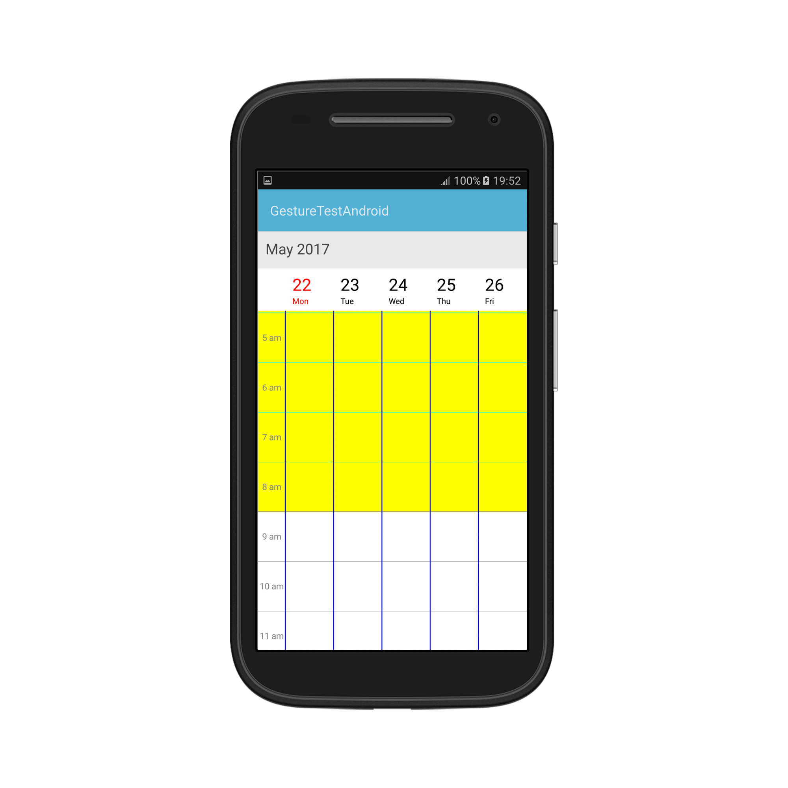
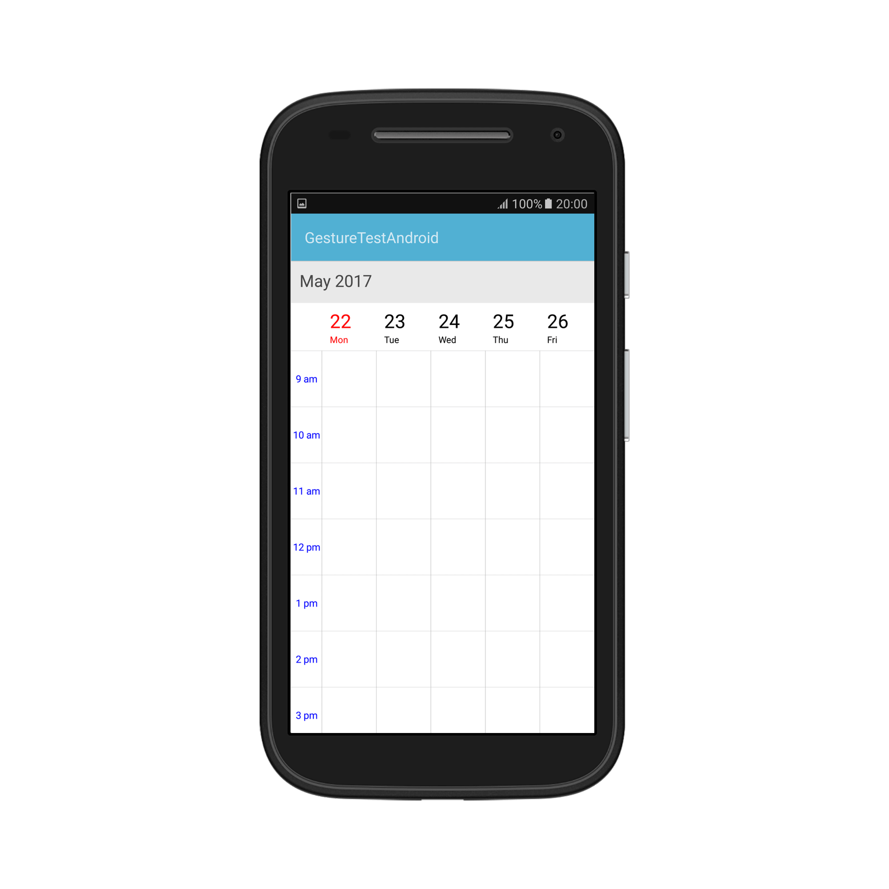

---

layout: post
title: Customize the Schedule WorkWeekView at SfSchedule control for Xamarin.Android
description: Learn how to Customize the schedule WorkWeekView in SfSchedule control
platform: xamarin.Android
control: SfSchedule
documentation: ug

---

# WorkWeekView
WorkWeekView is to view only working days of a particular week. By default, Saturday and Sunday are the non-working days. You can be customize it with any days of a Week. Appointments arranged in timeslots based on its duration with respective day of the week.

## ViewHeader Appearance
You can customize the default appearance of view header in [WorkWeekView](https://help.syncfusion.com/cr/cref_files/xamarin-android/sfschedule/Syncfusion.SfSchedule.Android~Com.Syncfusion.Schedule.Enums.ScheduleView.html) by using [ViewHeaderStyle](https://help.syncfusion.com/cr/cref_files/xamarin-android/sfschedule/Syncfusion.SfSchedule.Android~Com.Syncfusion.Schedule.SfSchedule~ViewHeaderStyle.html) property of [SfSchedule](https://help.syncfusion.com/cr/cref_files/xamarin-android/sfschedule/Syncfusion.SfSchedule.Android~Com.Syncfusion.Schedule.SfSchedule.html).



           //Create new instance of Schedule
			SfSchedule schedule = new SfSchedule(this);
			schedule.ScheduleView = ScheduleView.WorkWeekView;
			//Customize the schedule view header
			ViewHeaderStyle viewHeaderStyle = new ViewHeaderStyle();
			viewHeaderStyle.BackgroundColor = Color.Rgb(0, 150, 136);
			viewHeaderStyle.DayTextColor = Color.Rgb(255, 255, 255);
			viewHeaderStyle.DateTextColor = Color.Rgb(255, 255, 255);
			viewHeaderStyle.DayTextStyle = Typeface.DefaultFromStyle(TypefaceStyle.Italic);
			viewHeaderStyle.DateTextStyle = Typeface.DefaultFromStyle(TypefaceStyle.Italic);
			schedule.ViewHeaderStyle = viewHeaderStyle;


You can customize the height of the ViewHeader in `WorkWeekView` by setting [ViewHeaderHeight](https://help.syncfusion.com/cr/cref_files/xamarin-android/sfschedule/Syncfusion.SfSchedule.Android~Com.Syncfusion.Schedule.SfSchedule~ViewHeaderHeight.html) property of `SfSchedule`.



           schedule.ScheduleView = ScheduleView.WorkWeekView;
			schedule.ViewHeaderHeight = 50;


## Change Time Interval
You can customize the interval of timeslots in `WorkWeekView` by setting [TimeInterval](https://help.syncfusion.com/cr/cref_files/xamarin-android/sfschedule/Syncfusion.SfSchedule.Android~Com.Syncfusion.Schedule.SfSchedule~TimeInterval.html) property of `SfSchedule`.



            schedule.ScheduleView = ScheduleView.WorkWeekView;
			schedule.TimeInterval = 120;


## Change Time Interval Height
You can customize the interval height of timeslots in `WorkWeekView` by setting [TimeIntervalHeight](https://help.syncfusion.com/cr/cref_files/xamarin-android/sfschedule/Syncfusion.SfSchedule.Android~Com.Syncfusion.Schedule.SfSchedule~TimeIntervalHeight.html)  property of `SfSchedule`.



    schedule.ScheduleView = ScheduleView.WorkWeekView;
    schedule.TimeIntervalHeight = 180;


>**Note**:
	`WorkStartHour` and `WorkEndHour` should be in integer value to represent hours.

## Change Working hours

Working hours in `WorkWeekView` of Schedule control will be differentiated with non-working hours by separate color. By default, working hours will be between 09 to 18. You can customize the working hours by setting [WorkStartHour](https://help.syncfusion.com/cr/cref_files/xamarin-android/sfschedule/Syncfusion.SfSchedule.Android~Com.Syncfusion.Schedule.WorkWeekViewSettings~WorkStartHour.html) and [WorkEndHour](https://help.syncfusion.com/cr/cref_files/xamarin-android/sfschedule/Syncfusion.SfSchedule.Android~Com.Syncfusion.Schedule.WorkWeekViewSettings~WorkEndHour.html) properties of [WorkWeekViewSettings](https://help.syncfusion.com/cr/cref_files/xamarin-android/sfschedule/Syncfusion.SfSchedule.Android~Com.Syncfusion.Schedule.SfSchedule~WorkWeekViewSettings.html).



           schedule.ScheduleView = ScheduleView.WorkWeekView;
			//Create new instance of WorkWeekViewSettings
			WorkWeekViewSettings workWeekViewSettings = new WorkWeekViewSettings();
			workWeekViewSettings.WorkStartHour = 10;
			workWeekViewSettings.WorkEndHour = 18;
			schedule.WorkWeekViewSettings = workWeekViewSettings;


## Changing StartHour and EndHour

Default value for [StartHour](https://help.syncfusion.com/cr/cref_files/xamarin-android/sfschedule/Syncfusion.SfSchedule.Android~Com.Syncfusion.Schedule.WorkWeekViewSettings~StartHour.html) and [EndHour](https://help.syncfusion.com/cr/cref_files/xamarin-android/sfschedule/Syncfusion.SfSchedule.Android~Com.Syncfusion.Schedule.WorkWeekViewSettings~EndHour.html) value is 0 to 24 to show all the time slots in `WorkWeekView`. You need to set [StartHour](https://help.syncfusion.com/cr/cref_files/xamarin-android/sfschedule/Syncfusion.SfSchedule.Android~Com.Syncfusion.Schedule.WorkWeekViewSettings~StartHour.html) and [EndHour](https://help.syncfusion.com/cr/cref_files/xamarin-android/sfschedule/Syncfusion.SfSchedule.Android~Com.Syncfusion.Schedule.WorkWeekViewSettings~EndHour.html) property of `WorkWeekView`, to show only the required time duration for end users.



           schedule.ScheduleView = ScheduleView.WorkWeekView;
			//Create new instance of WorkWeekViewSettings
			WorkWeekViewSettings workWeekViewSettings = new WorkWeekViewSettings();
			workWeekViewSettings.StartHour = 08;
			workWeekViewSettings.EndHour = 15;
			schedule.WorkWeekViewSettings = workWeekViewSettings;


>**Note**:
* `StartHour` and `EndHour` should be in integer value to represent hours.
* `StartHour` must be greater than or equal to 0 and `EndHour` must be lesser than or equal to 24, otherwise `InvalidDataException` will be thrown.
* `EndHour` value must be greater than `StartHour`, otherwise `InvalidDataException` will be thrown.
* Schedule UI such as Appointments and NonAccessibleBlocks which does not fall within the `StartHour` and `EndHour` will not be visible and if it falls partially, it will be clipped.

## Timeslot Appearance
You can customize the appearance of timeslots in `WorkWeekView`.

 * [Timeslot customization in Work hours](#timeslot-customization-in-work-hours)
* [Timeslot customization in Non Working hours](#timeslot-customization-in-non-working-hours)

### Timeslot customization in Work hours
You can customize the appearance of the working hour timeslots by its color using[TimeSlotColor](https://help.syncfusion.com/cr/cref_files/xamarin-android/sfschedule/Syncfusion.SfSchedule.Android~Com.Syncfusion.Schedule.WorkWeekViewSettings~TimeSlotColor.html),[TimeSlotBorderColor](https://help.syncfusion.com/cr/cref_files/xamarin-android/sfschedule/Syncfusion.SfSchedule.Android~Com.Syncfusion.Schedule.WorkWeekViewSettings~TimeSlotBorderColor.html), [VerticalLineStrokeWidth](https://help.syncfusion.com/cr/cref_files/xamarin-android/sfschedule/Syncfusion.SfSchedule.Android~Com.Syncfusion.Schedule.WorkWeekViewSettings~VerticalLineStrokeWidth.html), [VerticalLineColor](https://help.syncfusion.com/cr/cref_files/xamarin-android/sfschedule/Syncfusion.SfSchedule.Android~Com.Syncfusion.Schedule.WorkWeekViewSettings~VerticalLineColor.html) and [TimeSlotBorderStrokeWidth](https://help.syncfusion.com/cr/cref_files/xamarin-android/sfschedule/Syncfusion.SfSchedule.Android~Com.Syncfusion.Schedule.WorkWeekViewSettings~TimeSlotBorderStrokeWidth.html) properties of `WorkWeekViewSettings`.



            schedule.ScheduleView = ScheduleView.WorkWeekView;
			//Create new instance of WorkWeekViewSettings
			WorkWeekViewSettings workWeekViewSettings = new WorkWeekViewSettings();
			workWeekViewSettings.TimeSlotBorderColor = Color.Aqua;
			workWeekViewSettings.VerticalLineColor = Color.Blue;
			workWeekViewSettings.TimeSlotColor = Color.Yellow;
			workWeekViewSettings.TimeSlotBorderStrokeWidth = 5;
			workWeekViewSettings.VerticalLineStrokeWidth = 5;
			schedule.WorkWeekViewSettings = workWeekViewSettings;


### Timeslot customization in Non Working hours

You can customize the appearance of the non-working hour timeslots by its color using[NonWorkingHoursTimeSlotBorderColor](https://help.syncfusion.com/cr/cref_files/xamarin-android/sfschedule/Syncfusion.SfSchedule.Android~Com.Syncfusion.Schedule.WorkWeekViewSettings~NonWorkingHoursTimeSlotBorderColor.html),[NonWorkingHoursTimeSlotColor](https://help.syncfusion.com/cr/cref_files/xamarin-android/sfschedule/Syncfusion.SfSchedule.Android~Com.Syncfusion.Schedule.WorkWeekViewSettings~NonWorkingHoursTimeSlotColor.html),`VerticalLineStrokeWidth`, `VerticalLineColor` and `TimeSlotBorderStrokeWidth` properties of `WorkWeekViewSettings`.



           schedule.ScheduleView = ScheduleView.WorkWeekView;
			//Create new instance of WorkWeekViewSettings
			WorkWeekViewSettings workWeekViewSettings = new WorkWeekViewSettings();
			workWeekViewSettings.NonWorkingHoursTimeSlotBorderColor = Color.Aqua;
			workWeekViewSettings.VerticalLineColor = Color.Blue;
			workWeekViewSettings.NonWorkingHoursTimeSlotColor = Color.Yellow;
			workWeekViewSettings.TimeSlotBorderStrokeWidth = 5;
			workWeekViewSettings.VerticalLineStrokeWidth = 5;
			schedule.WorkWeekViewSettings = workWeekViewSettings;


>**Note**:
` TimeSlotBorderStrokeWidth`and ` VerticalLineStrokeWidth` properties are common to both Working hours and Non-Working hour time slot customization.

## Non-Accessible timeslots

You can restrict or allocate certain timeslot as Non-accessible blocks by using[NonAccessibleBlocks](https://help.syncfusion.com/cr/cref_files/xamarin-android/sfschedule/Syncfusion.SfSchedule.Android~Com.Syncfusion.Schedule.WorkWeekViewSettings~NonAccessibleBlocks.html) of `WorkWeekViewSettings` so that you can allocate those timeslots for predefined events/activities like Lunch hour.



    schedule.ScheduleView = ScheduleView.WorkWeekView;
			//Create new instance of NonAccessibleBlock
			NonAccessibleBlock nonAccessibleBlock = new NonAccessibleBlock();
			//Create new instance of NonAccessibleBlocksCollection
			NonAccessibleBlocksCollection nonAccessibleBlocksCollection = new NonAccessibleBlocksCollection();
			WorkWeekViewSettings workWeekViewSettings = new WorkWeekViewSettings();
			nonAccessibleBlock.StartTime = 13;
			nonAccessibleBlock.EndTime = 14;
			nonAccessibleBlock.Text = "LUNCH";
			nonAccessibleBlock.Color = Color.Black;
			nonAccessibleBlocksCollection.Add(nonAccessibleBlock);
			workWeekViewSettings.NonAccessibleBlocks = nonAccessibleBlocksCollection;
			schedule.WorkWeekViewSettings = workWeekViewSettings;


>**Note**:
Selection and related events will not be working in this blocks.

## Change first day of week

By default, schedule control will be rendered with Sunday as the first day of the week, it can be customized to any day of the week by using[FirstDayOfWeek](https://help.syncfusion.com/cr/cref_files/xamarin-android/sfschedule/Syncfusion.SfSchedule.Android~Com.Syncfusion.Schedule.SfSchedule~FirstDayOfWeek.html) property of `SfSchedule`.



            schedule.ScheduleView = ScheduleView.WorkWeekView;
			schedule.FirstDayOfWeek = 3;


## Time Label Formatting
You can customize the format for the labels which are mentioning the time, by setting [TimeFormat](https://help.syncfusion.com/cr/cref_files/xamarin-android/sfschedule/Syncfusion.SfSchedule.Android~Com.Syncfusion.Schedule.WorkWeekLabelSettings~TimeFormat.html) property of [WorkWeekLabelSettings](https://help.syncfusion.com/cr/cref_files/xamarin-android/sfschedule/Syncfusion.SfSchedule.Android~Com.Syncfusion.Schedule.WorkWeekViewSettings~WorkWeekLabelSettings.html) in `WorkWeekViewSettings`.



            schedule.ScheduleView = ScheduleView.WorkWeekView;
			WorkWeekViewSettings workweekViewSettings = new WorkWeekViewSettings();
			WorkWeekLabelSettings workWeekLabelSettings = new WorkWeekLabelSettings();
			workWeekLabelSettings.TimeFormat = "hh mm";
			workweekViewSettings.WorkWeekLabelSettings = workWeekLabelSettings;
			schedule.WorkWeekViewSettings = workweekViewSettings;


## Time Label Appearance

You can customize the color for the labels which are mentioning the time, by setting [TimeLabelColor](https://help.syncfusion.com/cr/cref_files/xamarin-android/sfschedule/Syncfusion.SfSchedule.Android~Com.Syncfusion.Schedule.WorkWeekLabelSettings~TimeLabelColor.html) property of `WorkWeekLabelSettings` in `WorkWeekViewSettings`.



           schedule.ScheduleView = ScheduleView.WorkWeekView;
			//Create new instance of WorkWeekViewSettings
			WorkWeekViewSettings workWeekViewSettings = new WorkWeekViewSettings();
			//Create new instance of WorkWeekLabelSettings
			WorkWeekLabelSettings workWeekLabelSettings = new WorkWeekLabelSettings();
			workWeekLabelSettings.TimeLabelColor = Color.Blue;
			workWeekViewSettings.WorkWeekLabelSettings = workWeekLabelSettings;
			schedule.WorkWeekViewSettings = workWeekViewSettings;


## Selection
You can customize the default appearance of selection UI in the timeslots.

* [Selection customization using style](#selection-customization-using-style)
* [Selection customization using custom View](#selection-customization-using-custom-view)

### Selection customization using style
You can customize the timeslot selection by using [SelectionStyle](https://help.syncfusion.com/cr/cref_files/xamarin-android/sfschedule/Syncfusion.SfSchedule.Android~Com.Syncfusion.Schedule.SfSchedule~SelectionStyle.html) property of `SfSchedule`.



            schedule.ScheduleView = ScheduleView.WorkWeekView;
			//Create new instance of SelectionStyle 
			SelectionStyle selectionStyle = new SelectionStyle();
			selectionStyle.BackgroundColor = Color.Blue;
			selectionStyle.BorderColor = Color.Black;
			selectionStyle.BorderThickness = 5;
			selectionStyle.CornerRadius = 5;
			schedule.SelectionStyle = selectionStyle;


### Selection customization using custom View
You can replace the default selection UI with your custom view by setting [SelectionView](https://help.syncfusion.com/cr/cref_files/xamarin-android/sfschedule/Syncfusion.SfSchedule.Android~Com.Syncfusion.Schedule.SfSchedule~SelectionView.html) property of `SfSchedule`.


          schedule.ScheduleView = ScheduleView.WorkWeekView;
			//Add the CustomView 
			Button customView = new Button(this);
			customView.Text = "+NewEvent";
			customView.SetBackgroundColor(Color.Rgb(255, 152, 0));
			customView.SetTextColor(Color.White);
			schedule.SelectionView = customView;


### Programmatic selection
You can programmatically select the specific timeslot by setting corresponding date and time value to [SelectedDate]( https://help.syncfusion.com/cr/cref_files/xamarin-android/sfschedule/Syncfusion.SfSchedule.Android~Com.Syncfusion.Schedule.SfSchedule~SelectedDate.html) property of `SfSchedule`. By default, it is null.



    // Creating instance of calendar
    Calendar calendar = Calendar.Instance;

    // Setting a date and time to select
    calendar.Set(2017, 09, 04, 10, 0, 0);
    schedule.SelectedDate = calendar;



You can clear the selection by setting [SelectedDate]( https://help.syncfusion.com/cr/cref_files/xamarin-android/sfschedule/Syncfusion.SfSchedule.Android~Com.Syncfusion.Schedule.SfSchedule~SelectedDate.html) as null.



    // Setting null value to deselect
    schedule.SelectedDate = null;



You can download the entire source code of this demo for Xamarin.Android from here [Date_Selection](http://www.syncfusion.com/downloads/support/directtrac/general/ze/Date_Selection-303833588.zip)

>**Note**:
* `SfSchedule` does not support multiple selection.
* `SfSchedule` supports two-way binding of `SelectedDate` property.

