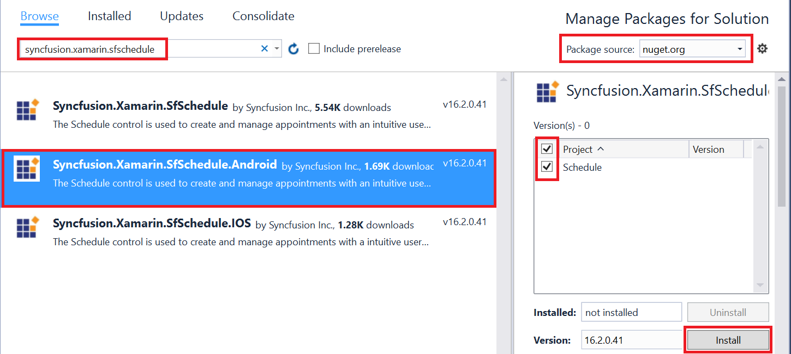
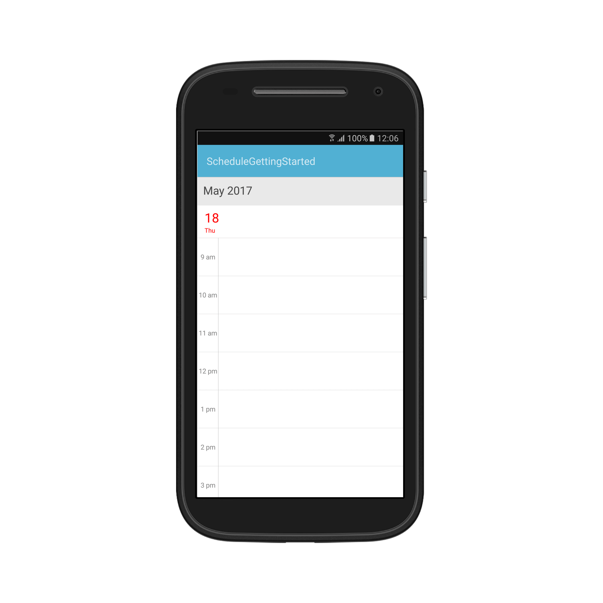

--- 
layout: post 
title: Getting started with Syncfusion Essential Schedule for Xamarin.Android 
description: A quick tour to initial users on Syncfusion SfSchedule control for Xamarin.Android platform 
platform: Xamarin.Android 
control: SfSchedule 
documentation: ug 
--- 
 
# Getting Started 
 
This section provides you an overview for working with SfSchedule for Xamarin.Android and also provides a walk through to configure SfSchedule control in real time scenario. 
 
## Assembly Configuration 

You can download our Xamarin components directly from our website, refer [here](https://help.syncfusion.com/xamarin-android/introduction/download-and-installation) for assistance.
 
Once the assemblies has been downloaded and explored as mentioned above,you can find all the required assemblies in the installation folders. 
 
{Syncfusion Essential Studio Installed location}\Essential Studio\syncfusionessentialstudio-releaseversion\Xamarin\lib 
 
Eg: C:\Program Files (x86)\Syncfusion\Essential Studio\15.1.0.41\Xamarin\lib 
 
>**NOTE**
Assemblies can be found in unzipped package location in Mac
 
## Adding SfSchedule Reference
Syncfusion Xamarin components are available in [nuget.org](https://www.nuget.org/). To add SfSchedule to your project, open the NuGet package manager in Visual Studio, and search for Syncfusion.Xamarin.SfSchedule, and then install it.  

To know more about obtaining our components, refer this [link](https://help.syncfusion.com/xamarin-android/introduction/download-and-installation). Also, if you prefer to manually refer the assemblies instead of NuGet,refer the assembly mentioned in the table below.
 
<table> 
<tr> 
<th>Project</th> 
<th>Required assembly</th> 
</tr> 
<tr> 
<td>Xamarin.Android</td> 
<td>android\Syncfusion.SfSchedule.Android.dll </td> 
</tr> 
</table> 

>**Important**
Starting with v16.2.0.x, if you reference Syncfusion assemblies from trial setup or from the NuGet feed, you also have to include a license key in your projects. Please refer to this [link](https://help.syncfusion.com/common/essential-studio/licensing/license-key) to know about registering Syncfusion license key in your Xamarin application to use our components.
 
## Create a simple application with SfSchedule 
 
This section explains how to create a simple application using SfSchedule control. SfSchedule control can be configured entirely in C# code. This is how the final output will look like on Android devices.
 
 

You can download the entire source code of this demo for Xamarin.Android from   
here [ScheduleGettingStarted](http://www.syncfusion.com/downloads/support/directtrac/general/ze/ScheduleGettingStarted1888257278.zip). 
 
This section provides a walks through to create `MeetingRoomScheduler` using our Schedule control.
 
* [Creating a new project](#creating-a-new-project) 
* [Adding SfSchedule to the project](#adding-sfschedule-to-the-project)      
* [Changing Schedule Views](#changing-schedule-views)   
* [Binding data to SfSchedule control](#binding-data-to-sfschedule-control) 

## Creating a new project 
 
Create a new Android application in Xamarin Studio or Visual Studio for Xamarin.Android. 
 
Add the required assembly references to the project as discussed in the [Assembly Configuration](#assembly-configuration) section. 
 
Import SfSchedule control namespace `Syncfusion.SfSchedule.Android`. 
 
## Adding SfSchedule to the project 
 
Create an instance of SfSchedule control and add as a child to the view hosted in the Activity. 



using Syncfusion.SfSchedule.Android;

SfSchedule schedule;
protected override void OnCreate(Bundle bundle)
{
    base.OnCreate(bundle);
    //Creating new instance for SfSchedule
    schedule = new SfSchedule(this);
    SetContentView(schedule);
}


 
## Changing Schedule Views 
 
SfSchedule control provides four different types of views to display dates and it can be assigned to the control by using [ScheduleView](https://help.syncfusion.com/cr/cref_files/xamarin-android/Syncfusion.SfSchedule.Android~Com.Syncfusion.Schedule.SfSchedule~ScheduleView.html) property. By default the control is assigned with `DayView`.Current date will be displayed initially for all the Schedule views.
 
Schedule control will be rendered with `Sunday` as the first day of the week, but you can customize to any day by using [FirstDayOfWeek](https://help.syncfusion.com/cr/cref_files/xamarin-android/Syncfusion.SfSchedule.Android~Com.Syncfusion.Schedule.SfSchedule~FirstDayOfWeek.html) property of `SfSchedule`. 



//setting first day of the week
schedule.FirstDayOfWeek = Calendar.Tuesday;


 
 

### Day View 
 
`DayView` is used to display a single day, current day will be visible by default. Appointments on a specific day will be arranged in respective timeslots based on its duration. 



//setting schedule view
schedule.ScheduleView = ScheduleView.DayView;


 
 

### Week View 
 
`WeekView` is to view all days of a particular week. Appointments will be arranged based on the dates on the week in respective timeslots. 



//setting schedule view
schedule.ScheduleView = ScheduleView.WeekView;


 
 

### Work Week View 
 
`WorkWeekView` is to view only working days of a particular week. By default, Saturday and Sunday are the non-working days. You can be customize it with any days of a Week. Appointments arranged in timeslots based on its duration with respective day of the week. 



//setting schedule view
schedule.ScheduleView = ScheduleView.WorkWeekView;


 
 

>**NOTE**
Appointments in non-working days will not be displayed.

### Month View 
 
`MonthView` in Schedule control is to view entire dates of a particular month. Appointments can be viewed in inline by setting [ShowAppointmentsInline](https://help.syncfusion.com/cr/cref_files/xamarin-android/Syncfusion.SfSchedule.Android~Com.Syncfusion.Schedule.MonthViewSettings~ShowAppointmentsInline.html) property of [MonthViewSettings](https://help.syncfusion.com/cr/cref_files/xamarin-android/Syncfusion.SfSchedule.Android~Com.Syncfusion.Schedule.SfSchedule~MonthViewSettings.html) of `SfSchedule` as true. 



//setting schedule view
schedule.ScheduleView = ScheduleView.MonthView;
schedule.MonthViewSettings.ShowAppointmentsInline = true;


 
 

## Binding data to SfSchedule control  
 
You can add events to the schedule by creating collection of [ScheduleAppointment](https://help.syncfusion.com/cr/cref_files/xamarin-android/Syncfusion.SfSchedule.Android~Com.Syncfusion.Schedule.ScheduleAppointment.html) using [ScheduleAppointmentCollection](https://help.syncfusion.com/cr/cref_files/xamarin-android/Syncfusion.SfSchedule.Android~Com.Syncfusion.Schedule.ScheduleAppointmentCollection.html).  
 
### Adding Appointments  
 
`ScheduleAppointment` is a class, which holds the details about the appointment to be rendered in schedule. It has some basic properties such as [StartTime](https://help.syncfusion.com/cr/cref_files/xamarin-android/Syncfusion.SfSchedule.Android~Com.Syncfusion.Schedule.ScheduleAppointment~StartTime.html), [EndTime](https://help.syncfusion.com/cr/cref_files/xamarin-android/Syncfusion.SfSchedule.Android~Com.Syncfusion.Schedule.ScheduleAppointment~EndTime.html), [Subject](https://help.syncfusion.com/cr/cref_files/xamarin-android/Syncfusion.SfSchedule.Android~Com.Syncfusion.Schedule.ScheduleAppointment~Subject.html) and some additional information about the appointment can be added using [Color](https://help.syncfusion.com/cr/cref_files/xamarin-android/Syncfusion.SfSchedule.Android~Com.Syncfusion.Schedule.ScheduleAppointment~Color.html), [Notes](https://help.syncfusion.com/cr/cref_files/xamarin-android/Syncfusion.SfSchedule.Android~Com.Syncfusion.Schedule.ScheduleAppointment~Notes.html), [Location](https://help.syncfusion.com/cr/cref_files/xamarin-android/Syncfusion.SfSchedule.Android~Com.Syncfusion.Schedule.ScheduleAppointment~Location.html), [IsAllDay](https://help.syncfusion.com/cr/cref_files/xamarin-android/Syncfusion.SfSchedule.Android~Com.Syncfusion.Schedule.ScheduleAppointment~IsAllDay.html), [IsRecursive](https://help.syncfusion.com/cr/cref_files/xamarin-android/Syncfusion.SfSchedule.Android~Com.Syncfusion.Schedule.ScheduleAppointment~IsRecursive.html) properties. 

Here are steps to render `MeetingRoomScheduler` using SfSchedule control.

* [Adding data for class](#adding-data-for-class)
* [Populating data collection](#populating-data-collection) 
* [Setting appointments for SfSchedule](#setting-appointments-for-sfschedule) 

#### Adding data for class

##### Adding event names

You can add `Subject` to the appointments created by creating a collection for the same. 



List<string> subjectCollection;

/// 

/// Creates subject collection.
/// 

private void CreateSubjectCollection()
{
    subjectCollection = new List<string>();
    subjectCollection.Add("GoToMeeting");
    subjectCollection.Add("Business Meeting");
    subjectCollection.Add("Conference");
    subjectCollection.Add("Project Status Discussion");
    subjectCollection.Add("Auditing");
    subjectCollection.Add("Client Meeting");
    subjectCollection.Add("Generate Report");
    subjectCollection.Add("Target Meeting");
    subjectCollection.Add("General Meeting");
    subjectCollection.Add("Pay House Rent");
    subjectCollection.Add("Car Service");
    subjectCollection.Add("Medical Check Up");
    subjectCollection.Add("Wedding Anniversary");
    subjectCollection.Add("Sam's Birthday");
    subjectCollection.Add("Jenny's Birthday");
}



##### Adding color collection 

You can add `Color` to the appointments created by creating a collection for the same. 



List<string> colorCollection;

/// 

/// Creates color collection.
/// 

private void CreateColorCollection()
{
    colorCollection = new List<string>();
    colorCollection.Add("#117EB4");
    colorCollection.Add("#B4112E");
    colorCollection.Add("#C44343");
    colorCollection.Add("#11B45E");
    colorCollection.Add("#43BEC4");
    colorCollection.Add("#B4112E");
    colorCollection.Add("#C44343");
    colorCollection.Add("#117EB4");
    colorCollection.Add("#C4435A");
    colorCollection.Add("#DF5348");
    colorCollection.Add("#43c484");
    colorCollection.Add("#11B49B");
    colorCollection.Add("#C44378");
    colorCollection.Add("#DF8D48");
    colorCollection.Add("#11B45E");
    colorCollection.Add("#43BEC4");
}



#### Populating data collection

Schedule control has a built-in capability to handle the appointment arrangement internally based on the ScheduleAppointment collections.



ScheduleAppointmentCollection Meetings;
int workStartHour = 9;

/// 

/// Creates meetings and stores in a collection.
/// 

private void CreateAppointments()
{
    Meetings = new ScheduleAppointmentCollection();
    Java.Util.Random randomTime = new Java.Util.Random();
    CreateSubjectCollection();
    CreateColorCollection();
    Calendar calendar = Calendar.Instance;
    Calendar DateFrom = Calendar.Instance;
    DateFrom.Add(CalendarField.Date, -10);
    Calendar DateTo = Calendar.Instance;
    DateTo.Add(CalendarField.Date, 10);
    Calendar dateRangeStart = Calendar.Instance;
    dateRangeStart.Add(CalendarField.Date, -3);
    Calendar dateRangeEnd = Calendar.Instance;
    dateRangeEnd.Add(CalendarField.Date, 3);
    for (calendar = DateFrom; calendar.Before(DateTo); calendar.Add(CalendarField.Date, 1))
    {
        if (calendar.After(dateRangeStart) && calendar.Before(dateRangeEnd))
        {
            for (int AdditionalAppointmentIndex = 0; AdditionalAppointmentIndex < 3; AdditionalAppointmentIndex++)
            {
                ScheduleAppointment meeting = new ScheduleAppointment();
                int hour = workStartHour + randomTime.NextInt(9);
                Calendar startTimeCalendar = Calendar.Instance;
                startTimeCalendar.Set(calendar.Get(CalendarField.Year),
                                      calendar.Get(CalendarField.Month),
                                      calendar.Get(CalendarField.Date),
                                      hour, 0);
                meeting.StartTime = startTimeCalendar;
                Calendar endTimeCalendar = Calendar.Instance;
                endTimeCalendar.Set(calendar.Get(CalendarField.Year),
                                    calendar.Get(CalendarField.Month),
                                    calendar.Get(CalendarField.Date),
                                    hour + 1, 0);
                meeting.EndTime = endTimeCalendar;
                meeting.Color = Color.ParseColor(colorCollection[randomTime.NextInt(9)]);
                meeting.Subject = subjectCollection[randomTime.NextInt(9)];
                Meetings.Add(meeting);
            }
        }
        else
        {
            ScheduleAppointment meeting = new ScheduleAppointment();
            int hour = workStartHour + randomTime.NextInt(9);
            Calendar startTimeCalendar = Calendar.Instance;
            startTimeCalendar.Set(calendar.Get(CalendarField.Year),
                                  calendar.Get(CalendarField.Month),
                                  calendar.Get(CalendarField.Date),
                                  hour, 0);
            meeting.StartTime = startTimeCalendar;
            Calendar endTimeCalendar = Calendar.Instance;
            endTimeCalendar.Set(calendar.Get(CalendarField.Year),
                                calendar.Get(CalendarField.Month),
                                calendar.Get(CalendarField.Date),
                                hour + 1, 0);
            meeting.EndTime = endTimeCalendar;
            meeting.Color = Color.ParseColor(colorCollection[randomTime.NextInt(9)]);
            meeting.Subject = subjectCollection[randomTime.NextInt(9)];
            Meetings.Add(meeting);
        }
    }
}


 
#### Setting appointments for SfSchedule 

Create meetings of type `ScheduleAppointmentCollection` and assign those appointments collection `Meetings` to the [Appointments](https://help.syncfusion.com/cr/cref_files/xamarin-android/Syncfusion.SfSchedule.Android~Com.Syncfusion.Schedule.SfSchedule~Appointments.html) property.



CreateAppointments();
schedule.Appointments = Meetings;



 
