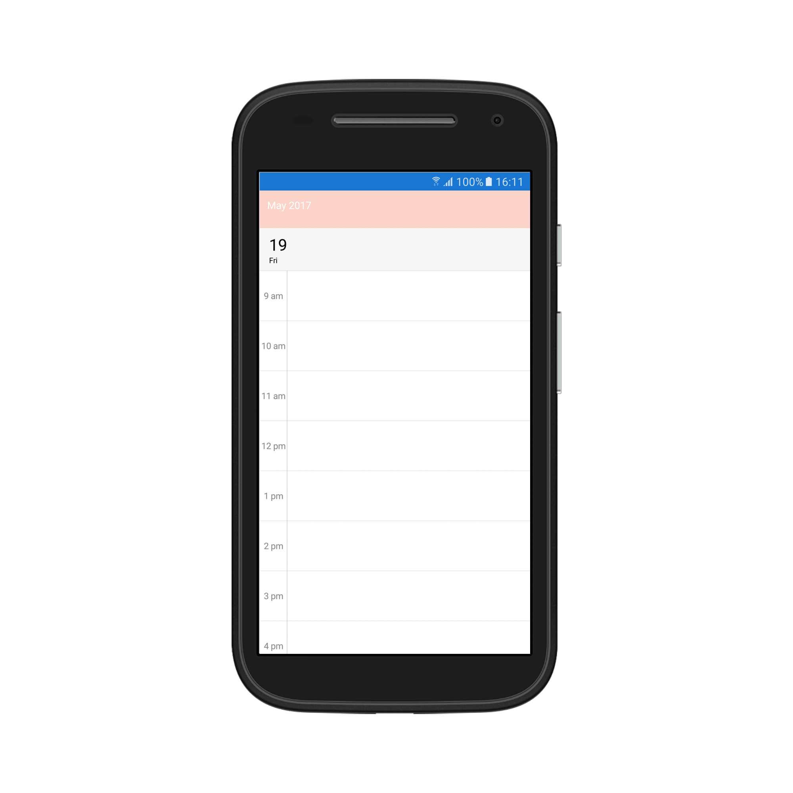

---     
layout: post     
title: Header appearance and customization in Syncfusion SfSchedule control for Xamarin.Android     
description: Learn how to customize header in SfSchedule control    
platform: xamarin.Android    
control: SfSchedule     
documentation: ug
---  

# Header

You can customize the header of the Schedule using [HeaderStyle](https://help.syncfusion.com/cr/cref_files/xamarin-android/sfschedule/Syncfusion.SfSchedule.Android~Com.Syncfusion.Schedule.SfSchedule~HeaderStyle.html) and [HeaderHeight](https://help.syncfusion.com/cr/cref_files/xamarin-android/sfschedule/Syncfusion.SfSchedule.Android~Com.Syncfusion.Schedule.SfSchedule~HeaderHeight.html) property in schedule.

## Header Height

You can customize the height for the Header in Schedule using `HeaderHeight` in schedule.



	schedule.HeaderHeight = 50;



## Appearance

You can change the header format and style using `HeaderStyle` property in schedule.

You can change the background color,text style and text size using properties such as [BackgroundColor](https://help.syncfusion.com/cr/cref_files/xamarin-android/sfschedule/Syncfusion.SfSchedule.Android~Com.Syncfusion.Schedule.HeaderStyle~BackgroundColor.html),[TextStyle](https://help.syncfusion.com/cr/cref_files/xamarin-android/sfschedule/Syncfusion.SfSchedule.Android~Com.Syncfusion.Schedule.HeaderStyle~TextStyle.html), [TextSize](https://help.syncfusion.com/cr/cref_files/xamarin-android/sfschedule/Syncfusion.SfSchedule.Android~Com.Syncfusion.Schedule.HeaderStyle~TextSize.html),[TextColor](https://help.syncfusion.com/cr/cref_files/xamarin-android/sfschedule/Syncfusion.SfSchedule.Android~Com.Syncfusion.Schedule.HeaderStyle~TextColor.html) of Header using `HeaderStyle` property in schedule.



	HeaderStyle headerStyle = new HeaderStyle();
	headerStyle.BackgroundColor = Color.FromRgb(250, 219, 216);
	headerStyle.TextStyle = Font.Default;
	headerStyle.TextSize = 15;
	headerStyle.TextColor=Color.White;
	schedule.HeaderStyle = headerStyle;



 

## Loading Custom Headers

You can collapse the default header of schedule by setting `HeaderHeight` property of `SfSchedule` as 0. Instead you can use your own custom header for it. While navigating views in schedule, text labels available in the header will be changed based on it visible dates, so while using custom header, respective text value can be obtained from the `VisibleDatesChanged` event of `SfSchedule`.


    
    //triggering visible dates changed event.
    schedule.VisibleDatesChanged += Schedule_VisibleDatesChanged;
    
    IList<Calendar> visibleDates;
	void Schedule_VisibleDatesChanged(object sender, VisibleDatesChangedEventArgs e)
		{
			visibleDates = e.VisibleDates;
			var headerString = string.Empty;
			SimpleDateFormat dateFormat = new SimpleDateFormat("MMMM, yyyy", Locale.Us);
			if (schedule.ScheduleView == ScheduleView.DayView)
			{
				headerString = dateFormat.Format(visibleDates[0].Time);
			}
			else 
			{
				headerString = dateFormat.Format(visibleDates[visibleDates.Count / 2].Time);
			}
		}



You can get the complete sample for customizing the Header of Schedule [here](http://www.syncfusion.com/downloads/support/directtrac/general/ze/Header_Android_Sample-935057749.zip) 