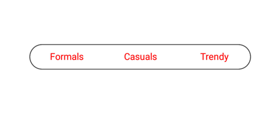
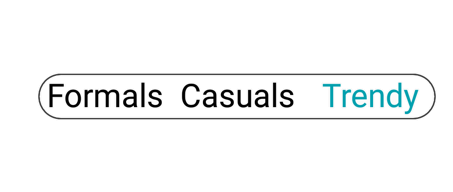
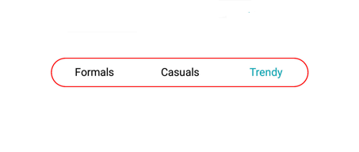
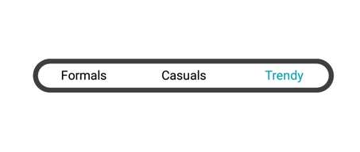
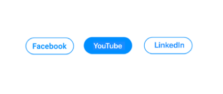
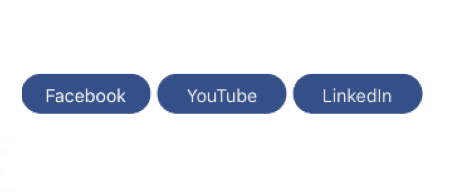
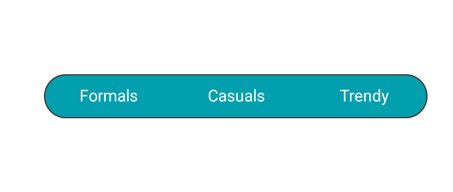

# Customization of Xamarin.Android Segmented Control

The segmented control supports customizing segment color, text color, icon size, selection color, and more. This control also supports enabling the segments to fit your application’s theme. It can be customized in the following areas.

## Text appearance

The text inside the segmented control can be customized by its font size, color, and its font family.

### Font family

You can customize the font family of the segmented item using the [`FontIconStyle`](https://help.syncfusion.com/cr/cref_files/xamarin-android/Syncfusion.Buttons.Android~Syncfusion.Android.Buttons.SfSegmentedControl~FontIconStyle.html) property.



segmentedControl.FontIconStyle= Typeface.Create("sans-serif-light", TypefaceStyle.Normal);



### Font color

You can customize the text color of the segmented item using the [`FontColor`](https://help.syncfusion.com/cr/cref_files/xamarin-android/Syncfusion.Buttons.Android~Syncfusion.Android.Buttons.SfSegmentedControl~FontColor.html) property.



segmentedControl.FontColor = Color.Red;



### Font size

You can change the text size of the segmented item using the [`FontSize`](https://help.syncfusion.com/cr/cref_files/xamarin-android/Syncfusion.Buttons.Android~Syncfusion.Android.Buttons.SfSegmentedControl~FontSize.html) property.



segmentedControl.FontSize = 20;



## Border

You can customize the border by their color and thickness.

### Border color

You can customize the [`BorderColor`](https://help.syncfusion.com/cr/xamarin-android/Syncfusion.Buttons.Android~Syncfusion.Android.Buttons.SfSegmentedControl~BorderColor.html) of all the items in the segmented control.



segmentedControl.BorderColor = Color.Red;



### Border thickness

You can customize the width of the border using the [`BorderThickness`](https://help.syncfusion.com/cr/cref_files/xamarin-android/Syncfusion.Buttons.Android~Syncfusion.Android.Buttons.SfSegmentedControl~BorderThickness.html) property.



segmentedControl.BorderThickness = 5;



### Padding

The segmented control handles padding between the items.

#### Segment padding

Spacing between the segmented items in the control can be customized using the [`SegmentPadding`](https://help.syncfusion.com/cr/cref_files/xamarin-android/Syncfusion.Buttons.Android~Syncfusion.Android.Buttons.SfSegmentedControl~SegmentPadding.html).



segmentedControl.SegmentPadding = 15;



### Corner radius

The segmented control provides corner radius support for the segmented items and strip.

#### Item radius

The segmented control customizes the corner radius for each segmented item.



segmentedControl.SegmentCornerRadius = 15;



#### Selection strip radius

The segmented control customizes corner radius for selection strip using the [`CornerRadius`](https://help.syncfusion.com/cr/cref_files/xamarin-android/Syncfusion.Buttons.Android~Syncfusion.Android.Buttons.SfSegmentedControl~CornerRadius.html) property of [`SelectionIndicatorSetting`](https://help.syncfusion.com/cr/xamarin-android/Syncfusion.Buttons.Android~Syncfusion.Android.Buttons.SfSegmentedControl~SelectionIndicatorSettings.html).



SelectionIndicatorSettings selectionIndicator = new SelectionIndicatorSettings();
selectionIndicator.CornerRadius = 15;
segmentedControl.SelectionIndicatorSettings = selectionIndicator;



#### Control radius

The segmented control also handles corner radius for border line of the whole control.



segmentedControl.CornerRadius = 15;



### Color

The segmented control allows users to customize the background color of the segmented items and background color of the control.

#### Item color

You can customize the background color of each segmented item using the [`Color`](https://help.syncfusion.com/cr/xamarin-android/Syncfusion.Buttons.Android~Syncfusion.Android.Buttons.SfSegmentItem~BackgroundColor.html) property of [`SelectionIndicatorSettings`](https://help.syncfusion.com/cr/xamarin-android/Syncfusion.Buttons.Android~Syncfusion.Android.Buttons.SfSegmentedControl~SelectionIndicatorSettings.html).



SelectionIndicatorSettings selectionIndicator = new SelectionIndicatorSettings();
selectionIndicator.Color = Color.ParseColor("#FF355088");
segmentedControl.SelectionIndicatorSettings = selectionIndicator;



#### Control color

You can customize the background color of the control by setting value for the [`BackColor`](https://help.syncfusion.com/cr/xamarin-android/Syncfusion.Buttons.Android~Syncfusion.Android.Buttons.SfSegmentedControl~BackColor.html) property.



segmentedControl.BackColor = Color.ParseColor("#02A0AE");



## Scrolling in segmented control programmatically

The SegmentedControl allows programmatic scrolling based on index and item using the [`ScrollTo`](https://help.syncfusion.com/cr/cref_files/xamarin-android/Syncfusion.Buttons.Android~Syncfusion.Android.Buttons.SfSegmentedControl~ScrollTo.) methods mentioned as follows.

### ScrollTo(index, scrollToPosition)

This method is used to scroll the segment item based on given index and [`ScrollToPosition`](https://help.syncfusion.com/cr/xamarin-android/Syncfusion.Buttons.Android~Syncfusion.Android.Buttons.SfSegmentedControl~ScrollToPosition.html) value.





segmentedControl.ScrollTo(5, Syncfusion.Android.Buttons.ScrollToPosition.Start);





### ScrollTo(item, scrollToPosition)

This method is used to scroll the segment item based on the given data or [`SfSegmentItem`](https://help.syncfusion.com/cr/cref_files/xamarin-android/Syncfusion.Buttons.Android~Syncfusion.Android.Buttons.SfSegmentItem.html) and [`ScrollToPosition`](https://help.syncfusion.com/cr/cref_files/xamarin-android/Syncfusion.Buttons.Android~Syncfusion.Android.Buttons.ScrollToPosition.html) value.





segmentedControl.ScrollTo(viewModel.Items[5], Syncfusion.Android.Buttons.ScrollToPosition.Start);



