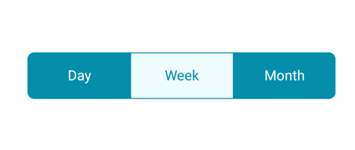
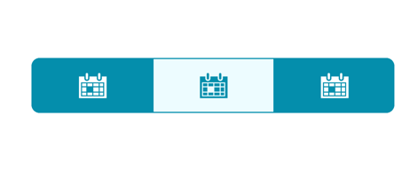
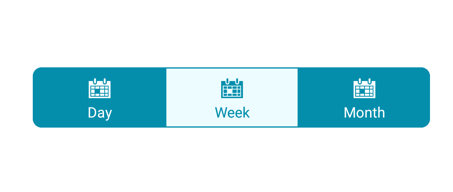

# Display mode in Xamarin.Android Segmented control (SfSegmentedControl)

Depending on the application, different scenarios may require icons, text, or a combination of both for effective communication. The segmented control supports these three options.

## Text

Items populated in the segmented control will be displayed as text by default.



public class MainActivity : Activity
{
SfSegmentedControl segmentedControl;
ViewModel viewModel;
protected override void OnCreate(Bundle savedInstanceState)
{
base.OnCreate(savedInstanceState);
segmentedControl = new SfSegmentedControl(this);
segmentedControl.LayoutParameters = new ViewGroup.LayoutParams(ViewGroup.LayoutParams.MatchParent, 400);
segmentedControl.SelectionTextColor = Color.ParseColor("#FFFFFF");
segmentedControl.VisibleSegmentsCount = 3;
segmentedControl.BackColor = Color.ParseColor("#048EAC");
segmentedControl.CornerRadius = 15;
segmentedControl.DisplayMode = SegmentDisplayMode.Text;
segmentedControl.BorderColor = Color.ParseColor("#929292");
segmentedControl.SelectedIndex = 0;
segmentedControl.FontColor = Color.Black;
segmentedControl.SegmentBackgroundColor = Color.Transparent;
segmentedControl.ItemsSource = viewModel.TextCollection;
SelectionIndicatorSettings selectionIndicator = new SelectionIndicatorSettings();
selectionIndicator.Color = Color.White;

segmentedControl.SelectionIndicatorSettings = selectionIndicator;
SetContentView(segmentedControl);
}
}

The items inside the ItemsSource can be added in the view model as below.

public class ViewModel : INotifyPropertyChanged
{
private ObservableCollection<SfSegmentItem> textCollection;
public ObservableCollection<SfSegmentItem> TextCollection
{
    get { return textCollection; }
    set { textCollection = value; }
}

public ViewModel(Android.Content.Context segment)
{
    TextCollection = new ObservableCollection<SfSegmentItem>
    {
    new SfSegmentItem(){ Text = "Day"},
    new SfSegmentItem(){Text = "Week"},
    new SfSegmentItem(){ Text = "Month"},
    };
}
public event PropertyChangedEventHandler PropertyChanged;

    private void NotifyPropertyChanged([CallerMemberName] String propertyName = "")
    {
        if (PropertyChanged != null)
        {
            PropertyChanged(this, new PropertyChangedEventArgs(propertyName));
        }
    }
}
    



## Image 

Items populated in the segmented control can be displayed as icons.



public class MainActivity : Activity
{
SfSegmentedControl segmentedControl;
ViewModel viewModel;
protected override void OnCreate(Bundle savedInstanceState)
{
base.OnCreate(savedInstanceState);
segmentedControl = new SfSegmentedControl(this);
segmentedControl.LayoutParameters = new ViewGroup.LayoutParams(ViewGroup.LayoutParams.MatchParent, 400);
segmentedControl.SelectionTextColor = Color.ParseColor("#FFFFFF");
segmentedControl.VisibleSegmentsCount = 3;
segmentedControl.BackColor = Color.ParseColor("#048EAC");
segmentedControl.CornerRadius = 15;
segmentedControl.DisplayMode = SegmentDisplayMode.Image;
segmentedControl.BorderColor = Color.ParseColor("#929292");
segmentedControl.SelectedIndex = 0;
segmentedControl.FontColor = Color.Black;
segmentedControl.FontIconFontFamily = "segment.ttf";
segmentedControl.SegmentBackgroundColor = Color.Transparent;
segmentedControl.ItemsSource = viewModel.ImageCollection;
SelectionIndicatorSettings selectionIndicator = new SelectionIndicatorSettings();
selectionIndicator.Color = Color.White;

segmentedControl.SelectionIndicatorSettings = selectionIndicator;
SetContentView(segmentedControl);
}
}

The items inside the ItemsSource can be added in the view model as below.

public class ViewModel : INotifyPropertyChanged
{
private ObservableCollection<SfSegmentItem> imageCollection;
public ObservableCollection<SfSegmentItem> ImageCollection
{
    get { return imageCollection; }
    set { imageCollection = value; }
}

public ViewModel(Android.Content.Context segment)
{
ImageCollection = new ObservableCollection<SfSegmentItem>
{
new SfSegmentItem(){IconFont = "6", FontIconFontColor=Color.ParseColor("#FFFFFF"), FontColor=Color.ParseColor("#FFFFFF")},          
new SfSegmentItem(){IconFont = "6",  FontIconFontColor=Color.ParseColor("#FFFFFF"),  FontColor=Color.ParseColor("#FFFFFF")},     
new SfSegmentItem(){IconFont = "6",  FontIconFontColor=Color.ParseColor("#FFFFFF"),  FontColor=Color.ParseColor("#FFFFFF")},          
};  
}
public event PropertyChangedEventHandler PropertyChanged;

    private void NotifyPropertyChanged([CallerMemberName] String propertyName = "")
    {
        if (PropertyChanged != null)
        {
            PropertyChanged(this, new PropertyChangedEventArgs(propertyName));
        }
    }
}
    



## Image with text

Items populated in the segmented control can be displayed as icons with accompanying text.



public class MainActivity : Activity
{
SfSegmentedControl segmentedControl;
ViewModel viewModel;
protected override void OnCreate(Bundle savedInstanceState)
{
base.OnCreate(savedInstanceState);
segmentedControl = new SfSegmentedControl(this);
segmentedControl.LayoutParameters = new ViewGroup.LayoutParams(ViewGroup.LayoutParams.MatchParent, 400);
segmentedControl.SelectionTextColor = Color.ParseColor("#FFFFFF");
segmentedControl.VisibleSegmentsCount = 3;
segmentedControl.BackColor = Color.ParseColor("#048EAC");
segmentedControl.CornerRadius = 15;
segmentedControl.DisplayMode = SegmentDisplayMode.ImageWithText;
segmentedControl.BorderColor = Color.ParseColor("#929292");
segmentedControl.SelectedIndex = 0;
segmentedControl.FontColor = Color.Black;
segmentedControl.SegmentBackgroundColor = Color.Transparent;
segmentedControl.ItemsSource = viewModel.ImageTextCollection;
segmentedControl.FontIconFontFamily = "segment.ttf";
SelectionIndicatorSettings selectionIndicator = new SelectionIndicatorSettings();
selectionIndicator.Color = Color.White;
segmentedControl.SelectionIndicatorSettings = selectionIndicator;
SetContentView(segmentedControl);
}
}

The items inside the ItemsSource can be added in the view model as below.

public class ViewModel : INotifyPropertyChanged
{
private ObservableCollection<SfSegmentItem> imageTextCollection;
public ObservableCollection<SfSegmentItem> ImageTextCollection
{
    get { return imageTextCollection; }
    set { imageTextCollection = value; }
}

public ViewModel(Android.Content.Context segment)
{
ImageTextCollection = new ObservableCollection<SfSegmentItem>
{
new SfSegmentItem(){IconFont = "6", FontIconFontColor=Color.ParseColor("#FFFFFF"), FontColor=Color.ParseColor("#FFFFFF"), Text = "Day"},     
new SfSegmentItem(){IconFont = "6",  FontIconFontColor=Color.ParseColor("#FFFFFF"),  FontColor=Color.ParseColor("#FFFFFF"), Text = "Week"}    
new SfSegmentItem(){IconFont = "6",  FontIconFontColor=Color.ParseColor("#FFFFFF"),  FontColor=Color.ParseColor("#FFFFFF"), Text = "Month"}, 
};
  
}
public event PropertyChangedEventHandler PropertyChanged;

    private void NotifyPropertyChanged([CallerMemberName] String propertyName = "")
    {
        if (PropertyChanged != null)
        {
            PropertyChanged(this, new PropertyChangedEventArgs(propertyName));
        }
    }
}



## How to generate font icons

The segmented control enables the user to use font icons for the items in the data source collection. For this we have to first give the desired font icon and its font family using `IconFont` and `FontIconFontFamily` property.

N> Font family must be added to the respective folders based on the platforms 
Android -> Add the font family inside Resource-> drawable



SegmentedControl.FontIconFontFamily = "segment.ttf";



