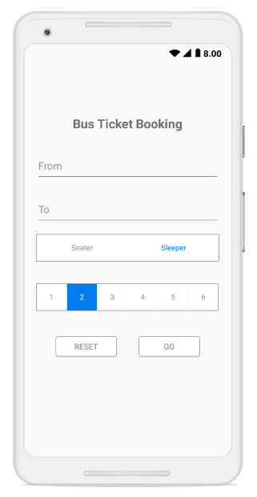
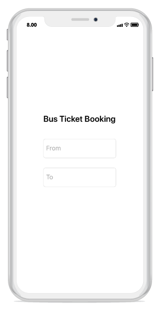
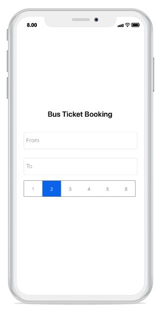
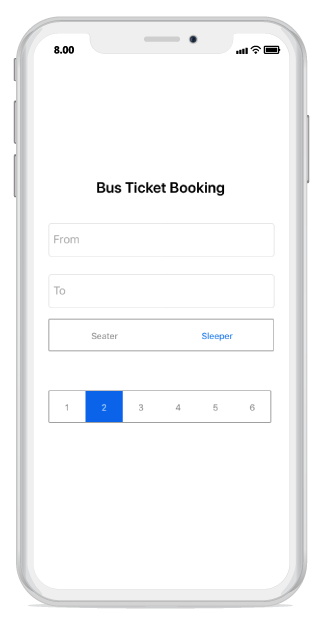

# Getting Started with Xamarin.Android Segmented Control (SfSegmentedControl)

This section provides a quick overview for working with the Segmented Control for Xamarin.Android. Walk through the entire process of creating a real-world application with the Segmented Control.

## Assembly Deployment

After installing Essential Studio® for Xamarin, find all the required assemblies in the installation folders:
{Syncfusion Essential Studio Installed location}\Essential Studio\16.2.0.41\Xamarin\lib
Eg: C:\Program Files (x86)\Syncfusion\Essential Studio\16.2.0.41\Xamarin\lib

N> Assemblies can be found in the unzipped package location on Mac.

## Adding SfSegmentedControl Reference

Syncfusion® Xamarin components are available in [nuget.org](https://www.nuget.org/). To add SfSegmentedControl to your project, open the NuGet package manager in Visual Studio, search for [Syncfusion.Xamarin.Buttons.Android](https://www.nuget.org/packages/Syncfusion.Xamarin.Buttons.Android/#), and then install it.

To know more about obtaining our components, refer to this [link](https://help.syncfusion.com/xamarin-android/introduction/download-and-installation). Also, if you prefer to manually reference the assemblies instead of NuGet, please refer to the assembly below:

android\Syncfusion.Buttons.Android.dll

### Create a Simple Segmented Control

This section explains how to create a Segmented Control and configure it. The Segmented Control can be configured entirely in C# code. This is how the final output will look on Android devices:

## Creating the Project

Create a new Android application in Visual Studio for Xamarin.Android.

## Adding SfSegmentedControl in Xamarin.Android

1. Add the required assembly reference to the project as discussed in the [Assembly deployment](#assembly-deployment) section.

2. Import the control namespace as



[C#]

using Syncfusion.Android.Buttons;



3. Create an instance of the segmented control and add it as a child to the view hosted in the activity.



[C#]

...
protected override void OnCreate(Bundle savedInstanceState)
{
    base.OnCreate(savedInstanceState);

    SfSegmentedControl segmentedControl = new SfSegmentedControl(this);
    SetContentView(segmentedControl);
}
...
		


### Adding supportive views to the application.
 
For the completeness of the ticket booking application, a few framework controls are added to the application to get data from the user.

The initial view for the application can be created by the following code snippet:



[C#]

...
public class MainActivity : Activity
{
    protected override void OnCreate(Bundle savedInstanceState)
    {
        base.OnCreate(savedInstanceState);

        LinearLayout mainLayout = new LinearLayout(this);
        mainLayout.Orientation = Orientation.Vertical;
        mainLayout.LayoutParameters = new ViewGroup.LayoutParams(ViewGroup.LayoutParams.MatchParent, ViewGroup.LayoutParams.MatchParent);
        mainLayout.SetBackgroundColor(Color.WhiteSmoke);
        mainLayout.SetPadding(50,50,50,50);

        //Adding text view as the header part of the application.
        TextView headerLabel = new TextView(this);
        headerLabel.LayoutParameters = new ViewGroup.LayoutParams(ViewGroup.LayoutParams.MatchParent, 100);
        headerLabel.Text = "Bus Ticket Booking";
        headerLabel.SetTextColor(Color.Black);
        headerLabel.TextSize =25;
        headerLabel.TextAlignment = TextAlignment.Center;
        headerLabel.TextAlignment = TextAlignment.Gravity;

        //Adding the editor to enter the origin location.
        EditText fromEditor = new EditText(this);
        fromEditor.LayoutParameters = new ViewGroup.LayoutParams(ViewGroup.LayoutParams.MatchParent 170);
        fromEditor.Hint = "From";
        fromEditor.SetTextColor(Color.Black);
        fromEditor.SetHintTextColor(Color.Gray);

        //Adding editor to enter the destination location.
        EditText toEditor = new EditText(this);
        toEditor.LayoutParameters = new ViewGroup.LayoutParams(ViewGroup.LayoutParams.MatchParent,250);
        toEditor.Hint = "To";
        toEditor.SetTextColor(Color.Black);
        toEditor.SetHintTextColor(Color.Gray);

        mainLayout.AddView(headerLabel);
        mainLayout.AddView(fromEditor);
        mainLayout.AddView(toEditor);

        SetContentView(mainLayout);
    }
}

..


## Adding Data/Items to SfSegmentedControl

You can add data inside the Segmented Control in three different ways:

1. Populating string data
2. SfSegmentItem
3. Custom view

Items inside the Segmented Control can be added through the [`ItemsSource`](https://help.syncfusion.com/cr/xamarin-android/Syncfusion.Android.Buttons.SfSegmentedControl.html#Syncfusion_Android_Buttons_SfSegmentedControl_ItemsSource) property of [`SfSegmentedControl`](https://help.syncfusion.com/cr/xamarin-android/Syncfusion.Android.Buttons.SfSegmentedControl.html), which holds the collection/list of items.

## Adding Data as a String

With the help of `System.Collections.Generic`, you can add string data as [`ItemsSource`](https://help.syncfusion.com/cr/xamarin-android/Syncfusion.Android.Buttons.SfSegmentedControl.html#Syncfusion_Android_Buttons_SfSegmentedControl_ItemsSource) to SfSegmentedControl:



[C#]

...

protected override void OnCreate(Bundle savedInstanceState)
{
    base.OnCreate(savedInstanceState);

    LinearLayout mainLayout = new LinearLayout(this);
    mainLayout.Orientation = Orientation.Vertical;
    mainLayout.LayoutParameters = new ViewGroup.LayoutParams(ViewGroup.LayoutParams.MatchParent, ViewGroup.LayoutParams.MatchParent);
    mainLayout.SetBackgroundColor(Color.WhiteSmoke);
    mainLayout.SetPadding(50,50,50,50);
    
    //Adding text view as the header part of the application.
    TextView headerLabel = new TextView(this);
    headerLabel.LayoutParameters = new ViewGroup.LayoutParams(ViewGroup.LayoutParams.MatchParent, 100);
    headerLabel.Text = "Bus Ticket Booking";
    headerLabel.SetTextColor(Color.Black);
    headerLabel.TextSize =25;
    headerLabel.TextAlignment = TextAlignment.Center;
    headerLabel.TextAlignment = TextAlignment.Gravity;

    //Adding the editor to enter the origin location.
    EditText fromEditor = new EditText(this);
    fromEditor.LayoutParameters = new ViewGroup.LayoutParams(ViewGroup.LayoutParams.MatchParent 170);
    fromEditor.Hint = "From";
    fromEditor.SetTextColor(Color.Black);
    fromEditor.SetHintTextColor(Color.Gray);

    //Adding editor to enter the destination location.
    EditText toEditor = new EditText(this);
    toEditor.LayoutParameters = new ViewGroup.LayoutParams(ViewGroup.LayoutParams.MatchParent,250);
    toEditor.Hint = "To";
    toEditor.SetTextColor(Color.Black);
    toEditor.SetHintTextColor(Color.Gray);

    //segmented control to add item as string data.
    SfSegmentedControl segmentedControl = new SfSegmentedControl(this)
    {
        LayoutParameters = new ViewGroup.LayoutParams(ViewGroup.LayoutParams.MatchParent, 200),
        SelectionTextColor = Color.White,
        BackColor = Color.Transparent,
        SegmentHeight = 50,
        BorderColor = Color.ParseColor("#929292"),
        FontColor = Color.ParseColor("#929292"),
        SegmentBackgroundColor = Color.Transparent,
        VisibleSegmentsCount = 6,
        DisplayMode = SegmentDisplayMode.Text,
        ItemsSource = new List<string>
        {
            "1","2","3","4","5","6"
        }
    };

    mainLayout.AddView(headerLabel);
    mainLayout.AddView(fromEditor);
    mainLayout.AddView(toEditor);
    mainLayout.AddView(segmentedControl);

    SetContentView(mainLayout);
}

...



## Adding Data as a SfSegmentItem

By using the [`SfSegmentItem`](https://help.syncfusion.com/cr/xamarin-android/Syncfusion.Android.Buttons.SfSegmentItem.html) class, you can add data inside the Segmented Control:



[C#]

...
SfSegmentedControl segment = new SfSegmentedControl(this)
{
    SelectionTextColor = Color.White,
    LayoutParameters = new ViewGroup.LayoutParams(ViewGroup.LayoutParams.MatchParent, 200),
    BorderColor = Color.ParseColor("#007CEE"),
    FontColor = Color.Black,
    SelectedIndex = 2,
    FontSize = 15,
    SegmentHeight = 50,
    SegmentBackgroundColor = Color.Transparent,
    VisibleSegmentsCount = 5,
    DisplayMode = SegmentDisplayMode.Text,
    ItemsSource = new ObservableCollection<SfSegmentItem>
    {
        new SfSegmentItem(){Text="Sleepers"},
        new SfSegmentItem(){Text="Seaters"},
    },

    SelectionIndicatorSettings = new SelectionIndicatorSettings()
    {
        Color = Color.Transparent
    }

};
...



## Adding Data as Custom View

You can add any custom view to the Segmented Control:



[C#]

...

Button resetButtonView = new Button(this) { Text = "Reset", TextAlignment = TextAlignment.Center };
resetButtonView.SetHeight(50);
resetButtonView.SetBackgroundColor(Color.White);
resetButtonView.SetTextColor(Color.Gray);

Button goButtonView = new Button(this) { Text = "Go", TextAlignment = TextAlignment.Center };
goButtonView.SetHeight(50);
goButtonView.SetTextColor(Color.Gray);
goButtonView.SetBackgroundColor(Color.White);

...

//segmented control to add item as View.
SfSegmentedControl segmentView = new SfSegmentedControl(this)
{
    LayoutParameters = new ViewGroup.LayoutParams(ViewGroup.LayoutParams.MatchParent, 200),
    BorderColor = Color.Transparent,
    SegmentHeight = 50,
    VisibleSegmentsCount = 2,
    SegmentPadding = 30,
    ItemsSource = new ObservableCollection<View>
    {
        resetButtonView,
        goButtonView
    },

};

...



## Customizing Segmented Control Appearance

### Share Space Equally to All the Items

To share the item space equally in the Segmented Control, set the number of segment items that have to be visible on the available screen width and that can be distributed in the available space through the [`VisibleSegmentsCount`](https://help.syncfusion.com/cr/xamarin-android/Syncfusion.Android.Buttons.SfSegmentedControl.html#Syncfusion_Android_Buttons_SfSegmentedControl_VisibleSegmentsCount) property of [`SfSegmentedControl`](https://help.syncfusion.com/cr/xamarin-android/Syncfusion.Android.Buttons.SfSegmentedControl.html):



[C#]

segmentedControl.VisibleSegmentsCount = 5;



### Display Mode

You can change the appearance of the Segmented Control by using the [`DisplayMode`](https://help.syncfusion.com/cr/xamarin-android/Syncfusion.Android.Buttons.SfSegmentedControl.html#Syncfusion_Android_Buttons_SfSegmentedControl_DisplayMode) property of [`SfSegmentedControl`](https://help.syncfusion.com/cr/xamarin-android/Syncfusion.Android.Buttons.SfSegmentedControl.html). You can set the [`DisplayMode`](https://help.syncfusion.com/cr/xamarin-android/Syncfusion.Android.Buttons.SfSegmentedControl.html#Syncfusion_Android_Buttons_SfSegmentedControl_DisplayMode) to either Image, Text, or ImageWithText:



[C#]

segmentedControl.DisplayMode = SegmentDisplayMode.Text;



## Customizing Selection Indicator Appearance

The selection indicator can be used to indicate the selected index of the Segmented Control. It can be customized with the built-in APIs that are available in the [`SelectionIndicatorSettings`](https://help.syncfusion.com/cr/xamarin-android/Syncfusion.Android.Buttons.SfSegmentedControl.html#Syncfusion_Android_Buttons_SfSegmentedControl_SelectionIndicatorSettings) property of SfSegmentedControl.

To know more about customizing the selection indicator, refer to this [feature link](https://help.syncfusion.com/xamarin-android/sfsegmentedcontrol/indicating-the-selected-item).

N> For custom views, users need to handle click events manually for the view that has been used.
Example: For Button, you have to use its "Click" event.

The code below can be included on the custom view to get the click event output:

N> For custom view user need to handle click event manually for the view which have been used.
eg. For Button we have to use its "Click" event.

The below given code can be included on the Custom view to get the click event output.



[C#]

...
AlertDialog.Builder resultsDialog =  new AlertDialog.Builder(this);
resultsDialog.SetTitle("Status");
..

Button resetButtonView = new Button(this){ Text = "Reset" };
Button goButtonView = new Button(this){ Text = "Go" };

resetButtonView.Click += (object sender, EventArgs e) =>
{
    resultsDialog.SetMessage("Fields has been reset.");
    resultsDialog.Create().Show();
    resultsDialog.SetCancelable(true);
};

goButtonView.Click += (object sender, EventArgs e) =>
{
    resultsDialog.SetMessage("Your ticket has been booked.");
    resultsDialog.Create().Show();
    resultsDialog.SetCancelable(true);
};

segmentView.ItemsSource = new ObservableCollection<View>
{
    resetButtonView,
    goButtonView
};

...


Note: Getting started sample can be downloaded from [this link](https://github.com/SyncfusionExamples/Getting-Started-Sample-SegmentedControl-Xamarin-Androidd)

