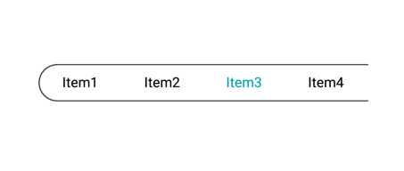

# Handling multiple segments

The segmented control handles the segmented items with the space distributed for the items on two ways.

## Visible segment counts

The segmented control displays the item for the view based on the count which is given for `VisibleSegmentCount`. 



public class MainActivity : Activity
{
SfSegmentedControl segmentedControl;
ViewModel viewModel;
protected override void OnCreate(Bundle savedInstanceState)
{
base.OnCreate(savedInstanceState);
segmentedControl = new SfSegmentedControl(this);
segmentedControl.LayoutParameters = new ViewGroup.LayoutParams(ViewGroup.LayoutParams.MatchParent, 400);
segmentedControl.SelectionTextColor = Color.ParseColor("#02A0AE");
segmentedControl.VisibleSegmentsCount = 4;
segmentedControl.BackColor = Color.White;
segmentedControl.CornerRadius = 15;
segmentedControl.DisplayMode = SegmentDisplayMode.ImageWithText;
segmentedControl.BorderColor = Color.Black;
segmentedControl.SelectedIndex = 0;
segmentedControl.FontColor = Color.Black;
segmentedControl.SegmentBackgroundColor = Color.Transparent;
segmentedControl.ItemsSource = viewModel.ItemsCollection;
segmentedControl.FontIconFontFamily = "segment.ttf";
SelectionIndicatorSettings selectionIndicator = new SelectionIndicatorSettings();
selectionIndicator.Color = Color.White;

segmentedControl.SelectionIndicatorSettings = selectionIndicator;
SetContentView(segmentedControl);
}
}

The items inside the ItemsSource can be added in the view model as below.

public class ViewModel : INotifyPropertyChanged
{
private ObservableCollection<SfSegmentItem> itemsCollection = new ObservableCollection<SfSegmentItem>();
public ObservableCollection<SfSegmentItem> ItemsCollection
{
    get { return itemsCollection; }
    set { itemsCollection = value; }
}

public ViewModel(Android.Content.Context segment)
{
ItemsCollection = new ObservableCollection<SfSegmentItem>
  {
new SfSegmentItem(){Text = "Item1"},          
new SfSegmentItem(){Text = "Item2"},     
new SfSegmentItem(){Text = "Item3"},  
new SfSegmentItem(){Text = "Item4"},          
new SfSegmentItem(){Text = "Item5"},     
new SfSegmentItem(){Text = "Item6"},  
new SfSegmentItem(){Text = "Item7"},          
  };
  
}
public event PropertyChangedEventHandler PropertyChanged;

    private void NotifyPropertyChanged([CallerMemberName] String propertyName = "")
    {
        if (PropertyChanged != null)
        {
            PropertyChanged(this, new PropertyChangedEventArgs(propertyName));
        }
    }
}



## Scrolling

When the available space in the segmented control is not equally distributed, the items beyond the edges of the control can be viewed by scrolling the panel.

