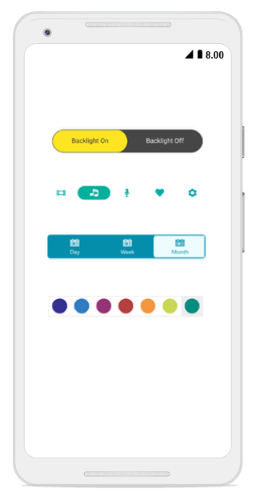

# Overview

The Segmented Control for Xamarin.Android provides a simple way to choose from a linear set of two or more segments, each of which functions as a mutually exclusive button.

## Key Features

* Supports displaying the segments with text, font icons, or both.

* Supports scrolling and aligning the segments equally within the available space.

* Populates the segments from a collection of strings and views along with objects of built-in classes.

* Supports customizing the text and other UI elements.