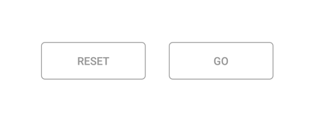

# Populating data source

The segmented control can be populated from a collection of strings, views, or a collection of objects in a built-in class.

## String collection

The segmented control provides the collection of strings as a data source.



 public class MainActivity : Activity
{
SfSegmentedControl segmentedControl;
protected override void OnCreate(Bundle savedInstanceState)
{
base.OnCreate(savedInstanceState);
segmentedControl = new SfSegmentedControl(this);
segmentedControl.LayoutParameters = new ViewGroup.LayoutParams(ViewGroup.LayoutParams.MatchParent, 300);
segmentedControl.SelectionTextColor = Color.ParseColor("#02A0AE");
segmentedControl.BackColor = Color.Transparent;
segmentedControl.BorderColor = Color.ParseColor("#3F3F3F");
segmentedControl.FontColor = Color.Black;
segmentedControl.SelectedIndex = 2;
segmentedControl.BorderThickness = 15;
segmentedControl.FontSize = 15;
segmentedControl.SegmentPadding = 25;
segmentedControl.SegmentBackgroundColor = Color.Transparent;
segmentedControl.VisibleSegmentsCount = 3;
segmentedControl.DisplayMode = SegmentDisplayMode.Text;
List<String> clothList = new List<String>
{
"Formals","Casuals","Trendy"
};
segmentedControl.ItemsSource = clothList;
SetContentView(segmentedControl);
}
}



## Segment items

The segmented control customize the text or icons, or use other built-in customization options available for the segments. Segment item collections can also be used.



public class MainActivity : Activity
{
SfSegmentedControl segmentedControl;
ViewModel viewModel;
protected override void OnCreate(Bundle savedInstanceState)
{
base.OnCreate(savedInstanceState);
segmentedControl = new SfSegmentedControl(this);
segmentedControl.LayoutParameters = new ViewGroup.LayoutParams(ViewGroup.LayoutParams.MatchParent, 400);
segmentedControl.SelectionTextColor = Color.ParseColor("#007CEE");
segmentedControl.VisibleSegmentsCount = 5;
segmentedControl.BackColor = Color.White;
segmentedControl.BorderColor = Color.ParseColor("#929292");
segmentedControl.SelectedIndex = 0;
segmentedControl.FontColor = Color.Black;
segmentedControl.FontIconFontFamily = "segment.ttf";
segmentedControl.SegmentBackgroundColor = Color.Transparent;
segmentedControl.ItemsSource = viewModel.SizeCollection;
SelectionIndicatorSettings selectionIndicator = new SelectionIndicatorSettings();
selectionIndicator.Color = Color.White;

segmentedControl.SelectionIndicatorSettings = selectionIndicator;
SetContentView(segmentedControl);
}
}

The items inside the ItemsSource can be added in the view model as below.

public class ViewModel : INotifyPropertyChanged
{
    private ObservableCollection<SfSegmentItem> sizeCollection;
    public ObservableCollection<SfSegmentItem> SizeCollection
    {
        get { return sizeCollection; }
        set { sizeCollection = value; }
    }

public ViewModel(Android.Content.Context segment)
    {
SizeCollection = new ObservableCollection<SfSegmentItem>
        {
new SfSegmentItem(){Text="XS",FontColor=Color.ParseColor("#3F3F3F")}, 
new SfSegmentItem(){Text="S",FontColor=Color.ParseColor("#3F3F3F")},
new SfSegmentItem(){Text="M",FontColor=Color.ParseColor("#3F3F3F")},
new SfSegmentItem(){Text="L",FontColor=Color.ParseColor("#3F3F3F")},
new SfSegmentItem(){Text="XL",FontColor=Color.ParseColor("#3F3F3F")},
};
}
 public event PropertyChangedEventHandler PropertyChanged;

        private void NotifyPropertyChanged([CallerMemberName] String propertyName = "")
        {
            if (PropertyChanged != null)
            {
                PropertyChanged(this, new PropertyChangedEventArgs(propertyName));
            }
        }
    }
    


 
   
## Custom views

Custom views or images can be added as segments in the Segmented control.



SfSegmentedControl segmentedControl;
LinearLayout mainLayout;
ViewModel viewModel;

protected override void OnCreate(Bundle savedInstanceState)
{
mainLayout = new LinearLayout(this);
mainLayout.Orientation = Orientation.Vertical;
mainLayout.LayoutParameters = new ViewGroup.LayoutParams(ViewGroup.LayoutParams.MatchParent, ViewGroup.LayoutParams.MatchParent);
mainLayout.SetBackgroundColor(Color.White);
mainLayout.SetPadding(50,50,50,50);
viewModel = new ViewModel(this);
segmentedControl = new SfSegmentedControl(this);
segmentedControl.LayoutParameters = new ViewGroup.LayoutParams(ViewGroup.LayoutParams.MatchParent, 100);
segmentedControl.BorderColor = Color.Transparent;
segmentedControl.SegmentHeight = 100;
segmentedControl.VisibleSegmentsCount = 2;
segmentedControl.BackColor = Color.Transparent;
segmentedControl.SegmentPadding = 30;
segmentedControl.ItemsSource = viewModel.ViewCollection;
SelectionIndicatorSettings selectionIndicator = new SelectionIndicatorSettings();
selectionIndicator.Color = Color.Transparent;
selectionIndicator.Position = SelectionIndicatorPosition.Fill;
selectionIndicator.StrokeThickness = 10;
segmentedControl.SelectionIndicatorSettings = selectionIndicator;
mainLayout.AddView(segmentedControl);
SetContentView(mainLayout);
}

The ItemsSource can be set in the view model as below.

public class ViewModel : INotifyPropertyChanged
{
private ObservableCollection<View> viewCollection;

public ObservableCollection<View> ViewCollection
{
get { return viewCollection; }
set { viewCollection = value; }
}
public ViewModel(Android.Content.Context segment)
{
Button ResetButtonView = new Button(segment);
ResetButtonView.Text = "Reset";
ResetButtonView.SetHeight(50);
ResetButtonView.SetBackgroundColor(Color.White);
ResetButtonView.SetTextColor(Color.Gray);
ResetButtonView.TextAlignment = TextAlignment.Center;

Button GoButtonView = new Button(segment);
GoButtonView.Text = "Go";
GoButtonView.SetHeight(50);
GoButtonView.SetTextColor(Color.Gray);
GoButtonView.SetBackgroundColor(Color.White);
GoButtonView.TextAlignment = TextAlignment.Center;

ViewCollection = new ObservableCollection<View>
{
    ResetButtonView,
    GoButtonView
};

}
public event PropertyChangedEventHandler PropertyChanged;

private void NotifyPropertyChanged([CallerMemberName] String propertyName = "")
{
if (PropertyChanged != null)
{
    PropertyChanged(this, new PropertyChangedEventArgs(propertyName));
}
}
}



