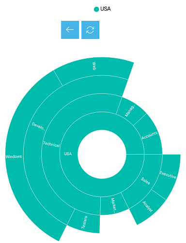

# Drill-down

The drill-down provides better visualization of hierarchy. Large set of data can be virtualized into minimal views. Each level of the segments can be drilled down. The sunburst chart provides animation along with the drill-down support. Toolbar will be enabled on drill-down that helps in performing zoom back and reset operations. The drill-down can be enabled or disabled using the [`Enable`](https://help.syncfusion.com/cr/xamarin-android/Syncfusion.SfSunburstChart.Android.DrilldownSettings.html#Syncfusion_SfSunburstChart_Android_DrilldownSettings_Enable) property in the drill-down settings.

I>  Double tapping the segment performs the drill-down operation.

The following code shows enabling the [`DrilldownSettings`](https://help.syncfusion.com/cr/xamarin-android/Syncfusion.SfSunburstChart.Android.SfSunburstChart.html#Syncfusion_SfSunburstChart_Android_SfSunburstChart_DrilldownSettings).

 

 

  sunburstChart.DrilldownSettings.Enable = true;



 

## Positioning Toolbar

Toolbar can be positioned anywhere on the chart by specifying the [`OffsetX`](https://help.syncfusion.com/cr/xamarin-android/Syncfusion.SfSunburstChart.Android.DrilldownSettings.html#Syncfusion_SfSunburstChart_Android_DrilldownSettings_OffsetX) and [`OffsetY`](https://help.syncfusion.com/cr/xamarin-android/Syncfusion.SfSunburstChart.Android.DrilldownSettings.html#Syncfusion_SfSunburstChart_Android_DrilldownSettings_OffsetY) values. The offset values range from 0 to 1.

 

 

  sunburstChart.DrilldownSettings.Enable = true;
  sunburstChart.DrilldownSettings.OffsetX = 0.5;
  sunburstChart.DrilldownSettings.OffsetY = 0;



 

## Toolbar alignment 

The vertical and the horizontal alignments of the toolbar can be customized using the [`ToolbarVerticalAlignment`](https://help.syncfusion.com/cr/xamarin-android/Syncfusion.SfSunburstChart.Android.DrilldownSettings.html#Syncfusion_SfSunburstChart_Android_DrilldownSettings_ToolbarVerticalAlignment) and [`ToolbarHorizontalAlignment`](https://help.syncfusion.com/cr/xamarin-android/Syncfusion.SfSunburstChart.Android.DrilldownSettings.html#Syncfusion_SfSunburstChart_Android_DrilldownSettings_ToolbarHorizontalAlignment) properties, respectively.

Both the alignment properties has the following enum types:

* Center: Toolbar takes the specified offset value as the center of the toolbar and get positioned.
* End: Toolbar takes the specified offset value as the start of the toolbar and get positioned.
* Start: Toolbar takes the specified offset value as the end of the toolbar and get positioned.

The following code shows the toolbar alignment.

 

 

  sunburstChart.DrilldownSettings.Enable = true;
  sunburstChart.DrilldownSettings.OffsetX = 0.5;
  sunburstChart.DrilldownSettings.OffsetY = 0.5;
  sunburstChart.DrilldownSettings.ToolbarHorizontalAlignment = ToolbarAlignment.Center;
  sunburstChart.DrilldownSettings.ToolbarVerticalAlignment = ToolbarAlignment.Center;



 

