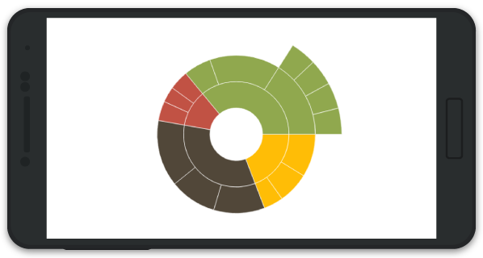
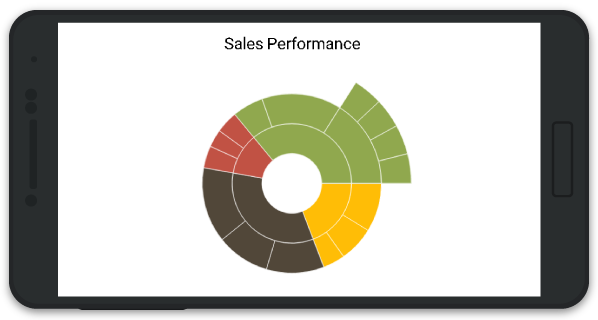
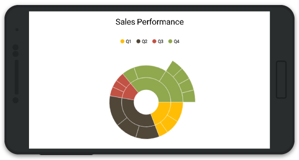
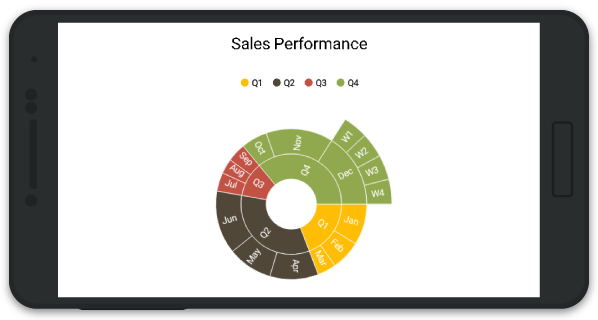

# Getting Started

This section explains you the steps required to populate the SunburstChart with data, data labels, legend and title. This section covers only the minimal features that you need to know to get started with the SunburstChart. 

## Adding SunburstChart Reference

After installing Essential Studio for Xamarin, you can find all the required assemblies in the installation folders, 

{Syncfusion Installed location}\Essential Studio\15.4.0.17\lib

Add the following SunburstChart assembly reference in the Xamarin.Android project,

lib\android\Syncfusion.SfSunburstChart.Android.dll

## Initialize SunburstChart

Import the [`SfSunburstChart`](https://help.syncfusion.com/cr/cref_files/xamarin-android/sfsunburstchart/Syncfusion.SfSunburstChart.Android~Syncfusion.SfSunburstChart.Android.SfSunburstChart.html) namespace as shown below in your respective Page,



using Syncfusion.SfSunburstChart.Android;



Then initialize an empty SunburstChart as shown below,



SfSunburstChart sunburstChart = new SfSunburstChart(this);

SetContentView(sunburstChart);



## Initialize view model

Now, let us define a data model that represents data in [`SfSunburstChart`](https://help.syncfusion.com/cr/cref_files/xamarin-android/sfsunburstchart/Syncfusion.SfSunburstChart.Android~Syncfusion.SfSunburstChart.Android.SfSunburstChart.html).


public class Model   
{   
    public string Quarter { get; set; }
        
    public string Month { get; set; }
        
    public string Week { get; set; }
        
    public double Sales { get; set; }
}
 

Next, create a view model class and initialize a list of `Model` objects as shown below,


public class DataModel
{
    public ObservableCollection<Model> Data { get; set; }

    public DataModel()
    {
        Data = new ObservableCollection<Model>();

        Data.Add(new Model() { Quarter = "Q1", Month = "Jan", Sales = 11 });
        Data.Add(new Model() { Quarter = "Q1", Month = "Feb", Sales = 8 });
        Data.Add(new Model() { Quarter = "Q1", Month = "Mar", Sales = 5 });

        Data.Add(new Model() { Quarter = "Q2", Month = "Apr", Sales = 13 });
        Data.Add(new Model() { Quarter = "Q2", Month = "May", Sales = 12 });
        Data.Add(new Model() { Quarter = "Q2", Month = "Jun", Sales = 17 });

        Data.Add(new Model() { Quarter = "Q3", Month = "Jul", Sales = 5 });
        Data.Add(new Model() { Quarter = "Q3", Month = "Aug", Sales = 4 });
        Data.Add(new Model() { Quarter = "Q3", Month = "Sep", Sales = 5 });

        Data.Add(new Model() { Quarter = "Q4", Month = "Oct", Sales = 7 });
        Data.Add(new Model() { Quarter = "Q4", Month = "Nov", Sales = 18 });
        Data.Add(new Model() { Quarter = "Q4", Month = "Dec", Week = "W1", Sales = 5 });
        Data.Add(new Model() { Quarter = "Q4", Month = "Dec", Week = "W2", Sales = 5 });
        Data.Add(new Model() { Quarter = "Q4", Month = "Dec", Week = "W3", Sales = 5 });
        Data.Add(new Model() { Quarter = "Q4", Month = "Dec", Week = "W4", Sales = 5 });
    }
}

 

## Populate SunburstChart with data

Now, set the Data property of the above DataModel to the [`ItemsSource`](https://help.syncfusion.com/cr/cref_files/xamarin-android/sfsunburstchart/Syncfusion.SfSunburstChart.Android~Syncfusion.SfSunburstChart.Android.SfSunburstChart~ItemsSource.html) property. 
Add [`SunburstHierarchicalLevel`](https://help.syncfusion.com/cr/cref_files/xamarin-android/sfsunburstchart/Syncfusion.SfSunburstChart.Android~Syncfusion.SfSunburstChart.Android.SunburstHierarchicalLevel.html) to [`Levels`](https://help.syncfusion.com/cr/cref_files/xamarin-android/sfsunburstchart/Syncfusion.SfSunburstChart.Android~Syncfusion.SfSunburstChart.Android.SfSunburstChart~Levels.html) property. Each hierarchy level is formed based on the property specified in [`GroupMemberPath`](https://help.syncfusion.com/cr/cref_files/xamarin-android/sfsunburstchart/Syncfusion.SfSunburstChart.Android~Syncfusion.SfSunburstChart.Android.SunburstHierarchicalLevel~GroupMemberPath.html) property, and each arc segment size is calculated using [`ValueMemberPath`](https://help.syncfusion.com/cr/cref_files/xamarin-android/sfsunburstchart/Syncfusion.SfSunburstChart.Android~Syncfusion.SfSunburstChart.Android.SfSunburstChart~ValueMemberPath.html).


SfSunburstChart sunburstChart = new SfSunburstChart(this);

DataModel dataModel = new DataModel();

sunburstChart.ItemsSource = dataModel.Data;

sunburstChart.ValueMemberPath = "Sales";

sunburstChart.Levels.Add(new SunburstHierarchicalLevel() { GroupMemberPath = "Quarter" });

sunburstChart.Levels.Add(new SunburstHierarchicalLevel() { GroupMemberPath = "Month" });

sunburstChart.Levels.Add(new SunburstHierarchicalLevel() { GroupMemberPath = "Week" });

SetContentView(sunburstChart);


## Add Title

You can add title to SunburstChart to provide quick information to the user about the data being plotted in the chart. You can set title using [`SfSunburstChart.Title`](https://help.syncfusion.com/cr/cref_files/xamarin-android/sfsunburstchart/Syncfusion.SfSunburstChart.Android~Syncfusion.SfSunburstChart.Android.SfSunburstChart~Title.html) property as shown below.

 
sunburstChart.Title.IsVisible = true;

sunburstChart.Title.Text = "Sales Performance";


## Add Legend

You can enable legend by using [`SfSunburstChart.Legend`](https://help.syncfusion.com/cr/cref_files/xamarin-android/sfsunburstchart/Syncfusion.SfSunburstChart.Android~Syncfusion.SfSunburstChart.Android.SfSunburstChart~Legend.html) property as shown below,

 
sunburstChart.Legend.IsVisible = true; 


## Add Data Labels

You can add data labels to improve the readability of the SunburstChart. This can be achieved by using [`SfSunburstChart.DataLabel`](https://help.syncfusion.com/cr/cref_files/xamarin-android/sfsunburstchart/Syncfusion.SfSunburstChart.Android~Syncfusion.SfSunburstChart.Android.SfSunburstChart~DataLabel.html) property as shown below.

 
sunburstChart.DataLabel.ShowLabel = true;


You can find the complete getting started sample from this [link.](http://files2.syncfusion.com/Xamarin.Android/Samples/SunburstChart_GettingStarted.zip)
