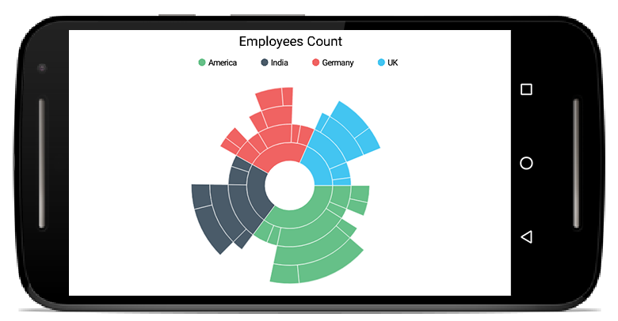

# Overview

Sunburst Chart is useful for visualizing hierarchical data. The center circle represents the root level in the hierarchy, with outer circles representing higher levels of the hierarchy.

## Key features

* Visualize hierarchical data
* Data label support for better readability
* Legend support.
* Colors can be customized.
