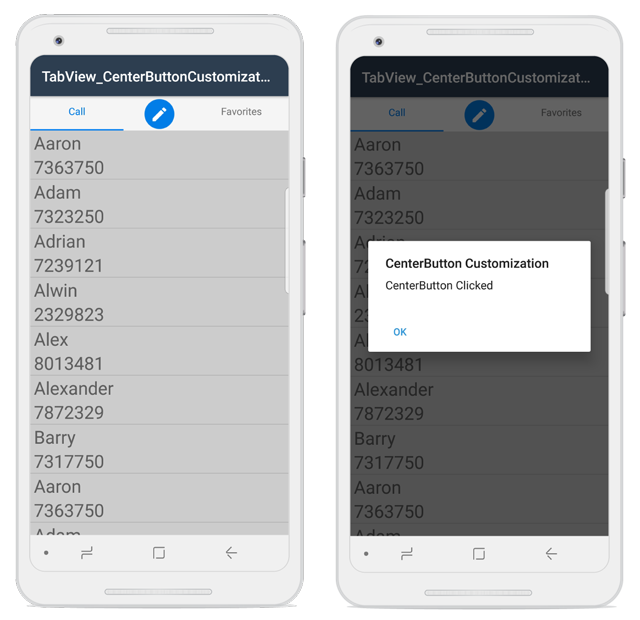

# CenterButtonSettings

This section explains how to create and customize the CenterButton in the Xamarin.Android SfTabView control. The CenterButton provides a prominent action button positioned in the center of the tab bar, commonly used for primary actions like creating new content or accessing frequently used features.

To enable the CenterButton, you need to set the `OverflowMode` property of the SfTabView to `CenterButton`.




SfTabView tabView;
protected override void OnCreate(Bundle savedInstanceState)
{
    base.OnCreate(savedInstanceState);
    tabView = new SfTabView(this);
    tabView.OverflowMode = OverflowMode.CenterButton;
    SetContentView(tabView);
}





## Customize CenterButtonSettings

You can customize the appearance of the CenterButton using the properties available in `CenterButtonSettings`. The following properties allow you to modify the visual aspects of the CenterButton: `BackgroundColor`, `BorderColor`, `BorderThickness`, `Height`, `Title`, `TitleFontColor`, `TitleFontSize`, `TitleFontStyle`, and `Width`.





protected override void OnCreate(Bundle savedInstanceState)
{
    var centerButton = tabView.CenterButtonSettings;
    centerButton.Height = 50;
    centerButton.Width = 100;
    centerButton.Title = "Center Button";
    centerButton.TitleFontSize = 15;
    centerButton.TitleFontColor = Color.DarkGreen;
    centerButton.TitleFontStyle = Typeface.DefaultBold;
}





## CenterButtonTapped Event

When we tap the `CenterButton` an event `CenterButtonTapped` will be raised. Using this event we can able to set alert message.





protected override void OnCreate(Bundle savedInstanceState)
{
    base.OnCreate(savedInstanceState);
    tabView.CenterButtonTapped += TabView_CenterButtonTapped;
}

private void TabView_CenterButtonTapped(object sender, System.EventArgs e)
{
    Android.App.AlertDialog.Builder alertDialog = new Android.App.AlertDialog.Builder(this);
    alertDialog.SetTitle("CenterButton Customization");
    alertDialog.SetMessage("CenterButton clicked");
    alertDialog.SetNeutralButton("Ok", (c, eve) => { });
    alertDialog.Show();
}





## Custom CenterButton

When built-in view is not needed, It can be overridden by adding custom views to the CenterButtonView. The CenterButton view can be customized by adding Image, Label, Button inside the CenterButtonView. Please refer the following code snippet to customize the CenterButton view.





SfTabView tabView;
ImageView image;
protected override void OnCreate(Bundle savedInstanceState)
{
    base.OnCreate(savedInstanceState);
    tabView = new SfTabView(this);
    image = new ImageView(this);
    image.SetImageResource(Resource.Drawable.Compose);
    image.Clickable = true;
    image.Click += Image_Click;
    tabView.CenterButtonView = image;
}

private void Image_Click(object sender, System.EventArgs e)
{
    Android.App.AlertDialog.Builder alertDialog = new Android.App.AlertDialog.Builder(this);
    alertDialog.SetTitle("CenterButton Customization");
    alertDialog.SetMessage("CenterButton view customized");
    alertDialog.SetNeutralButton("Ok", (c, eve) => { });
    alertDialog.Show();
}





Please Find the sample from this [link](http://www.syncfusion.com/downloads/support/directtrac/general/ze/TabView_CenterButtonCustomizatin1937817286.zip)
