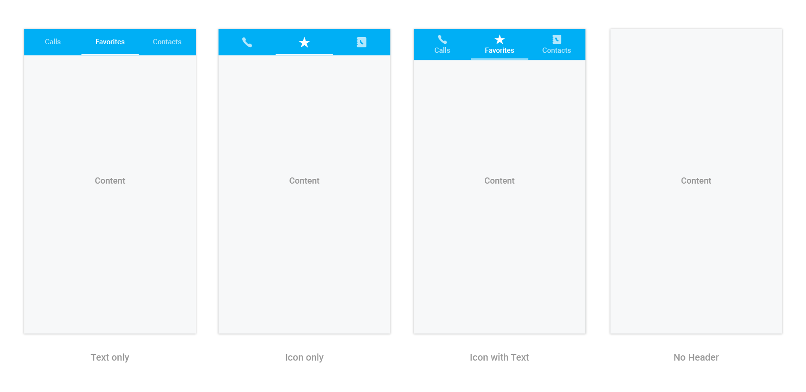

# Display Type

Tab view displays the title of each tab item by default. This can be changed to any of the following types.

* Text only
* Image only
* Image with text
* No header

Display type be changed by setting the `DisplayMode` property of `SfTabView`.





tabView.DisplayMode = TabDisplayMode.ImageWithText;





The "no header" type can be used when the header is not needed for the tab view control, so the content space will be occupied in the entire available height.

N> Image appearance in the header can be achieved through font icons.

## How to change the selection color for text and font icons?

The selected index can be differentiated by setting the `SelectionColor` property of `SfTabItem`.





var tabViewItem = new SfTabItem()
{
Title = "Calls",
TitleFontColor = Color.Green,
}
			




The further customizations of header are discussed in the following sections.

## How to customize text appearance of the header title?





var tabViewItem = new SfTabItem()
{
Title = "Calls",
Content = allContactsGrid,
TitleFontStyle = Typeface.DefaultBold,
TitleFontColor = Color.Red,
TitleFontSize = 22
}
			




## How to set and customize the font icons' appearance in the header?

Add the font file to your application by using the following steps.

**Adding font file to the Android project**

* Add the font file to the `Assets` folder in the application project, and set the `AndroidAsset` build action.

**Setting font file for font icons**





var tabViewItem = new SfTabItem
{
Title = "Calls",
Content = allContactsGrid,
IconFont = "a", // setting value for font icons as mentioned in *.ttf.
FontIconStyle = Typeface.CreateFromAsset(context.Assets, "TabIcons.ttf"),
FontIconFontColor = Color.LightBlue,
FontIconFontSize =  20
};

			



