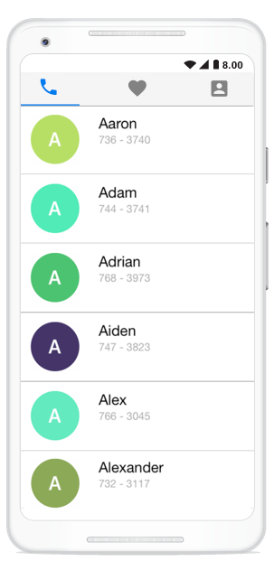

# Getting Started

This section provides an overview for working with the tab view control for Xamarin.Android. Walk through the entire process of creating a real-world application with tab view.

# Assembly deployment

After installing the Essential Studio for Xamarin, find all the required assemblies in the installation folders,

{Syncfusion Essential Studio Installed location}\Essential Studio\16.1.0.24\Xamarin\lib}

E.g., C:\Program Files (x86)\Syncfusion\Essential Studio\16.1.0.24\Xamarin\lib

N>In Mac, assemblies can be found in the unzipped package location.

## Tab view for Xamarin.Android

To use the tab view, the following list of assemblies should be added as reference from the lib folder.

<table>
<tr>
<th>Project</th>
<th>Required assemblies</th>
</tr>
<tr>
<td>Xamarin.Android</td>
<td>pcl\Syncfusion.SfTabView.Android.dll</td>
</tr>
</table>

### Create a simple tab view

This section explains how to create a tab view and configure it. The following screenshot illustrates the final output of tab view in Android devices.

# Creating the project

Create a new BlankApp (Android) application in Xamarin Studio or Visual Studio.

# Adding SfTabView in Xamarin.Android

Add the required assembly reference to the project as discussed in the Assembly deployment section.

Import the control namespace as shown in the following code.





using Syncfusion.Android.TabView;





Set the tab view control to content view in the `OnCreate` method.





private SfTabView tabView;
protected override void OnCreate(Bundle savedInstanceState)
{
base.OnCreate(savedInstanceState);
tabView = new SfTabView(this.ApplicationContext);
SetContentView(tabView);
}
		




# Adding tab items

Tab items can be configured in tab view through the `Items` property of `SfTabView`, which holds the collection of `SfTabItem` through `TabItemsCollection`.





var allContactsGrid = new FrameLayout(ApplicationContext);
var favoritesGrid = new FrameLayout(ApplicationContext);
var contactsGrid = new FrameLayout(ApplicationContext);
allContactsGrid.SetBackgroundColor(Color.Red);
favoritesGrid.SetBackgroundColor(Color.Green);
contactsGrid.SetBackgroundColor(Color.Blue);
var tabItems = new TabItemCollection
{
new SfTabItem()
{
Title = "Calls",
Content = allContactsGrid
},
new SfTabItem()
{
Title = "Favorites",
Content = favoritesGrid
},
new SfTabItem()
{
Title = "Contacts",
Content = contactsGrid
}
};

tabView.Items = tabItems;
SetContentView(tabView);





## Share the header space equally

To share the header space equally to the tabs, set the number of tabs that can be distributed in the available space though `VisibleHeaderCount` of `SfTabView`.





tabView.VisibleHeaderCount = 3;





After set the number of tabs, you can add the required controls to your application. Here, a `ListView` has been added in the content region.

## Adding list view in tab view

## Preparing data

Create a view model class with the `ContactsInfo` collection property, which is initialized with required number of data objects.



public class ContactInfo
{
public string Name { get; set; }
public long Number { get; set; }
}

public class ContactsViewModel
{
private ObservableCollection<ContactInfo> contactList;

public ObservableCollection<ContactInfo> ContactList
{
get { return contactList; }
set { contactList = value; }
}
public ContactsViewModel()
{
ContactList = new ObservableCollection<ContactInfo>();
ContactList.Add(new ContactInfo{Name = "Aaron",Number = 7363750});
ContactList.Add(new ContactInfo { Name = "Adam", Number = 7323250 });
ContactList.Add(new ContactInfo { Name = "Adrian", Number = 7239121 });
ContactList.Add(new ContactInfo { Name = "Alwin", Number = 2329823 });
ContactList.Add(new ContactInfo { Name = "Alex", Number = 8013481 });
ContactList.Add(new ContactInfo { Name = "Alexander", Number = 7872329 });
ContactList.Add(new ContactInfo { Name = "Barry", Number = 7317750 });
}
}



## Binding data to list view

Create a custom adapter for `ListView`, and customize the appearance of each item by overriding the `GetView` method in the inherited class of BaseAdapter in which the list view can be hosted within the content region of tab item. 



var listView = new ListView(Context);
TabContentListAdapter tabContentListAdapter = new TabContentListAdapter(data);
listView.SetAdapter(tabContentListAdapter);
    


Similarly, the content region for other tabs also can be configured.

## Swiping

By default, both vertical swiping for the list view and horizontal swiping for the tab view will work. If it is not required, you can customize this by using the `EnableSwiping` property of `SfTabView`.
