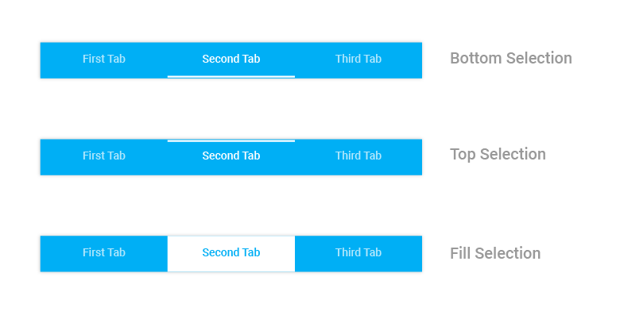

# Selection Indicator in Xamarin.Android TabView

The selection indicator is a visual element that highlights the currently selected tab in the TabView control. This indicator provides clear visual feedback to users about which tab is active, enhancing the overall user experience and navigation clarity.
The selection indicator can be extensively customized using the built-in APIs available in the `SelectionIndicatorSettings` property of `SfTabView`.

## Basic Configuration

To customize the selection indicator, create an instance of `SelectionIndicatorSettings` and configure its properties:




var selectionIndicatorSettings = new SelectionIndicatorSettings();
selectionIndicatorSettings.Color = Color.Yellow;
selectionIndicatorSettings.Position = SelectionIndicatorPosition.Top;
selectionIndicatorSettings.StrokeThickness = 10;

tabView.SelectionIndicatorSettings = selectionIndicatorSettings;

			




N> Stroke thickness is not applicable when selection indicator’s position is set as Fill.

