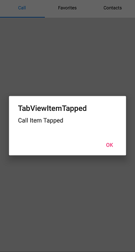

# TabView Events

The SfTabView control provides several events that allow you to respond to user interactions and control lifecycle changes. These events enable you to create dynamic, responsive tabbed interfaces that can react to user behavior and implement custom logic.
## TabItemTapped Event

The `TabItemTapped` event is triggered when a user taps on a tab header. This event occurs regardless of whether the tapped tab is already selected or not, making it useful for implementing custom behaviors such as refresh actions, analytics tracking, or conditional navigation.

### Event Handler Setup




SfTabView tabView;

protected override void OnCreate(Bundle savedInstanceState)
{
    base.OnCreate(savedInstanceState);
    tabView = new SfTabView(this)
    {
        VisibleHeaderCount = 3,
        Items = new TabItemCollection
                {
                    new SfTabItem() { Title = "Call", Content = callsTabItem },
                    new SfTabItem() { Title = "Favorite", Content = favoritesTabItem },
                    new SfTabItem() { Title = "Contacts", Content = contactsTabItem }
                }
    };
    tabView.TabItemTapped += TabView_TabItemTapped;
    SetContentView(tabView);
}
private void TabView_TabItemTapped(object sender, TabItemTappedEventArgs e)
{
    Android.App.AlertDialog.Builder alertDialog = new Android.App.AlertDialog.Builder(this);
    alertDialog.SetTitle("TabViewItem Tapped");
    alertDialog.SetMessage(e.TabItem.Title + " Item Tapped");
    alertDialog.SetNeutralButton("OK", (c, eve) => { });
    alertDialog.Show();
}





