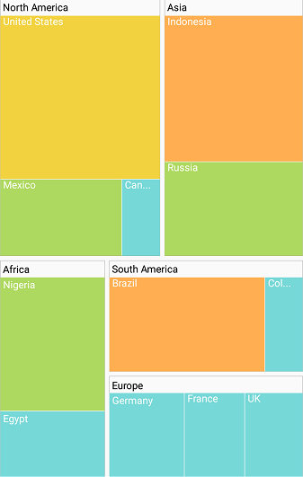
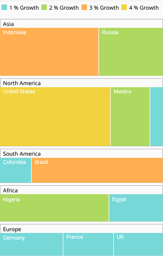
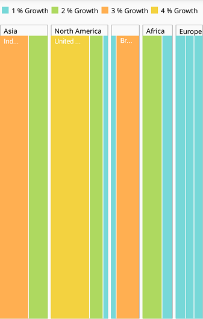
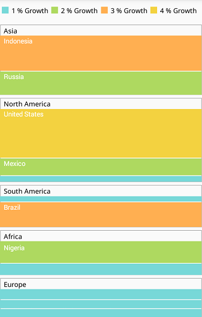

# Layout

You can decide the visual representation of nodes belonging to all the TreeMap levels using the [`LayoutType`](https://help.syncfusion.com/cr/cref_files/xamarin-android/Syncfusion.SfTreeMap.Android~Com.Syncfusion.Treemap.SfTreeMap~LayoutType.html) property of TreeMap.

The following four different types of layout are available in TreeMap:

* Squarified
* SliceAndDiceAuto
* SliceAndDiceHorizontal
* SliceAndDiceVertical

## Squarified

The **Squarified** layout creates rectangles with best aspect ratio.

  

 
      
    treeMap.LayoutType = Com.Syncfusion.Treemap.Enums.LayoutType.Squarified;



  

## SliceAndDiceAuto

The **SliceAndDiceAuto** layout creates rectangles with high aspect ratio and displays them sorted both horizontally and vertically.

 

 

   treeMap.LayoutType = Com.Syncfusion.Treemap.Enums.LayoutType.SliceAndDiceAuto;



  

## SliceAndDiceHorizontal

The **SliceAndDiceHorizontal** layout creates rectangles with high aspect ratio and displays them sorted horizontally.

  

 

       treeMap.LayoutType = Com.Syncfusion.Treemap.Enums.LayoutType.SliceAndDiceHorizontal;



  

## SliceAndDiceVertical

The **SliceAndDiceVertical** layout creates rectangles with high aspect ratio and displays them sorted vertically.

  

 

      treeMap.LayoutType = Com.Syncfusion.Treemap.Enums.LayoutType.SliceAndDiceVertical;



  

The following code is the complete code for squarified layout type.

  

 

     SfTreeMap treeMap = new SfTreeMap(this);
            treeMap.ColorValuePath = "Growth";
            treeMap.WeightValuePath = "Population";
            treeMap.LayoutType = Com.Syncfusion.Treemap.Enums.LayoutType.Squarified;
            treeMap.ShowTooltip = true;
           
            LeafItemSetting leafItemSetting = new LeafItemSetting();
            leafItemSetting.ShowLabels = true;
            leafItemSetting.Gap = 2;
            leafItemSetting.LabelPath = "Country";
            treeMap.LeafItemSettings = leafItemSetting;

            TreeMapFlatLevel flatLevel = new TreeMapFlatLevel();
            flatLevel.HeaderHeight = 20;
            flatLevel.GroupPath = "Continent";
            flatLevel.GroupGap = 5;
            flatLevel.ShowHeader = true;
            flatLevel.GroupStrokeColor = Color.Gray;
            flatLevel.GroupStrokeWidth = 1;
            flatLevel.HeaderStyle = new Style() { TextColor = Color.Black };
            treeMap.Levels.Add(flatLevel);

            LegendSetting legendSettings = new LegendSetting();
            legendSettings.ShowLegend = true;
            legendSettings.LegendSize = new Size(700, 45);
            legendSettings.LabelStyle = new Style() { TextColor = Color.Black };
            treeMap.LegendSettings = legendSettings;

            RangeColorMapping rangeColorMapping = new RangeColorMapping();

            Range range1 = new Range();
            range1.From = 0;
            range1.To = 1;
            range1.Color = Color.ParseColor("#77D8D8");
            range1.LegendLabel = "1 % Growth";

            Range range2 = new Range();
            range2.From = 0;
            range2.To = 2;
            range2.Color = Color.ParseColor("#AED960");
            range2.LegendLabel = "2 % Growth";

            Range range3 = new Range();
            range3.From = 0;
            range3.To = 3;
            range3.Color = Color.ParseColor("#FFAF51");
            range3.LegendLabel = "3 % Growth";

            Range range4 = new Range();
            range4.From = 0;
            range4.To = 4;
            range4.Color = Color.ParseColor("#F3D240");
            range4.LegendLabel = "4 % Growth";

            rangeColorMapping.Ranges.Add(range1);
            rangeColorMapping.Ranges.Add(range2);
            rangeColorMapping.Ranges.Add(range3);
            rangeColorMapping.Ranges.Add(range4);

            treeMap.LeafItemColorMapping = rangeColorMapping;
            treeMap.DataSource = GetDataSource();
            SetContentView(treeMap);



  
