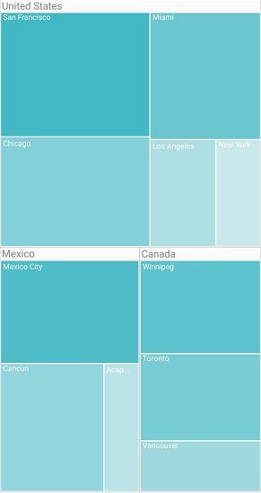

# TreeMap Levels

The levels of TreeMap can be categorized into the following two types:

* Flat level
* Hierarchical level

## Flat level

### GroupPath

You can use the [`GroupPath`](https://help.syncfusion.com/cr/cref_files/xamarin-android/Syncfusion.SfTreeMap.Android~Com.Syncfusion.Treemap.TreeMapFlatLevel~GroupPath.html) property for every flat level in the TreeMap control. It is a path to a field on the source object that serves as “Group” for the level specified. You can group the data based on the [`GroupPath`](https://help.syncfusion.com/cr/cref_files/xamarin-android/Syncfusion.SfTreeMap.Android~Com.Syncfusion.Treemap.TreeMapFlatLevel~GroupPath.html) property. When [`GroupPath`](https://help.syncfusion.com/cr/cref_files/xamarin-android/Syncfusion.SfTreeMap.Android~Com.Syncfusion.Treemap.TreeMapFlatLevel~GroupPath.html) is not specified, the items will not be grouped, and the data will be displayed in the order specified in [`DataSource`](https://help.syncfusion.com/cr/cref_files/xamarin-android/Syncfusion.SfTreeMap.Android~Com.Syncfusion.Treemap.SfTreeMap~DataSource.html).

### GroupGap

You can use the [`GroupGap`](https://help.syncfusion.com/cr/cref_files/xamarin-android/Syncfusion.SfTreeMap.Android~Com.Syncfusion.Treemap.TreeMapFlatLevel~GroupGap.html) property to separate items from every flat level and differentiate the levels mentioned in the TreeMap control.

  

  

  SfTreeMap treeMap = new SfTreeMap(this);
            treeMap.ColorValuePath = "Growth";
            treeMap.WeightValuePath = "Population";
            treeMap.LayoutType = Com.Syncfusion.Treemap.Enums.LayoutType.Squarified;
            treeMap.ShowTooltip = true;

            LeafItemSetting leafItemSetting = new LeafItemSetting();
            leafItemSetting.ShowLabels = true;
            leafItemSetting.Gap = 2;
            leafItemSetting.LabelPath = "Country";
            treeMap.LeafItemSettings = leafItemSetting;

            TreeMapFlatLevel flatLevel = new TreeMapFlatLevel();
            flatLevel.HeaderHeight = 20;
            flatLevel.GroupPath = "Continent";
            flatLevel.GroupGap = 5;
            flatLevel.ShowHeader = true;
            flatLevel.GroupStrokeColor = Color.Gray;
            flatLevel.GroupStrokeWidth = 1;
            flatLevel.HeaderStyle = new Style() { TextColor = Color.Black };
            treeMap.Levels.Add(flatLevel);

            LegendSetting legendSettings = new LegendSetting();
            legendSettings.ShowLegend = true;
            legendSettings.LegendSize = new Size(700, 45);
            legendSettings.LabelStyle = new Style() { TextColor = Color.Black };
            treeMap.LegendSettings = legendSettings;

            RangeColorMapping rangeColorMapping = new RangeColorMapping();

            Range range1 = new Range();
            range1.From = 0;
            range1.To = 1;
            range1.Color = Color.ParseColor("#77D8D8");
            range1.LegendLabel = "1 % Growth";

            Range range2 = new Range();
            range2.From = 0;
            range2.To = 2;
            range2.Color = Color.ParseColor("#AED960");
            range2.LegendLabel = "2 % Growth";

            Range range3 = new Range();
            range3.From = 0;
            range3.To = 3;
            range3.Color = Color.ParseColor("#FFAF51");
            range3.LegendLabel = "3 % Growth";

            Range range4 = new Range();
            range4.From = 0;
            range4.To = 4;
            range4.Color = Color.ParseColor("#F3D240");
            range4.LegendLabel = "4 % Growth";

            rangeColorMapping.Ranges.Add(range1);
            rangeColorMapping.Ranges.Add(range2);
            rangeColorMapping.Ranges.Add(range3);
            rangeColorMapping.Ranges.Add(range4);

            treeMap.LeafItemColorMapping = rangeColorMapping;
            treeMap.DataSource = GetDataSource();

            SetContentView(treeMap);



  

## Hierarchical level

Hierarchical level is used to define levels for hierarchical data collection that contains tree-structured data.

  

  

SfTreeMap treeMap = new SfTreeMap(this);
            treeMap.WeightValuePath = "Sales";
           
            DesaturationColorMapping colorMapping = new DesaturationColorMapping();
            colorMapping.Color = Color.ParseColor("#41B8C4");
            colorMapping.From = 1;
            colorMapping.To = 0.2;
            treeMap.ColorValuePath = "Expense";
            treeMap.LeafItemColorMapping = colorMapping;

            TreeMapHierarchicalLevel level = new TreeMapHierarchicalLevel();
            level.ChildPadding = 4;
            level.ShowHeader = true;
            level.HeaderHeight = 20;
            level.HeaderPath = "Name";
            level.ChildStrokeColor = Color.Gray;
            level.ChildStrokeWidth = 1;
            level.ChildPath = "RegionalSales";
            level.HeaderStyle = new Style() { TextColor = Color.Gray, TextSize = 16 };           
            level.ChildBackgroundColor = Color.White;
            treeMap.Levels.Add(level);

            LeafItemSetting leafItemSetting = new LeafItemSetting();
            leafItemSetting.ShowLabels = true;
            leafItemSetting.Gap = 5;
            leafItemSetting.StrokeColor = Color.White;
            leafItemSetting.StrokeWidth = 2;
            leafItemSetting.LabelStyle = new Style() { TextColor = Color.White };
            leafItemSetting.LabelPath = "Name";
            treeMap.LeafItemSettings = leafItemSetting;
                      
            treeMap.DataSource = GetDataSource();
            SetContentView(treeMap);
  


  

The following code snippet demonstrates the underlying hierarchical data model.

  

 

        JSONArray GetDataSource()
        {
            JSONArray regional1 = new JSONArray();
            regional1.Put(getJsonObject1("United States", "New York", 2353, 2000));
            regional1.Put(getJsonObject1("United States", "Los Angeles", 3453, 3000));
            regional1.Put(getJsonObject1("United States", "San Francisco", 8456, 8000));
            regional1.Put(getJsonObject1("United States", "Chicago", 6785, 7000));
            regional1.Put(getJsonObject1("United States", "Miami", 7045, 6000));

            JSONArray regional2 = new JSONArray();
            regional2.Put(getJsonObject1("Canada", "Toronto", 7045, 7000));
            regional2.Put(getJsonObject1("Canada", "Vancouver", 4352, 4000));
            regional2.Put(getJsonObject1("Canada", "Winnipeg", 7843, 7500));

            JSONArray regional3 = new JSONArray();
            regional3.Put(getJsonObject1("Mexico", "Mexico City", 7843, 6500));
            regional3.Put(getJsonObject1("Mexico", "Cancun", 6683, 6000));
            regional3.Put(getJsonObject1("Mexico", "Acapulco", 2454, 2000));

            JSONArray array = new JSONArray();
            array.Put(getJsonObject("United States", 98456, 87000, regional1));
            array.Put(getJsonObject("Canada", 43523, 40000, regional2));
            array.Put(getJsonObject("Mexico", 45634, 46000, regional3));

            return array;
        }

        JSONObject getJsonObject(String name, double expense, double sales, JSONArray regionalSale)
        {
            JSONObject obj = new JSONObject();
            obj.Put("Name", name);
            obj.Put("Expense", expense);
            obj.Put("Sales", sales);
            obj.Put("RegionalSales", regionalSale);
            return obj;
        }

        JSONObject getJsonObject1(String country, String name, double expense, double sales)
        {
            JSONObject obj = new JSONObject();
            obj.Put("Country", country);
            obj.Put("Name", name);
            obj.Put("Expense", expense);
            obj.Put("Sales", sales);
            return obj;
        }



  

