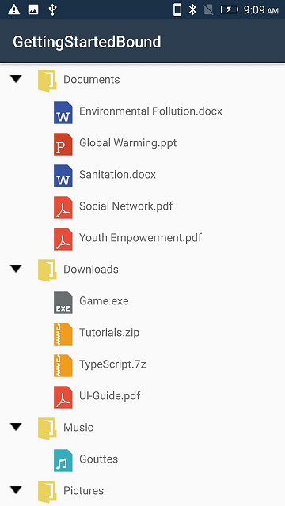
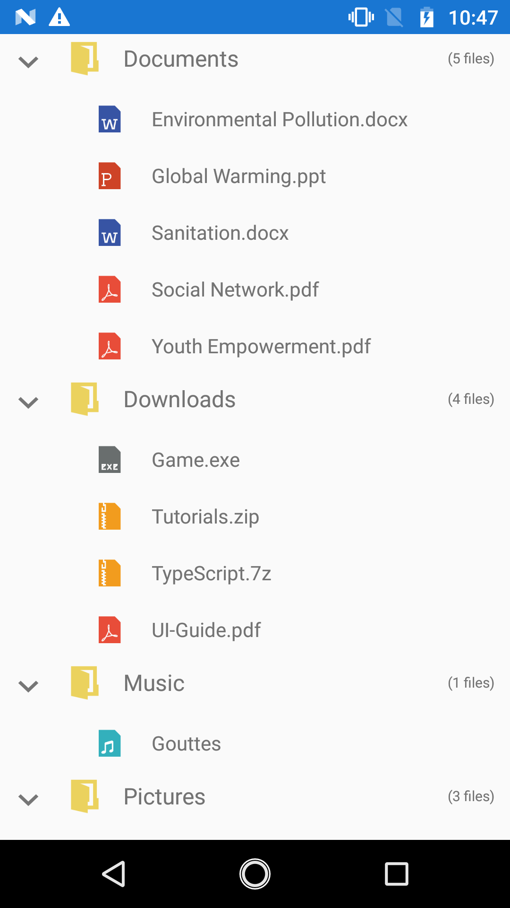

# Appearance

The TreeView allows customizing appearance of the underlying data, and provides different functionalities to the end-user.

## Adapter

An Adapter can be used to present the data in a way that makes sense for the application by using different controls.

The TreeView allows you to customize the appearance of content view and expander view by setting the [Adapter](https://help.syncfusion.com/cr/cref_files/xamarin-android/Syncfusion.SfTreeView.Android~Syncfusion.Android.TreeView.SfTreeView~Adapter.html) property.You can customize the content view and expander view by overriding the `CreateContentView`, `CreateExpanderView`, `UpdateContentView` and `UpdateExpanderView` methods of `TreeViewAdapter`.
                                      


protected override void OnCreate(Bundle savedInstanceState)
{
    SfTreeView treeView = new SfTreeView();
    treeView.Adapter = new CustomAdapter();
}



### Creating custom Adapter

Creating a custom adapter class derived from `TreeViewAdapter`.



// Adapter extension class
public class CustomAdapter : TreeViewAdapter
{
    public CustomAdapter()
    {
    }

    protected override View CreateContentView(TreeViewItemInfoBase itemInfo)
    {
        var customView = new CustomContentView(TreeView.Context);
        return customView;
    }

    protected override void UpdateContentView(View view, TreeViewItemInfoBase itemInfo)
    {
        var grid = view as CustomContentView;
        var treeViewNode = itemInfo.Node;
        if (grid != null)
        {
            var icon = grid.GetChildAt(0) as ImageView;
            if (icon != null)
            {
                var imageID = (treeViewNode.Content as FileManager).ImageIcon;
                icon.SetImageResource(imageID);
            }

            var label1 = grid.GetChildAt(1) as ContentLabel;
            if (label1 != null)
            {
                label1.Text = (treeViewNode.Content as FileManager).FileName.ToString();
            }
        }
    }

    protected override View CreateExpanderView(TreeViewItemInfoBase itemInfo)
    {
        var expanderView = new ImageView(TreeView.Context);
        return expanderView;
    }

    protected override void UpdateExpanderView(View view, TreeViewItemInfoBase itemInfo)
    {
        var image = view as ImageView;
        var node = itemInfo.Node;
        if (image != null && node.HasChildNodes)
        {
            image.SetImageResource(node.IsExpanded ? Resource.Drawable.expand : Resource.Drawable.collapse);
        }
    }
}



## Indentation

The TreeView allows customizing the indent spacing of items by setting the [Indentation](https://help.syncfusion.com/cr/xamarin-android/Syncfusion.SfTreeView.Android~Syncfusion.Android.TreeView.SfTreeView~Indentation.html) property. The default value of this property is `40`. This property can be customized at runtime.



<syncfusion:SfTreeView x:Name="treeView" Indentation="40">


SfTreeView treeView = new SfTreeView();
treeView.Indentation = 40; 



## Item Height

The TreeView allows customizing the height of items by setting the [ItemHeight](https://help.syncfusion.com/cr/xamarin-android/Syncfusion.SfTreeView.Android~Syncfusion.Android.TreeView.SfTreeView~ItemHeight.html) property. The default value of this property is `40`. This property can be customized at runtime.



<syncfusion:SfTreeView x:Name="treeView" ItemHeight="40">


SfTreeView treeView = new SfTreeView();
treeView.ItemHeight = 40; 



## Expander Width

The TreeView allows customizing the width of expander view by setting the [ExpanderWidth](https://help.syncfusion.com/cr/xamarin-android/Syncfusion.SfTreeView.Android~Syncfusion.Android.TreeView.SfTreeView~ExpanderWidth.html) property. The default value of this property is `40`. This property can be customized at runtime.



SfTreeView treeView = new SfTreeView();
treeView.ExpanderWidth = 40; 



## Level based Customisation

### Level based views

The TreeView allows you to customize the content view and expander view with different views by using `CreateContentView` and `CreateExpanderView` override methods based on specific constraints.

Following example illustrates you to load different content views based on the node level.



// Adapter extension class
public class NodeImageAdapter : TreeViewAdapter
{
    public NodeImageAdapter()
    {
    }

    protected override View CreateContentView(TreeViewItemInfoBase itemInfo)
    {
        if (itemInfo.Node.Level == 0)
        {
            var gridView = new CustomView1(TreeView.Context);
            return gridView;
        }
        else
        {
            var gridView = new CustomView2(TreeView.Context);
            return gridView;
        }
    }

    protected override void UpdateContentView(View view, TreeViewItemInfoBase itemInfo)
    {
        var grid = view as CustomView1;
        var treeViewNode = itemInfo.Node;
        if (grid != null)
        {
            var icon = grid.GetChildAt(0) as ImageView;
            if (icon != null)
            {
                var imageID = (treeViewNode.Content as FileManager).ImageIcon;
                icon.SetImageResource(imageID);
            }

            var label1 = grid.GetChildAt(1) as ContentLabel;
            if (label1 != null)
            {
                label1.Text = (treeViewNode.Content as FileManager).FileName.ToString();
            }
            var label2 = grid.GetChildAt(2) as ContentLabel;
            label2.Text = treeViewNode.HasChildNodes ? treeViewNode.ChildNodes.Count.ToString()+" files" : "No files";
        }
        else
        {
            var grid1 = view as CustomView2;
            if (grid1 != null)
            {
                var icon = grid1.GetChildAt(0) as ImageView;
                if (icon != null)
                {
                    var imageID = (treeViewNode.Content as FileManager).ImageIcon;
                    icon.SetImageResource(imageID);
                }
                    var label1 = grid1.GetChildAt(1) as ContentLabel;
                if (label1 != null)
                {
                    label1.Text = (treeViewNode.Content as FileManager).FileName.ToString();
                }
            }
        }
    }
}



You can also download the entire source code of this demo from [here]()

### Level based styling.

The TreeView allows you to customize the style of `TreeViewItem` based on different levels by customising the adapter by using `UpdateContentView` and  `UpdateExpanderView` override methods.

 You can customize the content view and expander view by overriding the `CreateContentView`, `CreateExpanderView`, `UpdateContentView` and `UpdateExpanderView` methods of `TreeViewAdapter`.

You can download the example for level based styling demo from [here]().

