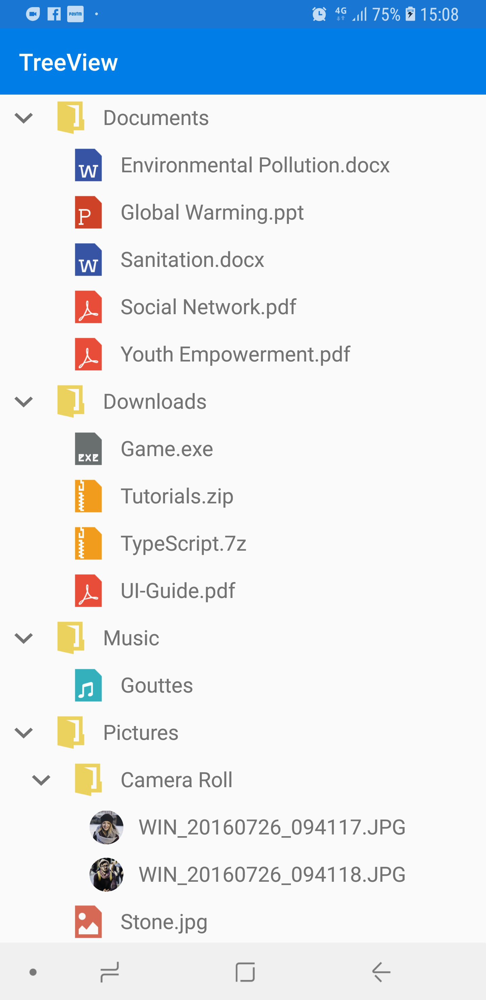

# Data Population

TreeView can be populated either with the data source by using a [ItemsSource](https://help.syncfusion.com/cr/cref_files/xamarin-android/Syncfusion.SfTreeView.Android~Syncfusion.Android.TreeView.SfTreeView~ItemsSource.html) property or by creating and adding the [TreeViewNode](https://help.syncfusion.com/cr/xamarin-android/Syncfusion.SfTreeView.Android~Syncfusion.TreeView.Engine.TreeViewNode.html) in hierarchical structure to [Nodes](https://help.syncfusion.com/cr/cref_files/xamarin-android/Syncfusion.SfTreeView.Android~Syncfusion.Android.TreeView.SfTreeView~Nodes.html) property.

## Populating Nodes by data binding - Bound Mode
[Nodes](https://help.syncfusion.com/cr/cref_files/xamarin-android/Syncfusion.SfTreeView.Android~Syncfusion.Android.TreeView.SfTreeView~Nodes.html) can be populated in bound mode includes following steps.

* [Create hierarchical data model](#create-data-model-for-treeview)
* [Bind data model to treeview](#bind-to-hierarchical-datasource)

### Create Data Model for treeview

Create a simple data source as shown in the following code example in a new class file, and save it as FileManager.cs file: 



public class FileManager : INotifyPropertyChanged
{
   private string fileName;
   private int imageIcon;
   private ObservableCollection<FileManager> subFiles;

   public ObservableCollection<FileManager> SubFiles
   {
       get
       {
            return subFiles;
       }

        set
       {
            subFiles = value;
            RaisedOnPropertyChanged("SubFiles");
       }
    }

    public string FileName
    {
        get
        {
            return fileName;
        }

        set
        {
            fileName = value;
            RaisedOnPropertyChanged("FileName");
        }
    }

    public int ImageIcon
    {
        get
        {
            return imageIcon;
        }

        set
        {
            imageIcon = value;
            RaisedOnPropertyChanged("ImageIcon");
        }
    }

    public FileManager()
    {
    }

    public event PropertyChangedEventHandler PropertyChanged;

    public void RaisedOnPropertyChanged(string propertyName)
    {
        if (PropertyChanged != null)
        {
            PropertyChanged(this, new PropertyChangedEventArgs(propertyName));
        }
    }
}



N> If you want your data model to respond to property changes, then implement `INotifyPropertyChanged` interface in your model class.

Create a model repository class with ImageNodeInfo collection property initialized with required number of data objects in a new class file as shown in the following code example, and save it as FileManagerViewModel.cs file:



public class FileManagerViewModel
{
    public ObservableCollection<FileManager> Folders { get; set; }

    public FileManagerViewModel()
    {
        GenerateFiles();
    }

    private void GenerateFiles()
    {
        var doc = new FileManager() { FileName = "Documents", ImageIcon = Resource.Drawable.treeview_folder };
        var download = new FileManager() { FileName = "Downloads", ImageIcon = Resource.Drawable.treeview_folder };
        var mp3 = new FileManager() { FileName = "Music", ImageIcon = Resource.Drawable.treeview_folder };
        var pictures = new FileManager() { FileName = "Pictures", ImageIcon = Resource.Drawable.treeview_folder };
        var video = new FileManager() { FileName = "Videos", ImageIcon = Resource.Drawable.treeview_folder };

        var pollution = new FileManager() { FileName = "Environmental Pollution.docx", ImageIcon = Resource.Drawable.treeview_word };
        var globalWarming = new FileManager() { FileName = "Global Warming.ppt", ImageIcon = Resource.Drawable.treeview_ppt };
        var sanitation = new FileManager() { FileName = "Sanitation.docx", ImageIcon = Resource.Drawable.treeview_word };
        var socialNetwork = new FileManager() { FileName = "Social Network.pdf", ImageIcon = Resource.Drawable.treeview_pdf };
        var youthEmpower = new FileManager() { FileName = "Youth Empowerment.pdf", ImageIcon = Resource.Drawable.treeview_pdf };

        var game = new FileManager() { FileName = "Game.exe", ImageIcon = Resource.Drawable.treeview_exe };
        var tutorials = new FileManager() { FileName = "Tutorials.zip", ImageIcon = Resource.Drawable.treeview_zip };
        var typescript = new FileManager() { FileName = "TypeScript.7z", ImageIcon = Resource.Drawable.treeview_zip };
        var uiGuide = new FileManager() { FileName = "UI-Guide.pdf", ImageIcon = Resource.Drawable.treeview_pdf };

        var song = new FileManager() { FileName = "Goutiest", ImageIcon = Resource.Drawable.treeview_mp3 };

        var camera = new FileManager() { FileName = "Camera Roll", ImageIcon = Resource.Drawable.treeview_folder };
        var stone = new FileManager() { FileName = "Stone.jpg", ImageIcon = Resource.Drawable.treeview_png };
        var wind = new FileManager() { FileName = "Wind.jpg", ImageIcon = Resource.Drawable.treeview_png };

        var img0 = new FileManager() { FileName = "WIN_20160726_094117.JPG", ImageIcon = Resource.Drawable.treeview_img0 };
        var img1 = new FileManager() { FileName = "WIN_20160726_094118.JPG", ImageIcon = Resource.Drawable.treeview_img1 };

        var video0 = new FileManager() { FileName = "Naturals.mp4", ImageIcon = Resource.Drawable.treeview_video };
        var video1 = new FileManager() { FileName = "Wild.mpg", ImageIcon = Resource.Drawable.treeview_video };

      doc.SubFiles = new ObservableCollection<FileManager>
      {
         pollution,
         globalWarming,
         sanitation,
         socialNetwork,
         youthEmpower
      };

      download.SubFiles = new ObservableCollection<FileManager>
      {
         games,
         tutorials,
         TypeScript,
         uiGuide
      };

      mp3.SubFiles = new ObservableCollection<FileManager>
      {
         song
      };

      pictures.SubFiles = new ObservableCollection<FileManager>
      {
         camera,
         stone,
         wind
      };
      
      camera.SubFiles = new ObservableCollection<FileManager>
      {
         img0,
         img1
      };

      video.SubFiles = new ObservableCollection<FileManager>
      {
         video1,
         video2
      };

      nodeImageInfo.Add(doc);
      nodeImageInfo.Add(download);
      nodeImageInfo.Add(mp3);
      nodeImageInfo.Add(pictures);
      nodeImageInfo.Add(video);
      imageNodeInfo = nodeImageInfo;
  }
}



### Bind to hierarchical datasource

To create a tree view using data binding, set a hierarchical data collection to the [ItemsSource](https://help.syncfusion.com/cr/cref_files/xamarin-android/Syncfusion.SfTreeView.Android~Syncfusion.Android.TreeView.SfTreeView~ItemsSource.html). And set the child object name to the [ChildPropertyName](https://help.syncfusion.com/cr/cref_files/xamarin-android/Syncfusion.SfTreeView.Android~Syncfusion.Android.TreeView.SfTreeView~ChildPropertyName.html) property.



using Syncfusion.Android.TreeView;
using Syncfusion.TreeView.Engine;

protected override void OnCreate(Bundle savedInstanceState)
{
    base.OnCreate(savedInstanceState);
    // Set our view from the "main" layout resource
    SetContentView(Resource.Layout.activity_main);
    SfTreeView treeView = FindViewById<SfTreeView>(Resource.Id.sfTreeView1);
    FileManagerViewModel viewModel = new FileManagerViewModel();
    treeView.ChildPropertyName = "SubFiles";
    treeView.ItemsSource = viewModel.Folders;
    treeView.Adapter = new NodeImageAdapter();
}



N> By defining the [Adapter](https://help.syncfusion.com/cr/cref_files/xamarin-android/Syncfusion.SfTreeView.Android~Syncfusion.Android.TreeView.SfTreeView~Adapter.html), a custom user interface(UI) can be achieved to display the data items for both expander and content view.

You can also download the entire source code of this demo from [here](http://www.syncfusion.com/downloads/support/directtrac/general/ze/GettingStartedBound1294397808).

## Populating Nodes without data binding - Unbound Mode

You can create and manage the [TreeViewNode](https://help.syncfusion.com/cr/xamarin-android/Syncfusion.SfTreeView.Android~Syncfusion.TreeView.Engine.TreeViewNode.html) objects by yourself to display the data in a hierarchical view. Create the node hierarchy by adding one or more root nodes to the [Nodes](https://help.syncfusion.com/cr/xamarin-android/Syncfusion.SfTreeView.Android~Syncfusion.Android.TreeView.SfTreeView~Nodes.html) collection. Each `TreeViewNode` can then have more nodes added to its Children collection. You can nest tree view nodes to whatever depth you require.



<?xml version="1.0" encoding="utf-8"?>
<LinearLayout xmlns:android="http://schemas.android.com/apk/res/android"
    xmlns:app="http://schemas.android.com/apk/res-auto"
    xmlns:tools="http://schemas.android.com/tools"
    android:layout_width="match_parent"
    android:layout_height="match_parent"
	android:id="@+id/linearLayout1" >
	<Syncfusion.Android.TreeView.SfTreeView
		android:minWidth="25px"
		android:minHeight="25px"
		android:layout_width="wrap_content"
		android:layout_height="wrap_content"
		android:id="@+id/sfTreeView1" />
</LinearLayout>





using Syncfusion.Android.TreeView;
using Syncfusion.TreeView.Engine;

protected override void OnCreate(Bundle savedInstanceState)
{
    base.OnCreate(savedInstanceState);
    // Set our view from the "main" layout resource
    SetContentView(Resource.Layout.activity_main);

    var treeView = FindViewById<SfTreeView>(Resource.Id.sfTreeView1);

    var australia = new TreeViewNode() { Content = "Australia", IsExpanded = true };
    var _NSW = new TreeViewNode() { Content = "New South Wales" };
    _NSW.ChildNodes.Add(new TreeViewNode() { Content = "Sydney" });
    australia.ChildNodes.Add(_NSW);
          
    var usa = new TreeViewNode() { Content = "United States of America", IsExpanded = true };
    var newYork = new TreeViewNode() { Content = "New York" };
    var california = new TreeViewNode() { Content = "California" };
    california.ChildNodes.Add(new TreeViewNode() { Content = "San Francisco" });
    usa.ChildNodes.Add(newYork);
    usa.ChildNodes.Add(california);
          
    treeView.Nodes.Add(australia);
    treeView.Nodes.Add(usa);
}



Now, run the application to render the below output:

You can also download the entire source code of this demo from [here](http://www.syncfusion.com/downloads/support/directtrac/general/ze/GettingStartedUnbound1093615327).