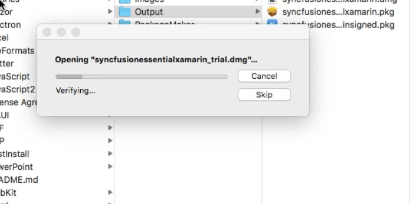
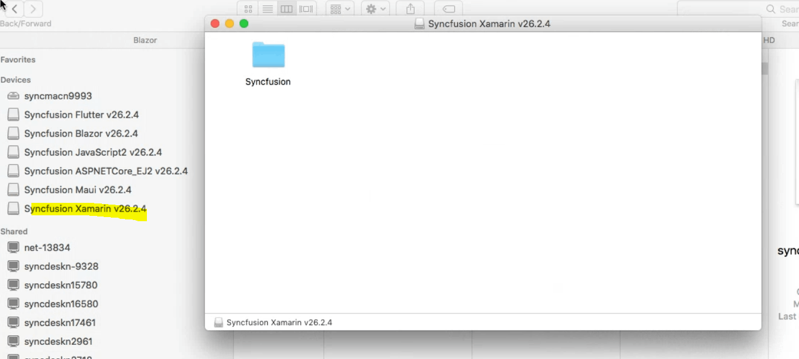
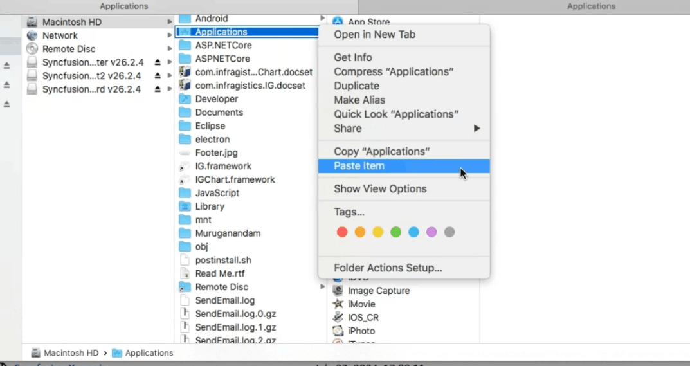
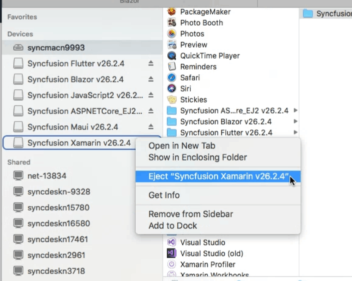

# Installing Syncfusion® Xamarin.android Mac Installer

## Overview of Syncfusion® components Installation in Mac

The Syncfusion® Essential Studio® allows you to create the Xamarin application in Visual Studio for Mac with the Syncfusion® components.

### Step-by-Step Installation

The steps below show how to install the Xamarin Mac installer.

1. Locate the downloaded dmg file and open the file by double click on it.

   

2. This action will automatically mount the disk image and create a virtual drive on your desktop or in the Finder sidebar.

   

3. Copy the mounted disk file.

   

4. And paste it in "Applications" folder shortcut.

   

   N> The Unlock key is not required to install the Mac installer. The Syncfusion® Mac installer can be used for development purposes without registering the Unlock key.

5. Now you can open the folder to explore the Syncfusion® Essential Studio® Mac installer.

   

6. To remove the DMG file, Right-click on the virtual drive on your desktop or in the Finder sidebar and select "Eject." Also delete the folder from the Applications.

   
   
### Add reference to the project

You can then add the assembly references to the respective projects such as PCL, XForms.Droid, XForms.iOS. You can find the dependencies for each control from this [link](https://help.syncfusion.com/xamarin/introduction/control-dependencies).

I> After adding the reference, currently, an additional step is required for iOS and UWP projects. For example, if we are using SfKanban, we need to call the Init method of SfKanbanRenderer as shown in this [KB article](https://www.syncfusion.com/kb/7171).

### Explore the libraries package

You can find the Syncfusion® libraries, samples and NuGet from the installed location in Mac.

{Essential Studio installed location}\Syncfusion\Essential Studio{version}\Xamarin

* “ Lib ” folder - eg, /Users/labuser/Documents/Syncfusion/16.2.0.41/Xamarin/lib
It contains all the required libraries for Xamarin.iOS, Xamarin.Android, and Xamarin.Forms projects.

* “Nuget” folder - eg, /Users/labuser/Documents/Syncfusion/16.2.0.41/nuget
It contains the above libraries as NuGet packages. The same NuGet packages also can be configured from online nuget.org.

* “sample” folder - e.g., /Users/labuser/Documents/Syncfusion/16.2.0.41/sample
It contains the sample applications for our controls in Xamarin.iOS, Xamarin.Android, and Xamarin.Forms platforms in iOS, Android, and Forms folders, respectively.

The **“Forms”** directory includes,

* **Individual control sample folders:** It contains the samples for individual controls such as SfChart, SfDataGrid, etc. Since they represent the individual controls, these samples are light-weighted. You can check the samples for your required controls alone faster with minimum deployment time.
* **“nuget” folder:** It contains the compiled assemblies of the above samples as NuGet package. It is referred in the common sample browser as explained in the next step.
* **“SampleBrowser” folder:** It contains common sample browser, which refers the individual control’s samples as NuGet package. Run this to see the demo samples of all the controls in single application.
* It also contains showcase samples such as Patient Monitor, Server Monitor, and Invoice.

### Add reference to the project

You can then add the assembly references to the respective projects such as PCL, XForms.Droid, XForms.iOS. You can find the dependencies for each control from [this](https://help.syncfusion.com/xamarin/introduction/control-dependencies) link.

## Creating a New Xamarin Visual Studio MAC project for a Control 

1. Firstly, create a new project in Visual Studio MAC, using File-> New Project.

2. Choose Blank Forms App under Xamarin.Forms category under the Multi platform sub-heading.

   

3. Enter the Application Name as required and click Next.

   N> Make sure both Android and iOS target platforms are clicked and shared code is .NETStandard.

   

4. Choose the location where the created project needs to be stored for future reference and then Click Create.

   

5. **Option 1:** Right click solution -> Click Manage NuGet packages.

   N> You can follow the [NuGet Packages](https://help.syncfusion.com/xamarin/visual-studio-integration/nuget-packages) to use the NuGet-Syncfusion Xamarin Controls/Components.

   

   Select the packages required to be added and click Add Packages
   
   Now select all projects in the solution in the appeared dialog box and Click OK.

   

   To successfully add the packages, Click Accept for the license acceptance for the added packages in solution

   

   Now, your new project with required packages have been created successfully.

6. **Option 2:** 
   You can add the assembly references to the respective projects such as PCL, XForms.Droid, XForms.iOS from the MAC build installed location in your machine. You can find the dependencies for each control from this link.
   
   You can find the Syncfusion® libraries, samples and NuGet from the installed location in Mac.

   {Essential Studio installed location}\Syncfusion\Essential Studio{version}\Xamarin

   “Lib ” folder - e.g., /Users/labuser/Documents/Syncfusion/16.2.0.41/Xamarin/lib

   It contains all the required libraries for Xamarin.iOS, Xamarin.Android, and Xamarin.Forms projects.

## Deploying a new control in a created project in MAC

1. Add the required code for control in PCL project.

   For example, For SfAutocomplete, refer  [this](https://help.syncfusion.com/xamarin/autocomplete/getting-started#initializing-autocomplete) link.

   Import the SfAutocomplete namespace in respective page and initialize the autocomplete using the code below.

   

   refer [this](https://help.syncfusion.com/xamarin/autocomplete/populating-data) link to learn more about the options available in SfAutocomplete to populate data.

2. Additional step for iOS

   We need to add Renderer for each control added in our project by adding Renderer in AppDelegate class in  iOS project

   N> If you are adding the reference from toolbox, this step is not needed.

   Here, Create an instance of `SfAutocompleteRenderer` in FinishedLaunching overridden method of an AppDelegate class in iOS project as shown below:

   

   The complete Getting Started sample is available in [this](http://www.syncfusion.com/downloads/support/directtrac/general/ze/AutoComplete312348434.zip) link.

3. Right click the iOS/ Android project-> Select Set As Startup Project in Debug/Release mode. Build and Run the project in any platform as desired.	

   Thus, you can create Xamarin Visual Studio MAC project for any Syncfusion® Xamarin control using the above guidelines.

## License key registration in samples

After the installation, the license key is required to register the demo source that is included in the Mac installer. To learn about the steps for license registration for the Xamarin Mac installer, please refer to this.

 Register the license key in [OnCreate](https://help.syncfusion.com/xamarin-android/licensing/how-to-register-in-an-application#xamarinandroid) override method of your main activity class before initializing any Syncfusion® control.